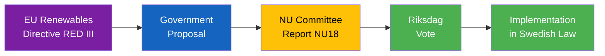

# Document Analysis: Tillståndsprövning enligt förnybartdirektivet

**Generated**: 2026-04-08 18:32 UTC
**dok_id**: HD01NU18
**Document Type**: Committee Report (betänkande)
**Committee**: NU (Näringsutskottet)
**Date**: 2026-04-08
**Riksmöte**: 2025/26
**Significance**: 🟡 Medium-High (7/10)
**Confidence**: HIGH (85%)

---

## Executive Summary

Committee report on permit review processes under the EU Renewables Directive (RED III). This is a significant legislative event as it transposes binding EU requirements into Swedish permitting law, streamlining renewable energy project approvals. The report has direct implications for Sweden's green transition timeline and EU compliance. [HIGH confidence]

## Legislative Flow

## SWOT Analysis

| Quadrant | Finding | Evidence | Confidence |
|----------|---------|----------|------------|
| **Strength** | Demonstrates Sweden's EU compliance commitment | HD01NU18 processed on schedule | HIGH |
| **Strength** | Streamlines renewable energy permitting — economic benefit | NU committee report | HIGH |
| **Weakness** | Potential tension with environmental protection standards | Related to HD03230 (species protection) | MEDIUM |
| **Opportunity** | Could unlock significant renewable energy investment | Industry estimates of permit backlog | MEDIUM |
| **Threat** | Implementation complexity may delay actual permit acceleration | Bureaucratic capacity constraints | LOW-MEDIUM |

## Stakeholder Impact

| Stakeholder | Impact | Detail |
|-------------|--------|--------|
| Citizens | Positive | Lower energy costs from faster renewable deployment |
| Government | Positive | EU compliance demonstrated; green transition narrative |
| Opposition | Neutral | Limited grounds to oppose EU directive transposition |
| Business | Strongly Positive | Reduced permitting times for renewable energy projects |
| International/EU | Positive | Compliance signal strengthens Sweden's EU standing |
| Environment | Mixed | Faster permits vs potential weakening of environmental review |

## Risk Assessment

| Risk | L | I | Score |
|------|---|---|-------|
| Implementation delay | 2 | 3 | 6 |
| Environmental standard erosion | 2 | 3 | 6 |
| EU compliance gap | 1 | 4 | 4 |

## Forward Indicators

- **Watch**: Riksdag vote scheduling (expected within 2-3 weeks) [MEDIUM confidence]
- **Watch**: Environmental organizations' response to permit streamlining [MEDIUM confidence]
- **Watch**: MJU committee cross-referencing with environmental legislation [LOW-MEDIUM confidence]
