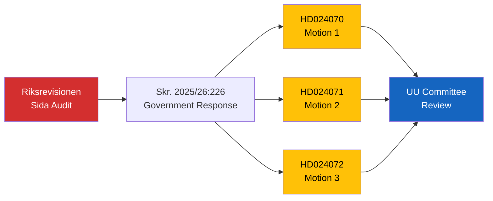

# Document Analysis: Motion re: Riksrevisionens rapport om Sidas humanitära bistånd (1)

**Generated**: 2026-04-08 18:32 UTC
**dok_id**: HD024070
**Document Type**: Motion
**Date**: 2026-04-08
**Riksmöte**: 2025/26
**Significance**: 🟡 Medium (4/10)
**Confidence**: MEDIUM (70%)

---

## Executive Summary

First of three coordinated motions filed in response to government skrivelse Skr. 2025/26:226 on the Riksrevisionen report about Sida's humanitarian aid work. The coordinated filing (HD024070, HD024071, HD024072) represents organized opposition scrutiny of Sweden's foreign aid accountability. [MEDIUM confidence]

## Accountability Chain

## SWOT Analysis

| Quadrant | Finding | Evidence | Confidence |
|----------|---------|----------|------------|
| **Strength** | Opposition exercising parliamentary scrutiny function | Three coordinated motions | HIGH |
| **Weakness** | Motions unlikely to pass given government majority | Coalition arithmetic | HIGH |
| **Opportunity** | Sida accountability debate could improve aid effectiveness | Riksrevisionen findings | MEDIUM |
| **Threat** | Could signal broader opposition attack on foreign aid policy | Pre-election positioning | LOW-MEDIUM |

## Risk Assessment

| Risk | L | I | Score |
|------|---|---|-------|
| Foreign aid policy debate intensification | 2 | 3 | 6 |
| Government credibility on aid effectiveness | 2 | 3 | 6 |
