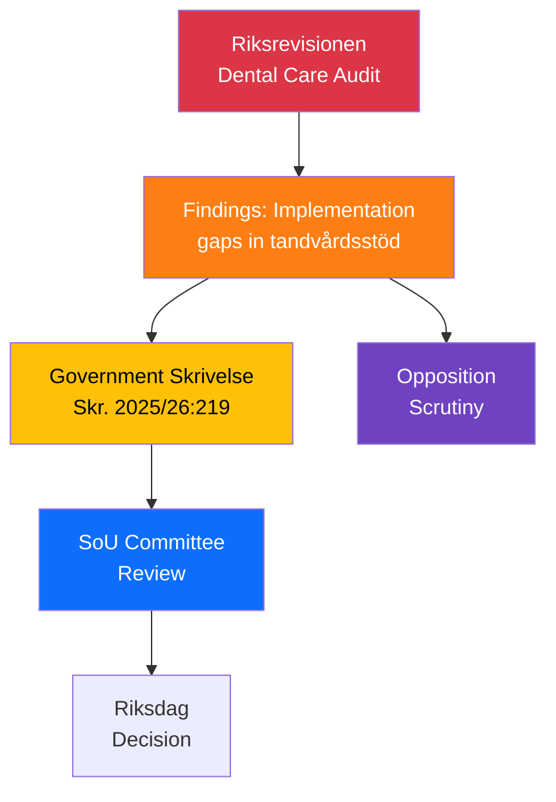

# Document Analysis: Riksrevisionens rapport om tandvårdsstödet

**Generated**: 2026-04-08 18:32 UTC
**dok_id**: HD03219
**Document Type**: Government Skrivelse (Skr. 2025/26:219)
**Department**: Socialdepartementet
**Date**: 2026-04-08
**Riksmöte**: 2025/26
**Significance**: 🟡 Medium (5/10)
**Confidence**: HIGH (80%)

---

## Executive Summary

Government communication responding to the National Audit Office (Riksrevisionen) report on Sweden's dental care subsidy system. The audit identifies implementation gaps in the tandvårdsstöd system that affects millions of residents. The government's response via skrivelse indicates acknowledgment of findings but no immediate legislative action. [HIGH confidence]

## Accountability Flow

## SWOT Analysis

| Quadrant | Finding | Evidence | Confidence |
|----------|---------|----------|------------|
| **Strength** | Government acknowledges audit findings via formal skrivelse | HD03219 | HIGH |
| **Weakness** | Dental care subsidy gaps directly affect public trust in healthcare | Riksrevisionen findings | HIGH |
| **Opportunity** | Spring budget healthcare investments could address identified gaps | Budget presentation April 7 | MEDIUM |
| **Threat** | Opposition can use audit findings for campaign narrative on welfare failures | SoU debate expected | MEDIUM |

## Risk Assessment

| Risk | L | I | Score |
|------|---|---|-------|
| Public trust erosion in dental care system | 3 | 3 | 9 |
| Opposition election messaging on healthcare gaps | 3 | 3 | 9 |
| Delayed policy response beyond election | 2 | 3 | 6 |

## Forward Indicators

- **Watch**: SoU committee scheduling for dental care debate [MEDIUM confidence]
- **Watch**: S healthcare policy proposals referencing audit [MEDIUM confidence]
- **Watch**: Public media coverage of dental care subsidy issues [LOW-MEDIUM confidence]
