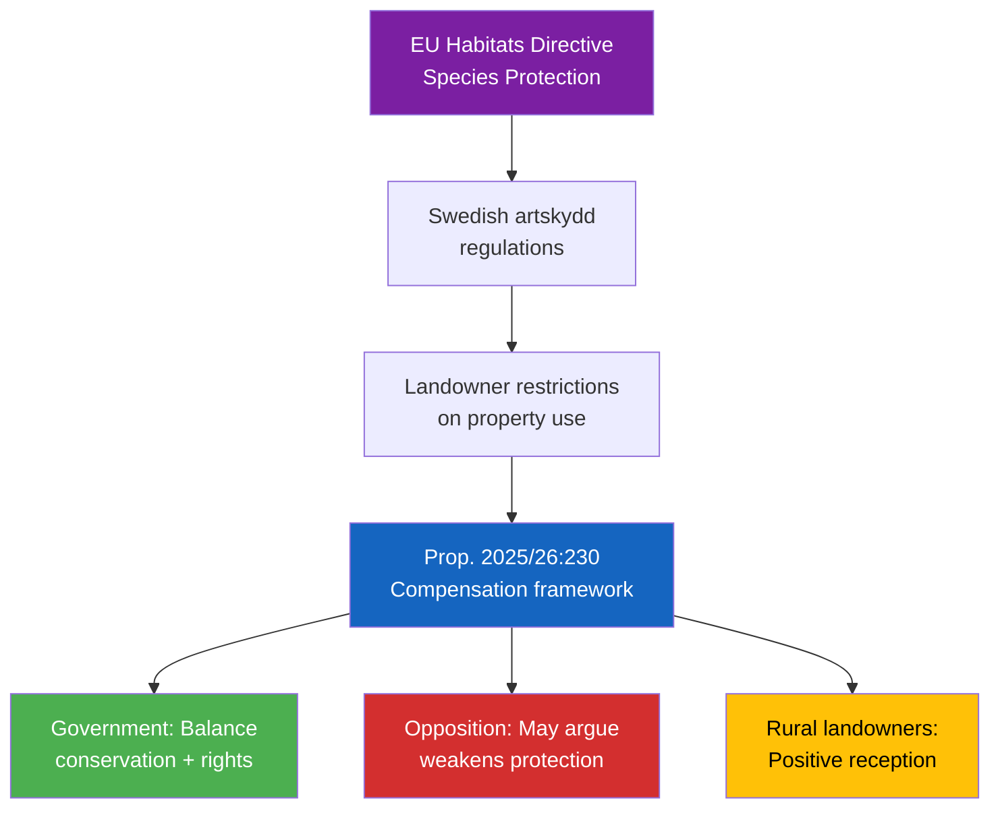

# Document Analysis: Ersättning vid rådighetsinskränkningar till följd av artskyddet

**Generated**: 2026-04-08 18:32 UTC
**dok_id**: HD03230
**Document Type**: Government Proposition
**Department**: Klimat- och näringslivsdepartementet
**Date**: 2026-04-08
**Riksmöte**: 2025/26
**Significance**: 🟡 Medium (6/10)
**Confidence**: HIGH (80%)

---

## Executive Summary

Government proposition establishing a compensation framework for landowners affected by species protection (artskydd) restrictions. This balances biodiversity conservation with property rights — a politically sensitive topic that intersects environmental policy, rural land use, and constitutional property protections. Published as Prop. 2025/26:230. [HIGH confidence]

## Policy Impact Flow

## SWOT Analysis

| Quadrant | Finding | Evidence | Confidence |
|----------|---------|----------|------------|
| **Strength** | Addresses longstanding landowner grievance | HD03230 — proposition from Klimat- och näringslivsdep | HIGH |
| **Strength** | Maintains biodiversity protection framework while adding compensation | Proposition text | MEDIUM |
| **Weakness** | Could be seen as weakening environmental protections | Potential MP/V criticism | MEDIUM |
| **Opportunity** | Builds rural support base for coalition ahead of election | Electoral calculation | MEDIUM |
| **Threat** | Environmental organizations may mount campaign against | Known artskydd advocacy groups | MEDIUM |

## Stakeholder Impact

| Stakeholder | Impact | Detail |
|-------------|--------|--------|
| Rural landowners | Strongly Positive | Compensation for property use restrictions |
| Environmental orgs | Negative | Perceived weakening of species protection |
| Government Coalition | Positive | Rural voter appeal; property rights narrative |
| MP/V | Negative | Contradicts environmental policy priorities |
| EU | Neutral | Must remain compliant with Habitats Directive |

## Risk Assessment

| Risk | L | I | Score |
|------|---|---|-------|
| Electoral polarization (rural vs urban/green) | 3 | 4 | 12 |
| EU Habitats Directive compliance concern | 1 | 4 | 4 |
| Coalition partner friction (L green profile) | 2 | 3 | 6 |

## Forward Indicators

- **Watch**: MJU committee referral and debate scheduling [MEDIUM confidence]
- **Watch**: Environmental NGO responses (Naturskyddsföreningen, WWF) [HIGH confidence]
- **Watch**: MP and V rhetorical response in plenary debates [MEDIUM confidence]
