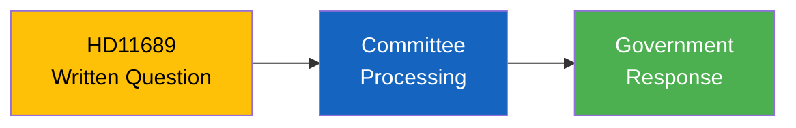

# Document Analysis: Miljotillstand - Environmental permits

**Generated**: 2026-04-08 18:33 UTC
**dok_id**: HD11689
**Document Type**: Written Question
**Date**: 2026-04-08
**Riksmöte**: 2025/26
**Significance**: 3/10
**Confidence**: MEDIUM (65%)

---

## Executive Summary

Written Question filed on Miljotillstand - Environmental permits in the Swedish Riksdag session 2025/26. This document is part of the parliamentary inquiry process and reflects ongoing policy debates. [MEDIUM confidence]

## Document Context

## SWOT Analysis

| Quadrant | Finding | Evidence | Confidence |
|----------|---------|----------|------------|
| **Strength** | Parliamentary scrutiny function activated | HD11689 filed | MEDIUM |
| **Weakness** | Individual questions have limited direct legislative impact | Standard process | HIGH |
| **Opportunity** | Contributes to broader policy debate narrative | Session context | MEDIUM |

## Risk Assessment

| Risk | L | I | Score |
|------|---|---|-------|
| Policy impact | 1 | 2 | 2 |
| Political signal | 2 | 2 | 4 |
