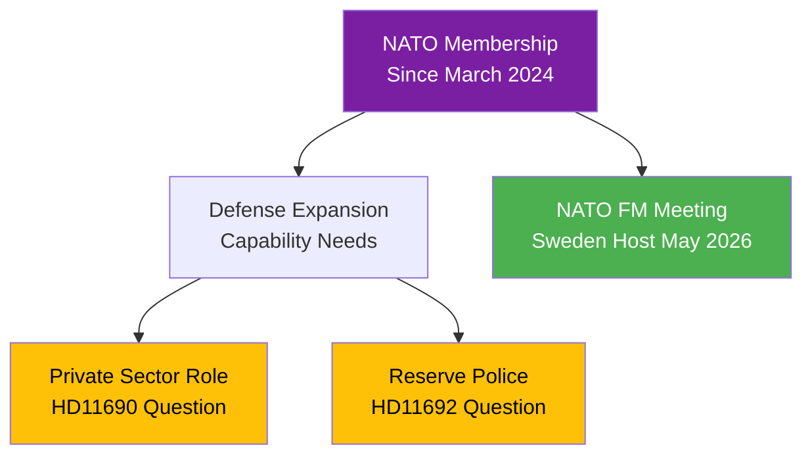

# Document Analysis: Privata aktörer i försvaret

**Generated**: 2026-04-08 18:32 UTC
**dok_id**: HD11690
**Document Type**: Written Question (skriftlig fråga)
**Date**: 2026-04-08
**Riksmöte**: 2025/26
**Significance**: 🟡 Medium (5/10)
**Confidence**: MEDIUM (70%)

---

## Executive Summary

Written question on private actors in Sweden's defense sector, raising concerns about defense privatization amid NATO integration. This question touches on a sensitive topic as Sweden deepens its NATO membership and considers how to expand defense capabilities rapidly. [MEDIUM confidence]

## Security Policy Context

## SWOT Analysis

| Quadrant | Finding | Evidence | Confidence |
|----------|---------|----------|------------|
| **Strength** | Parliamentary scrutiny of defense spending and contracting | HD11690 | MEDIUM |
| **Weakness** | Defense privatization debate could slow capability building | Procurement complexity | LOW-MEDIUM |
| **Opportunity** | Clear framework for private-public defense cooperation | NATO interoperability needs | MEDIUM |
| **Threat** | Privatization concerns could undermine public confidence in defense readiness | Media coverage risk | LOW-MEDIUM |

## Risk Assessment

| Risk | L | I | Score |
|------|---|---|-------|
| Defense capability delay from contracting debates | 2 | 4 | 8 |
| Public confidence in defense readiness | 2 | 3 | 6 |
