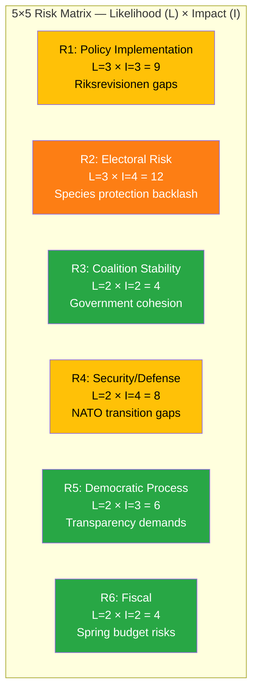

# Risk Assessment — 2026-04-08 Evening

**RSK-ID**: RSK-2026-04-08-EVE-2
**Generated**: 2026-04-08 18:30 UTC
**Riksmöte**: 2025/26
**Overall Risk**: MODERATE
**Confidence**: MEDIUM-HIGH
**Documents Analyzed**: 14

---

## Risk Heat Map

## Detailed Risk Assessment

### R1: Policy Implementation Risk (L=3 × I=3 = 9) — MODERATE
| Factor | Assessment |
|--------|-----------|
| **Trigger** | Riksrevisionen report on dental care subsidy (HD03219) exposes systemic implementation gaps |
| **Evidence** | Government skrivelse Skr. 2025/26:219 transmitted April 1; 3 related motions on Sida aid (HD024070-72) [HIGH confidence] |
| **Impact pathway** | Audit findings → media scrutiny → opposition pressure → forced policy adjustments |
| **Mitigation** | Government responding via skrivelse; committee referral process provides buffer time |
| **Forward indicator** | Watch SoU committee scheduling of dental care debate; watch UU committee on Sida motions |
| **Timeline** | 2-4 weeks for committee processing |

### R2: Electoral Risk (L=3 × I=4 = 12) — MODERATE-HIGH
| Factor | Assessment |
|--------|-----------|
| **Trigger** | Species protection compensation (Prop. 2025/26:230, HD03230) creates tension between environmental and rural voter blocs |
| **Evidence** | Proposition published April 8 from Klimat- och näringslivsdepartementet [HIGH confidence] |
| **Impact pathway** | Environmental groups oppose weakening protection → rural landowners demand compensation → coalition parties pulled in opposite directions |
| **Mitigation** | Framing as balance between conservation and property rights |
| **Forward indicator** | Watch MJU committee response; environmental NGO reactions; rural landowner association statements |
| **Timeline** | 3-6 months to legislative passage; electoral impact through 2026 election |

### R3: Coalition Stability (L=2 × I=2 = 4) — LOW
| Factor | Assessment |
|--------|-----------|
| **Trigger** | No visible coalition friction in today's activity |
| **Evidence** | Government maintaining joint legislative agenda; spring budget presented jointly [MEDIUM confidence] |
| **Mitigation** | Active legislative program and NATO hosting provide coalition unity narrative |

### R4: Security/Defense Risk (L=2 × I=4 = 8) — MODERATE
| Factor | Assessment |
|--------|-----------|
| **Trigger** | Written questions on defense privatization (HD11690) and reserve police (HD11692) signal capability concerns |
| **Evidence** | Two written questions filed today on defense readiness topics [MEDIUM confidence] |
| **Impact pathway** | Questions → media attention → public concern about defense capability during NATO transition |
| **Forward indicator** | Watch FöU committee response; defense procurement announcements |

### R5: Democratic Process Risk (L=2 × I=3 = 6) — LOW-MODERATE
| Factor | Assessment |
|--------|-----------|
| **Trigger** | Lobby register (HD11693) and public trust (HD11694) questions target institutional transparency |
| **Evidence** | Written questions filed today — recurring themes from KU debates [MEDIUM confidence] |
| **Forward indicator** | KU committee activity; election campaign transparency promises |

### R6: Fiscal Risk (L=2 × I=2 = 4) — LOW
| Factor | Assessment |
|--------|-----------|
| **Trigger** | Spring budget 2026 presented with targeted healthcare and education investments |
| **Evidence** | Government press release April 7; unemployment assessment positive [MEDIUM confidence] |
| **Mitigation** | Equilibrium unemployment declining for first time in 20 years provides positive fiscal narrative |

## Risk Summary Matrix

| Risk | L | I | Score | Trend | Watch Item |
|------|---|---|-------|-------|-----------|
| Electoral (HD03230) | 3 | 4 | **12** | ↗ Rising | MJU committee, environmental reactions |
| Policy Implementation | 3 | 3 | **9** | → Stable | SoU on dental, UU on Sida |
| Security/Defense | 2 | 4 | **8** | → Stable | FöU committee, NATO preparation |
| Democratic Process | 2 | 3 | **6** | → Stable | KU transparency agenda |
| Coalition Stability | 2 | 2 | **4** | ↘ Declining | Spring budget reception |
| Fiscal | 2 | 2 | **4** | ↘ Declining | Economic forecasts |
