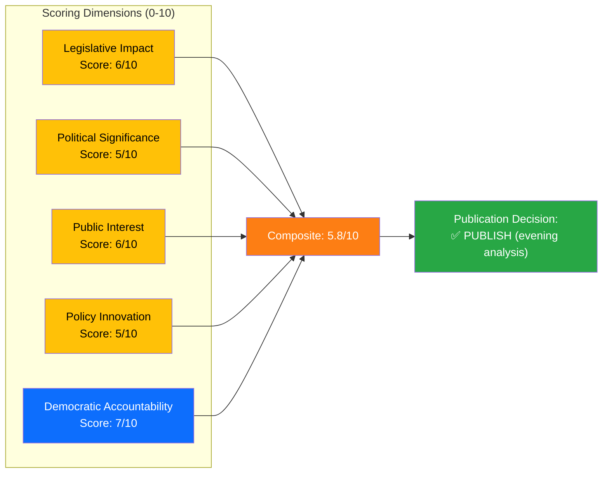

# Significance Scoring — 2026-04-08 Evening

**SIG-ID**: SIG-2026-04-08-EVE-2
**Generated**: 2026-04-08 18:31 UTC
**Riksmöte**: 2025/26
**Documents Scored**: 14
**Confidence**: MEDIUM-HIGH

---

## 5-Dimension Scoring

## Dimension Details

### 1. Legislative Impact (6/10)
- **NU18 Renewables Directive**: EU directive transposition with binding deadlines — high legislative weight [HIGH confidence]
- **HD03230 Species Protection**: New compensation framework — property law change [MEDIUM confidence]
- **HD03219 Dental Care**: Government skrivelse responding to audit — no legislative change required [MEDIUM confidence]

### 2. Political Significance (5/10)
- **Spring Budget 2026**: Major fiscal event but presented April 7 (yesterday) — residual significance today [HIGH confidence]
- **Sida motions**: Three coordinated motions signal organized opposition but low passage probability [MEDIUM confidence]
- **Written questions**: Individually low significance, collectively paint picture of opposition inquiry activity [LOW-MEDIUM confidence]

### 3. Public Interest (6/10)
- **Dental care**: Directly affects millions of residents — high public relevance [HIGH confidence]
- **EV premium**: Consumer fairness concern with broad interest [MEDIUM confidence]
- **Energy permits**: Indirect but significant impact on energy transition costs [MEDIUM confidence]

### 4. Policy Innovation (5/10)
- **Species protection compensation**: Novel legal framework balancing artskydd and property rights [MEDIUM confidence]
- **Renewables permitting**: Streamlining regulatory process — incremental but important [HIGH confidence]
- **Most items are status quo**: Written questions and motion responses largely reference existing policy [HIGH confidence]

### 5. Democratic Accountability (7/10)
- **Riksrevisionen findings**: Two audit reports driving accountability responses [HIGH confidence]
- **Opposition motions**: Three Sida motions demonstrate parliamentary scrutiny function [HIGH confidence]
- **Lobby register + public trust**: Written questions advance transparency discourse [MEDIUM confidence]
- **This is the day's strongest dimension** — multiple accountability mechanisms activated [HIGH confidence]

## Composite Score

| Dimension | Score | Weight | Weighted |
|-----------|-------|--------|----------|
| Legislative Impact | 6 | 0.25 | 1.50 |
| Political Significance | 5 | 0.20 | 1.00 |
| Public Interest | 6 | 0.20 | 1.20 |
| Policy Innovation | 5 | 0.15 | 0.75 |
| Democratic Accountability | 7 | 0.20 | 1.40 |
| **Composite** | | **1.00** | **5.85/10** |

## Publication Decision

**✅ PUBLISH** — Composite score 5.85/10 exceeds minimum threshold (5.0). The day features meaningful parliamentary activity with accountability themes (Riksrevisionen reports, opposition motions) and significant legislative events (EU directive transposition, species protection reform). Evening analysis warranted.
