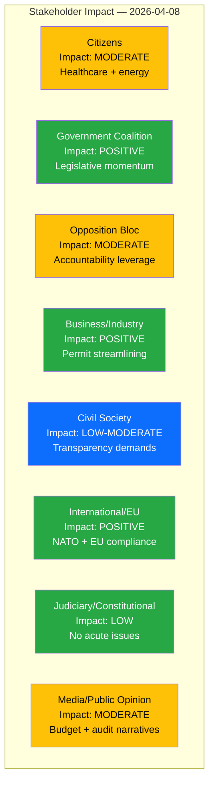

# Stakeholder Impact Analysis — 2026-04-08 Evening

**STA-ID**: STA-2026-04-08-EVE-2
**Generated**: 2026-04-08 18:31 UTC
**Riksmöte**: 2025/26
**Stakeholder Groups Assessed**: 8
**Confidence**: MEDIUM-HIGH

---

## Impact Radar

## Impact Summary Matrix

| Stakeholder Group | Overall Impact | Key Documents | Primary Concern | Confidence |
|-------------------|---------------|---------------|-----------------|------------|
| Citizens | MODERATE | HD03219 (dental), HD01NU18 (energy), Spring Budget | Healthcare access, energy transition costs | HIGH |
| Government Coalition | POSITIVE | HD01NU18, HD03230, Spring Budget | Maintaining legislative momentum pre-election | HIGH |
| Opposition Bloc | MODERATE | HD024070-72 (Sida motions), HD03219 | Leveraging audit findings for accountability narrative | HIGH |
| Business/Industry | POSITIVE | HD01NU18 (renewables permits), HD11689 (environmental permits) | Regulatory certainty, permit streamlining | MEDIUM |
| Civil Society | LOW-MODERATE | HD11693 (lobby register), HD11694 (public trust) | Democratic transparency, institutional reform | MEDIUM |
| International/EU | POSITIVE | HD01NU18 (EU directive), NATO FM meeting, Somalia strategy | EU compliance, NATO alliance deepening | HIGH |
| Judiciary/Constitutional | LOW | HD03230 (property rights), HD11693 (lobby register) | Legal clarity on compensation frameworks | LOW-MEDIUM |
| Media/Public Opinion | MODERATE | Spring Budget, HD03219, HD03230 | Budget narratives, Riksrevisionen coverage | MEDIUM |

## Detailed Group Analysis

### Citizens
- **Healthcare**: Dental care subsidy reform (HD03219) could improve access; spring budget invests in healthcare [HIGH]
- **Energy costs**: Renewables permit streamlining (HD01NU18) may reduce long-term energy costs [MEDIUM]
- **EV access**: Question on elbilspremie equality (HD11688) reflects consumer fairness concerns [LOW-MEDIUM]
- **Defense**: Reserve police (HD11692) and defense actors (HD11690) questions relate to civil protection [LOW]

### Government Coalition (M, KD, L + SD support)
- **Legislative delivery**: EU transposition (NU18) and species protection proposition (HD03230) demonstrate governance capacity [HIGH]
- **Budget narrative**: Spring budget with targeted investments strengthens election positioning [HIGH]
- **NATO credibility**: FM meeting hosting (May 21-22) reinforces security policy credibility [HIGH]
- **Vulnerability**: Riksrevisionen findings require defensive communication on dental care and Sida [MEDIUM]

### Opposition Bloc (S, V, MP, C)
- **Accountability leverage**: Three coordinated Sida motions (HD024070-72) by S — organized response to audit [HIGH]
- **Environmental critique**: Species protection compensation (HD03230) provides ammunition for MP/V environmental narrative [MEDIUM]
- **Healthcare scrutiny**: Dental care audit (HD03219) supports S welfare state critique [MEDIUM]

### Business/Industry
- **Positive**: Renewables permit reform (HD01NU18) directly benefits renewable energy sector [HIGH]
- **Mixed**: Species protection compensation (HD03230) — landowner benefit but regulatory complexity [MEDIUM]
- **STEM investment**: Government STEM education spending improves workforce pipeline [LOW-MEDIUM]

### Civil Society
- **Transparency**: Lobby register demand (HD11693) aligns with anti-corruption agenda [MEDIUM]
- **Healthcare equity**: Quality registries question (HD11687) highlights data-driven care equity [LOW-MEDIUM]
- **Humanitarian**: Sida audit motions (HD024070-72) engage development NGOs [MEDIUM]

### International/EU
- **EU alignment**: Renewables Directive transposition (HD01NU18) demonstrates compliance [HIGH]
- **NATO integration**: Sweden hosting FM meeting signals deepening commitment [HIGH]
- **Development policy**: Somalia strategy + Sida audit responses affect international credibility [MEDIUM]
- **Human rights**: Chechnya status question (HD11691) and Israel death penalty interpellation (HD10426) signal engagement [LOW-MEDIUM]

### Judiciary/Constitutional
- **Property law**: Species protection compensation framework (HD03230) creates new legal precedent [MEDIUM]
- **Constitutional reform**: Lobby register (HD11693) is recurring constitutional question [LOW-MEDIUM]

### Media/Public Opinion
- **Lead stories**: Spring Budget 2026 dominates news cycle [HIGH]
- **Investigative angle**: Riksrevisionen dental care and Sida reports provide investigative hooks [MEDIUM]
- **International**: NATO FM hosting generates positive coverage [MEDIUM]
