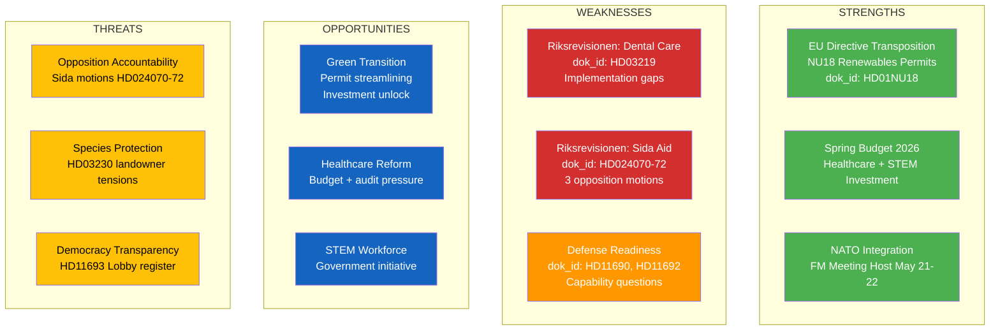

# Political SWOT Analysis — 2026-04-08 Evening

**SWT-ID**: SWT-2026-04-08-EVE-2
**Generated**: 2026-04-08 18:30 UTC
**Riksmöte**: 2025/26
**Confidence**: MEDIUM-HIGH
**Documents Analyzed**: 14
**Produced By**: AI-driven deep analysis

---

## SWOT Quadrant Map

## Detailed SWOT by Stakeholder Group

### 1. Citizens
| Quadrant | Finding | Evidence | Confidence |
|----------|---------|----------|------------|
| Strength | Healthcare investment in spring budget | Gov press release 2026-04-07 | HIGH |
| Weakness | Dental care subsidy gaps identified by Riksrevisionen | HD03219 | HIGH |
| Opportunity | Improved renewable energy permitting could reduce energy costs | HD01NU18 | MEDIUM |
| Threat | Species protection compensation may increase rural-urban tensions | HD03230 | MEDIUM |

### 2. Government Coalition (M, KD, L + SD support)
| Quadrant | Finding | Evidence | Confidence |
|----------|---------|----------|------------|
| Strength | Active legislative agenda — EU transposition, property law, budget | HD01NU18, HD03230, Spring Budget | HIGH |
| Strength | NATO FM hosting demonstrates foreign policy credibility | Gov press release | HIGH |
| Weakness | Riksrevisionen findings require government response on dental care and Sida | HD03219, HD024070 | HIGH |
| Opportunity | Spring budget investments in healthcare and education as election platform | Budget presentation | MEDIUM |
| Threat | Three coordinated Sida motions signal organized opposition challenge | HD024070, HD024071, HD024072 | MEDIUM |

### 3. Opposition Bloc (S, V, MP, C)
| Quadrant | Finding | Evidence | Confidence |
|----------|---------|----------|------------|
| Strength | Leveraging Riksrevisionen audit findings for accountability | HD024070-72 (S motions) | HIGH |
| Weakness | Limited ability to block EU directive transposition (NU18) | HD01NU18 | MEDIUM |
| Opportunity | Defense readiness questions can expose NATO transition gaps | HD11690, HD11692 | MEDIUM |
| Threat | Government spring budget may undercut opposition welfare narrative | Budget | LOW-MEDIUM |

### 4. Business/Industry
| Quadrant | Finding | Evidence | Confidence |
|----------|---------|----------|------------|
| Strength | Renewable energy permit streamlining benefits green industry | HD01NU18 | HIGH |
| Weakness | Species protection compensation adds regulatory uncertainty | HD03230 | MEDIUM |
| Opportunity | STEM education investment improves long-term talent pipeline | Gov press release | MEDIUM |
| Threat | Environmental permit concerns (HD11689) signal regulatory friction | HD11689 | LOW-MEDIUM |

### 5. Civil Society
| Quadrant | Finding | Evidence | Confidence |
|----------|---------|----------|------------|
| Strength | Lobby register question (HD11693) advances transparency agenda | HD11693 | MEDIUM |
| Weakness | National quality registries (HD11687) need reform for equity | HD11687 | LOW-MEDIUM |
| Opportunity | Humanitarian aid accountability (Sida motions) strengthens oversight | HD024070-72 | MEDIUM |
| Threat | Defense privatization (HD11690) could reduce civilian oversight | HD11690 | LOW |

### 6. International/EU
| Quadrant | Finding | Evidence | Confidence |
|----------|---------|----------|------------|
| Strength | EU Renewables Directive transposition on schedule | HD01NU18 | HIGH |
| Strength | NATO FM meeting hosting signals strong alliance commitment | Gov press release | HIGH |
| Weakness | Chechnya status question (HD11691) signals human rights concerns | HD11691 | LOW-MEDIUM |
| Opportunity | Somalia development strategy aligns with EU global partnership | Gov press release | MEDIUM |

### 7. Judiciary/Constitutional
| Quadrant | Finding | Evidence | Confidence |
|----------|---------|----------|------------|
| Strength | Species protection compensation framework provides legal clarity | HD03230 | MEDIUM |
| Weakness | Lobby register absence remains constitutional gap | HD11693 | MEDIUM |
| Opportunity | Public trust appointments question could strengthen institutional norms | HD11694 | LOW-MEDIUM |

### 8. Media/Public Opinion
| Quadrant | Finding | Evidence | Confidence |
|----------|---------|----------|------------|
| Strength | Spring budget narrative dominates media cycle | Budget presentation | HIGH |
| Weakness | Riksrevisionen reports provide ammunition for critical coverage | HD03219 | MEDIUM |
| Opportunity | NATO hosting creates positive international image | Gov press release | MEDIUM |
| Threat | Species protection vs landowner debate could polarize rural coverage | HD03230 | MEDIUM |

## Key SWOT Findings

1. Government coalition maintaining legislative momentum with EU transposition and spring budget [HIGH confidence]
2. Riksrevisionen findings on dental care and Sida create accountability vulnerabilities [HIGH confidence]
3. Opposition coordinating around audit findings with three targeted motions [MEDIUM confidence]
4. NATO integration and defense questions emerging as significant policy theme [MEDIUM confidence]
