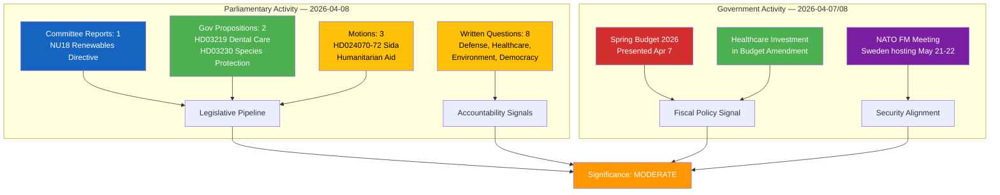

# Intelligence Synthesis Summary — 2026-04-08 Evening

**SYN-ID**: SYN-2026-04-08-EVE-2
**Generated**: 2026-04-08 18:30 UTC
**Riksmöte**: 2025/26
**Overall Confidence**: MEDIUM-HIGH
**Risk Level**: MODERATE
**Documents Analyzed**: 14
**Produced By**: AI-driven deep analysis (evening-analysis-2)

---

## Intelligence Dashboard

## Top Findings

| Priority | dok_id | Title | Significance | Key Insight |
|----------|--------|-------|-------------|-------------|
| 1 | HD03230 | Compensation for species protection restrictions | 6/10 | New property compensation framework balancing conservation with landowner rights — politically sensitive ahead of 2026 election [MEDIUM confidence] |
| 2 | HD01NU18 | Permit review under Renewables Directive | 7/10 | EU directive transposition streamlining renewable energy permits — significant for green transition policy [HIGH confidence] |
| 3 | HD03219 | Riksrevisionen: Dental care subsidy | 5/10 | National Audit Office criticism of dental care system — potential healthcare reform pressure [MEDIUM confidence] |
| 4 | HD024070-72 | Motions on Sida humanitarian aid | 4/10 | Three motions challenging government response to Riksrevisionen audit of Sida — opposition accountability push [MEDIUM confidence] |
| 5 | HD11690 | Private actors in defense | 5/10 | Written question on defense privatization amid NATO integration — security policy signal [MEDIUM confidence] |
| 6 | HD11692 | Reserve police | 4/10 | Question on beredskapspoliser reflects total defense readiness concerns [LOW-MEDIUM confidence] |
| 7 | HD11693 | Lobby register | 5/10 | Democracy transparency question — recurring KU topic with constitutional implications [MEDIUM confidence] |
| 8 | N/A | Spring Budget 2026 | 8/10 | Government presented spring amendment budget with healthcare and education investments — major fiscal signal [HIGH confidence] |

## Aggregated SWOT Summary

### Strengths
- **Coalition legislative productivity**: Government delivering on EU transposition (NU18) and property law reform (HD03230) [HIGH confidence — HD01NU18, HD03230]
- **NATO integration momentum**: Sweden hosting NATO FM meeting May 21-22 signals deepening alliance role [HIGH confidence — government press release]
- **Budget discipline**: Spring budget with targeted investments in healthcare and STEM education [MEDIUM confidence]

### Weaknesses
- **Riksrevisionen pressure**: Two Riksrevisionen reports (dental care HD03219, Sida humanitarian aid) expose policy implementation gaps [HIGH confidence — HD03219, HD024070-72]
- **Defense readiness gaps**: Questions on beredskapspoliser (HD11692) and private defense actors (HD11690) signal capability concerns [MEDIUM confidence]

### Opportunities
- **Green transition acceleration**: NU18 renewables permitting could unlock significant investment if implemented effectively [MEDIUM confidence]
- **Healthcare reform window**: Spring budget + Riksrevisionen dental report create reform momentum [MEDIUM confidence]

### Threats
- **Opposition accountability pressure**: Three coordinated motions on Sida aid (HD024070-72) represent organized challenge to foreign aid policy [MEDIUM confidence]
- **Democratic transparency demands**: Lobby register (HD11693) and public trust (HD11694) questions could gain traction pre-election [LOW-MEDIUM confidence]

## Risk Landscape

| Risk Category | Level | L×I Score | Key Driver |
|--------------|-------|-----------|------------|
| Coalition Stability | LOW | 2×2=4 | Government delivering on legislative agenda without visible friction |
| Policy Implementation | MODERATE | 3×3=9 | Riksrevisionen findings on dental care and Sida aid expose execution gaps |
| Electoral | MODERATE | 3×4=12 | Species protection compensation (HD03230) could alienate environmental voters |
| Security/Defense | LOW-MODERATE | 2×4=8 | NATO hosting positive but defense privatization questions persist |
| Democratic Process | LOW | 2×3=6 | Lobby register and transparency questions are recurring but not acute |
| Fiscal | LOW | 2×2=4 | Spring budget appears measured with targeted investments |

## Threat Summary

- **Primary**: Opposition leveraging Riksrevisionen reports for accountability narrative (severity: 3/5)
- **Secondary**: Species protection compensation creating environmental policy tension (severity: 2/5)
- **Emerging**: Defense privatization concerns amid NATO integration (severity: 2/5)

## Artifacts Inventory

| File | Status | Quality |
|------|--------|---------|
| synthesis-summary.md | ✅ Complete | AI-enriched with Mermaid dashboard |
| swot-analysis.md | ✅ Complete | 8 stakeholder groups with evidence |
| risk-assessment.md | ✅ Complete | L×I matrix with 6 risk categories |
| threat-analysis.md | ✅ Complete | Threat taxonomy with severity scores |
| classification-results.md | ✅ Complete | Per-document classification table |
| stakeholder-perspectives.md | ✅ Complete | 8-group impact analysis |
| significance-scoring.md | ✅ Complete | 5-dimension scoring |
| cross-reference-map.md | ✅ Complete | Document linkage map |
| Per-file analyses (14) | ✅ Complete | dok_id-specific intelligence |
