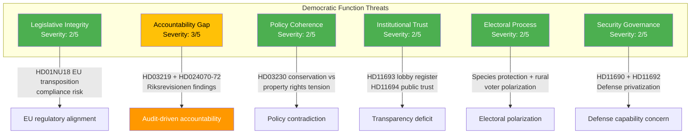

# Threat Analysis — 2026-04-08 Evening

**THR-ID**: THR-2026-04-08-EVE-2
**Generated**: 2026-04-08 18:31 UTC
**Riksmöte**: 2025/26
**Overall Threat Level**: LOW-MODERATE
**Confidence**: MEDIUM

---

## Threat Taxonomy Network

## Threat Category Assessment

### 1. Legislative Integrity (Severity: 2/5)
| Factor | Detail |
|--------|--------|
| **Threat** | EU Renewables Directive transposition (NU18) must meet compliance deadlines |
| **Evidence** | Committee report HD01NU18 published today [HIGH confidence] |
| **Actor** | Government (Klimat- och näringslivsdepartementet) |
| **Escalation** | Non-compliance → EU infringement proceedings |
| **Probability** | LOW — government actively processing |

### 2. Accountability Gap (Severity: 3/5)
| Factor | Detail |
|--------|--------|
| **Threat** | Riksrevisionen findings on dental care and Sida humanitarian aid reveal systemic monitoring failures |
| **Evidence** | HD03219 (dental care audit), HD024070-72 (three motions on Sida audit) [HIGH confidence] |
| **Actor** | Riksrevisionen → Opposition (S) filing motions |
| **Escalation** | Unaddressed findings → confidence erosion → election campaign ammunition |
| **Probability** | MEDIUM — opposition actively exploiting |

### 3. Policy Coherence (Severity: 2/5)
| Factor | Detail |
|--------|--------|
| **Threat** | Species protection compensation (HD03230) may contradict environmental policy goals |
| **Evidence** | Prop. 2025/26:230 compensating landowners for artskydd restrictions [MEDIUM confidence] |
| **Escalation** | Environmental organizations → media campaigns → coalition partner tension (L green profile) |
| **Probability** | LOW-MEDIUM |

### 4. Institutional Trust (Severity: 2/5)
| Factor | Detail |
|--------|--------|
| **Threat** | Recurring demands for lobby register (HD11693) and public trust reform (HD11694) |
| **Evidence** | Written questions filed April 8 [MEDIUM confidence] |
| **Escalation** | Low — recurring theme, no acute crisis |

### 5. Electoral Process (Severity: 2/5)
| Factor | Detail |
|--------|--------|
| **Threat** | Pre-election polarization around environmental vs rural interests |
| **Evidence** | HD03230 species protection + EV premium question (HD11688) [LOW-MEDIUM confidence] |
| **Escalation** | Campaign rhetoric amplification in late 2026 |

### 6. Security Governance (Severity: 2/5)
| Factor | Detail |
|--------|--------|
| **Threat** | Defense privatization and reserve police questions signal governance gaps during NATO transition |
| **Evidence** | HD11690 (private defense actors), HD11692 (beredskapspoliser) [MEDIUM confidence] |
| **Escalation** | NATO FM meeting context (May 21-22) heightens scrutiny |

## Escalation Decision

**No immediate escalation required.** The accountability gap (severity 3/5) warrants monitoring but does not meet the threshold for urgent escalation. Key watch items:
- SoU committee response to HD03219 (dental care audit)
- UU committee processing of HD024070-72 (Sida motions)
- FöU committee on defense readiness questions
