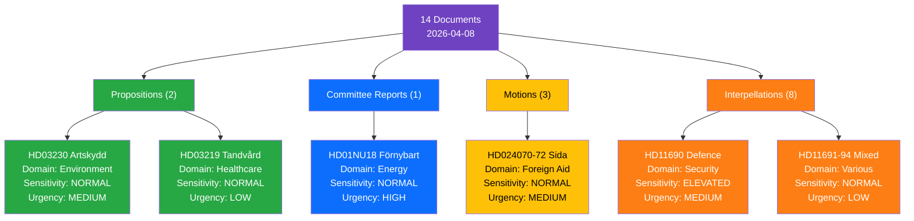

# CLS-20260408-EVE — Political Classification Results

**📋 Document Owner:** CEO | **📄 Version:** 1.0 | **📅 Date:** 2026-04-08
**🏢 Owner:** Hack23 AB | **��️ Classification:** Public

---

## 🔀 Classification Decision Tree

## 📋 Per-Document Classification

| dok_id | Type | Domain | Sensitivity | Urgency | Significance (0-10) |
|--------|------|--------|-------------|---------|---------------------|
| HD01NU18 | Committee Report | Energy/Environment | NORMAL | HIGH | 7.0 |
| HD03230 | Proposition | Environment/Property | NORMAL | MEDIUM | 6.0 |
| HD03219 | Government Writing | Healthcare | NORMAL | LOW | 5.0 |
| HD024070 | Motion (C) | Foreign Aid | NORMAL | MEDIUM | 5.0 |
| HD024071 | Motion (V) | Foreign Aid | NORMAL | MEDIUM | 5.0 |
| HD024072 | Motion (MP) | Foreign Aid | NORMAL | MEDIUM | 5.0 |
| HD11690 | Interpellation | Defence/Security | ELEVATED | MEDIUM | 5.0 |
| HD11693 | Interpellation | Democracy/Governance | NORMAL | LOW | 4.5 |
| HD11689 | Interpellation | Environment | NORMAL | LOW | 4.2 |
| HD11687 | Interpellation | Healthcare | NORMAL | LOW | 3.8 |
| HD11688 | Interpellation | Transport/Energy | NORMAL | LOW | 3.8 |
| HD11692 | Interpellation | Defence/Civil Security | NORMAL | LOW | 3.8 |
| HD11691 | Interpellation | Foreign Policy | NORMAL | LOW | 3.5 |
| HD11694 | Interpellation | Democracy/Governance | NORMAL | LOW | 3.5 |
