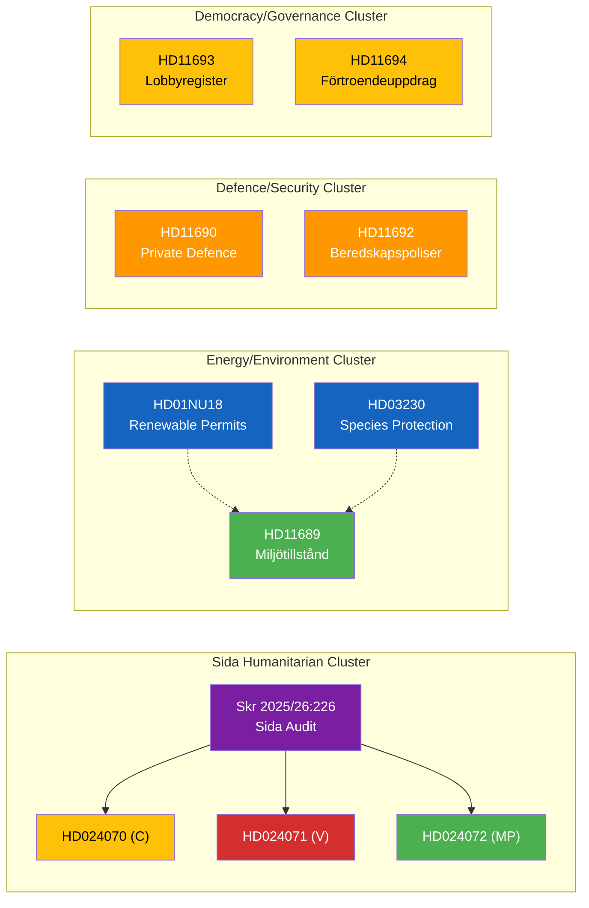

# Cross-Reference Map — 2026-04-08

**📅 Date:** 2026-04-08 | **📊 Confidence:** MEDIUM-HIGH

## Document Linkages

## Key Cross-References

| Source | Target | Relationship | Significance |
|--------|--------|-------------|--------------|
| HD024070, HD024071, HD024072 | Skr 2025/26:226 | All three motions respond to same Riksrevision audit | **HIGH** — coordinated opposition response |
| HD01NU18 | HD11689 | Both concern environmental permit processes | **MEDIUM** — regulatory coherence |
| HD03230 | HD11689 | Species protection intersects environmental permits | **MEDIUM** — policy overlap |
| HD11690 | HD11692 | Both address defence/security capacity | **LOW** — thematic connection |
| HD11693 | HD11694 | Both address democratic governance transparency | **LOW** — thematic connection |
