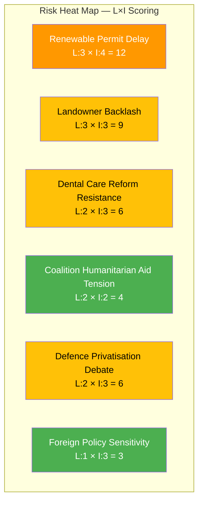

# RSK-20260408-EVE — Political Risk Assessment

**📋 Document Owner:** CEO | **📄 Version:** 1.0 | **📅 Date:** 2026-04-08
**🏢 Owner:** Hack23 AB | **🏷️ Classification:** Public
**🔗 Riksmöte:** 2025/26 | **📊 Confidence:** MEDIUM-HIGH

---

## 🔥 Risk Heat Map

## 📋 Risk Register

| ID | Risk | Category | Likelihood (1-5) | Impact (1-5) | L×I | Trend | dok_id | Mitigation |
|----|------|----------|------------------|--------------|-----|-------|--------|-----------|
| RSK-01 | Renewable energy permit reform delays due to implementation complexity | Policy | 3 | 4 | 12 | → Stable | HD01NU18 | Committee fast-tracking, EU pressure maintains momentum |
| RSK-02 | Rural/landowner pushback on species protection compensation scope | Electoral | 3 | 3 | 9 | ↑ Rising | HD03230 | Phased implementation, stakeholder consultation |
| RSK-03 | Dental care subsidy reform stalls after audit findings | Budget | 2 | 3 | 6 | → Stable | HD03219 | Cross-party consensus potential on healthcare spending |
| RSK-04 | Opposition alignment on humanitarian aid creates government pressure | Coalition | 2 | 2 | 4 | → Stable | HD024070-72 | Government can absorb as constructive criticism |
| RSK-05 | Defence privatisation debate exposes coalition disagreements | Coalition | 2 | 3 | 6 | → Stable | HD11690 | Strong defence consensus limits damage potential |
| RSK-06 | Chechnya interpellation creates diplomatic sensitivity | External | 1 | 3 | 3 | → Stable | HD11691 | Standard interpellation handling, limited escalation risk |

## 📊 Coalition Stability Assessment

**Overall Coalition Risk: LOW (4/10)** **[HIGH confidence]**

The Tidö coalition (M, KD, L with SD support) faces no immediate destabilising pressures from today's activity. The renewable energy and species protection propositions advance government policy priorities. The Sida motions represent standard opposition oversight. No votes were held today that could test coalition discipline.

## 🔮 Forward Risk Indicators

| Indicator | Trigger | Timeline | Early Warning |
|-----------|---------|----------|---------------|
| NU18 committee deliberation | Vote scheduling in NU | 2-4 weeks | Committee agenda publication |
| Species protection prop referral | Standard committee referral process | 1-2 weeks | Talman decision |
| Sida motion handling (UU) | Committee prioritisation | 2-6 weeks | UU agenda |
| Defence interpellation scheduling | Chamber scheduling | 1-3 weeks | Riksdag calendar |
