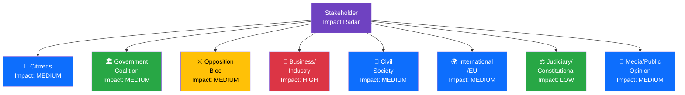

# STA-20260408-EVE — Stakeholder Impact Analysis

**📋 Document Owner:** CEO | **📄 Version:** 1.0 | **📅 Date:** 2026-04-08
**🏢 Owner:** Hack23 AB | **🏷️ Classification:** Public
**🔗 Riksmöte:** 2025/26 | **📊 Confidence:** MEDIUM-HIGH

---

## 🎯 Impact Radar

## 📊 Impact Summary Matrix

| Stakeholder Group | Impact Level | Key Documents | Assessment | Confidence |
|-------------------|-------------|---------------|------------|------------|
| 👥 **Citizens** | MEDIUM | HD03219, HD01NU18 | Dental care audit raises welfare quality questions; renewable energy permits could lower energy costs long-term | **[HIGH]** |
| ��️ **Government Coalition** | MEDIUM | HD03230, HD01NU18, HD03219 | Advancing policy agenda on renewables and species protection; dental care audit requires response | **[HIGH]** |
| ⚔️ **Opposition Bloc** | MEDIUM | HD024070-72, HD11687-94 | Active oversight through Sida motions (C, V, MP) and interpellations; constructive rather than confrontational | **[HIGH]** |
| 💼 **Business/Industry** | HIGH | HD01NU18, HD03230 | Renewable energy permit streamlining directly benefits energy sector; species protection compensation affects land-use industries | **[HIGH]** |
| 🤝 **Civil Society** | MEDIUM | HD024070-72, HD11693 | Humanitarian aid effectiveness and lobby transparency directly affect civil society interests | **[MEDIUM]** |
| 🌍 **International/EU** | MEDIUM | HD01NU18, HD024070-72, HD11691 | EU renewable directive compliance signals; Sida effectiveness under scrutiny; Chechnya diplomacy | **[MEDIUM]** |
| ⚖️ **Judiciary/Constitutional** | LOW | HD11693, HD11694 | Lobby register and public trust office interpellations touch on constitutional governance | **[MEDIUM]** |
| 📰 **Media/Public Opinion** | MEDIUM | HD03219, HD11693 | Dental care audit and lobby register have clear public interest angles; species protection debate generates rural media attention | **[HIGH]** |
