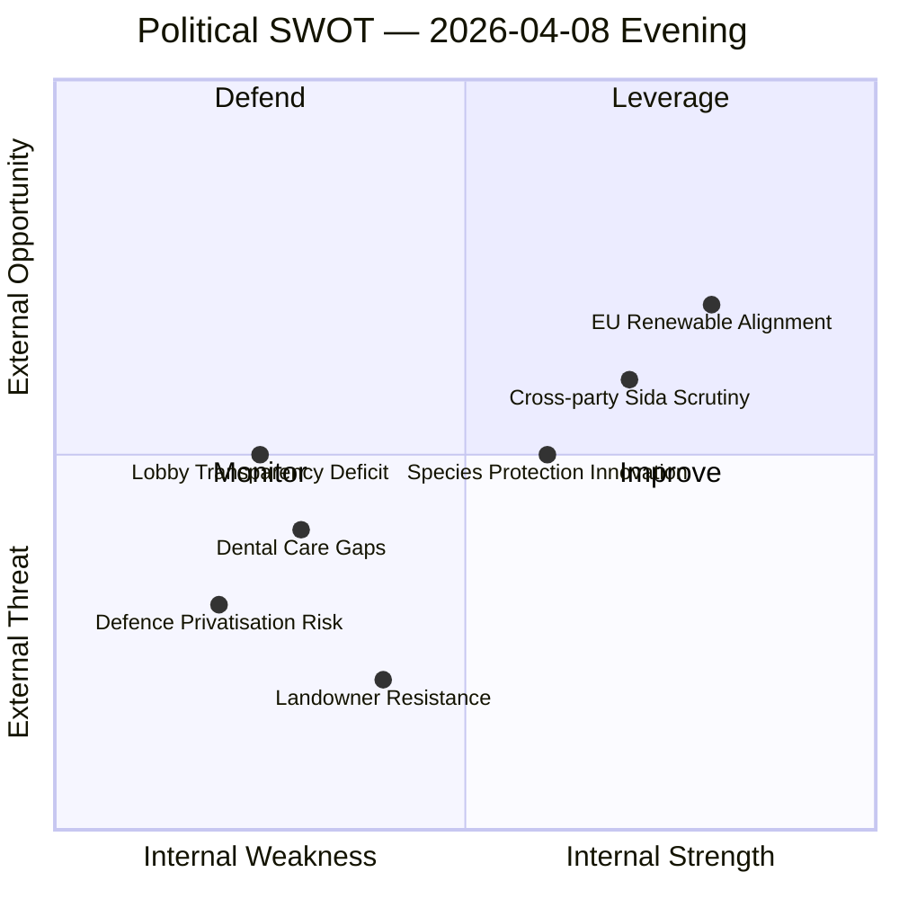

# SWT-20260408-EVE — Political SWOT Analysis

**📋 Document Owner:** CEO | **📄 Version:** 1.0 | **📅 Date:** 2026-04-08
**🏢 Owner:** Hack23 AB | **🏷️ Classification:** Public
**🔗 Riksmöte:** 2025/26 | **📊 Confidence:** MEDIUM-HIGH

---

## 📊 SWOT Quadrant Map

## 💪 Strengths

| Evidence | dok_id | Confidence | Stakeholder Impact |
|----------|--------|------------|-------------------|
| Sweden advancing EU renewable energy directive permit streamlining through NU18 — positions Sweden as green energy leader | HD01NU18 | **[HIGH]** | Government Coalition, Business/Industry, International/EU |
| Three opposition parties (C, V, MP) independently filed motions on Sida humanitarian audit — demonstrates robust democratic scrutiny of foreign aid | HD024070, HD024071, HD024072 | **[HIGH]** | Citizens, Opposition Bloc, International/EU |
| Novel compensation framework for species protection restrictions (Prop 230) shows policy innovation balancing environmental and property rights | HD03230 | **[MEDIUM]** | Government Coalition, Business/Industry, Civil Society |
| Active interpellation agenda covering defence (HD11690, HD11692), democracy (HD11693, HD11694), and environment (HD11689) — parliament functioning as effective oversight body | HD11690-94 | **[HIGH]** | Citizens, Media/Public Opinion |

## ⚠️ Weaknesses

| Evidence | dok_id | Confidence | Stakeholder Impact |
|----------|--------|------------|-------------------|
| Riksrevision audit reveals structural deficiencies in dental care subsidy system — government response (Skr 219) acknowledges issues without concrete timeline | HD03219 | **[HIGH]** | Citizens, Government Coalition |
| No formal lobby register despite recurring interpellations (HD11693) — democratic transparency gap persists | HD11693 | **[MEDIUM]** | Citizens, Media/Public Opinion, Judiciary/Constitutional |
| Unresolved framework for private sector defence participation amid heightened security environment | HD11690 | **[MEDIUM]** | Government Coalition, Business/Industry |
| Environmental permit complexity (HD11689) persists alongside renewable energy push — potential policy contradiction | HD11689, HD01NU18 | **[LOW]** | Business/Industry, Civil Society |

## 🚀 Opportunities

| Evidence | dok_id | Confidence | Stakeholder Impact |
|----------|--------|------------|-------------------|
| NU18 renewable energy permit streamlining could unlock significant investment — EU alignment creates market certainty | HD01NU18 | **[HIGH]** | Business/Industry, International/EU, Citizens |
| Cross-party humanitarian aid scrutiny (C+V+MP) creates reform pressure on Sida — potential for bipartisan efficiency improvements | HD024070-72 | **[MEDIUM]** | International/EU, Civil Society |
| Species protection compensation framework (HD03230) could become model for other EU member states | HD03230 | **[MEDIUM]** | International/EU, Government Coalition |
| Beredskapspoliser interpellation (HD11692) signals potential civil defence expansion opportunity | HD11692 | **[LOW]** | Citizens, Government Coalition |

## ⚡ Threats

| Evidence | dok_id | Confidence | Stakeholder Impact |
|----------|--------|------------|-------------------|
| Landowner and rural constituency backlash against species protection compensation scheme — potential coalition stress with C-aligned rural voters | HD03230 | **[MEDIUM]** | Government Coalition, Opposition Bloc |
| Chechnya status interpellation (HD11691) exposes foreign policy sensitivity — risk of diplomatic friction | HD11691 | **[LOW]** | International/EU, Government Coalition |
| Private defence actors debate (HD11690) could reveal coalition disagreements on defence procurement models | HD11690 | **[LOW]** | Government Coalition, Business/Industry |
| Dental care subsidy system strain (HD03219) could escalate into broader welfare state credibility issue before 2026 election | HD03219 | **[MEDIUM]** | Citizens, Opposition Bloc, Media/Public Opinion |
