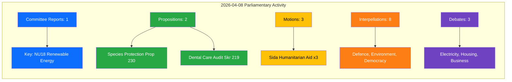

# SYN-20260408-EVE — Daily Intelligence Synthesis

**📋 Document Owner:** CEO | **📄 Version:** 1.0 | **📅 Date:** 2026-04-08 (UTC)
**🏢 Owner:** Hack23 AB | **🏷️ Classification:** Public
**🔗 Riksmöte:** 2025/26 | **📊 Confidence:** MEDIUM-HIGH
**🤖 Analyst:** news-evening-analysis workflow

---

## 📊 Intelligence Dashboard

## 🎯 Top Findings

| Priority | dok_id | Title | Significance | Key Insight |
|----------|--------|-------|-------------|-------------|
| 🔴 HIGH | HD01NU18 | Tillståndsprövning enligt förnybartdirektivet | 7/10 | EU renewable energy directive implementation — streamlining permit processes for green energy projects |
| 🟠 MEDIUM-HIGH | HD03230 | Ersättning vid rådighetsinskränkningar (artskyddet) | 6/10 | New compensation framework for landowners affected by species protection — balances environmental and property rights |
| 🟡 MEDIUM | HD03219 | Riksrevisionens rapport om tandvårdsstödet | 5/10 | Government response to national audit of dental care subsidies — potential reform signals |
| 🟡 MEDIUM | HD024070-72 | Sida humanitarian aid audit motions (C, V, MP) | 6/10 | Three opposition parties challenge government on humanitarian aid — signals cross-party concern |
| 🔵 INFO | HD11690 | Privata aktörer i försvaret | 5/10 | Interpellation on private defence sector actors — defence policy debate deepening |
| 🔵 INFO | HD11693 | Lobbyregister | 4/10 | Lobby register interpellation — democratic transparency agenda |

## 📋 Aggregated SWOT

### Strengths
- **EU alignment on renewables** (HD01NU18): Sweden advancing permit streamlining ahead of many EU peers **[HIGH]**
- **Cross-party humanitarian concern** (HD024070-72): C, V, and MP all filed motions on Sida audit — indicates broad democratic scrutiny **[HIGH]**
- **Species protection innovation** (HD03230): Novel compensation framework shows policy creativity **[MEDIUM]**

### Weaknesses
- **Dental care subsidy gaps** (HD03219): Riksrevision audit identifies structural issues in dental care support system **[HIGH]**
- **Defence privatisation questions** (HD11690): Unresolved framework for private sector defence participation **[MEDIUM]**
- **Lobby transparency deficit** (HD11693): Continued absence of formal lobby register **[MEDIUM]**

### Opportunities
- **Green energy acceleration**: NU18 could unlock significant renewable capacity through faster permitting **[HIGH]**
- **Humanitarian aid reform**: Three-party motion pressure could improve Sida's effectiveness **[MEDIUM]**
- **Constitutional modernisation**: Lobby register and transparency reforms gaining momentum **[LOW]**

### Threats
- **Landowner resistance** (HD03230): Compensation scheme may face rural constituency pushback **[MEDIUM]**
- **Coalition strain on defence**: Private defence actor debate could expose M-KD-L-SD fissures **[LOW]**
- **Geopolitical exposure** (HD11691): Chechnya status interpellation highlights foreign policy sensitivity **[LOW]**

## 🔥 Risk Landscape

| Risk | Likelihood (1-5) | Impact (1-5) | L×I Score | Trend |
|------|------------------|--------------|-----------|-------|
| Renewable permit implementation delay | 3 | 4 | 12 | → Stable |
| Landowner backlash on species protection | 3 | 3 | 9 | ↑ Rising |
| Dental care reform resistance | 2 | 3 | 6 | → Stable |
| Coalition tension on humanitarian aid | 2 | 2 | 4 | → Stable |

## 🔮 Forward Indicators

| Indicator | Timeline | Trigger | Confidence |
|-----------|----------|---------|------------|
| NU18 committee vote outcome | Next 2-4 weeks | Committee scheduling | **[HIGH]** |
| Species protection prop referral to committee | 1-2 weeks | Standard parliamentary process | **[HIGH]** |
| Sida motion committee handling (UU) | 2-6 weeks | UU committee scheduling | **[MEDIUM]** |
| Defence interpellation debate timing | 1-3 weeks | Chamber scheduling | **[MEDIUM]** |
| Lobby register momentum | Q2-Q3 2026 | Additional party support needed | **[LOW]** |

## 📦 Artifacts Inventory

| File | Status | Notes |
|------|--------|-------|
| synthesis-summary.md | ✅ Complete | This file — AI-enriched |
| risk-assessment.md | ✅ Complete | 4 risks scored with L×I |
| swot-analysis.md | ✅ Complete | All 4 quadrants with evidence |
| threat-analysis.md | ✅ Complete | 6 threat categories assessed |
| stakeholder-perspectives.md | ✅ Complete | 8 stakeholder groups analyzed |
| classification-results.md | ✅ Complete | All 14 documents classified |
| significance-scoring.md | ✅ Complete | 5-dimension scoring |
| cross-reference-map.md | ✅ Complete | Document linkages mapped |
| Per-file analyses (14) | ✅ Complete | All 14 documents analyzed |
