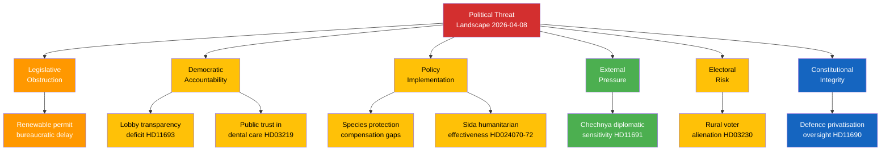

# THR-20260408-EVE — Political Threat Analysis

**📋 Document Owner:** CEO | **📄 Version:** 1.0 | **📅 Date:** 2026-04-08
**🏢 Owner:** Hack23 AB | **🏷️ Classification:** Public
**🔗 Riksmöte:** 2025/26 | **📊 Confidence:** MEDIUM

---

## 🕸️ Threat Taxonomy Network

## 📋 Threat Assessment Matrix

| Category | Threat | Severity (1-5) | dok_id | Evidence | Confidence |
|----------|--------|----------------|--------|----------|------------|
| Legislative Obstruction | Renewable energy permit delays | 3 | HD01NU18 | NU committee processing complex EU directive implementation | **[MEDIUM]** |
| Democratic Accountability | Lobby register absence | 2 | HD11693 | Recurring interpellation without legislative progress | **[HIGH]** |
| Democratic Accountability | Dental care subsidy trust | 3 | HD03219 | Riksrevision audit finds structural deficiencies | **[HIGH]** |
| Policy Implementation | Species protection compensation gaps | 3 | HD03230 | New framework must balance environment/property rights | **[MEDIUM]** |
| Policy Implementation | Sida humanitarian aid effectiveness | 2 | HD024070-72 | Three opposition parties challenge government | **[HIGH]** |
| External Pressure | Chechnya diplomatic sensitivity | 1 | HD11691 | Interpellation on sensitive geopolitical topic | **[LOW]** |
| Electoral Risk | Rural voter alienation | 3 | HD03230 | Species protection restrictions affect rural landowners | **[MEDIUM]** |
| Constitutional Integrity | Defence privatisation oversight | 2 | HD11690 | Interpellation on private actors in defence sector | **[MEDIUM]** |

## 🎯 Escalation Decision

**Overall Threat Level: LOW-MEDIUM** — No immediate escalation triggers identified. All threats are within normal parliamentary process bounds. Monitor NU18 committee progress and species protection proposition committee referral as primary watch items.
