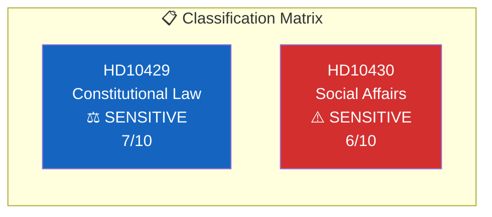

# Document Classification — Interpellations 2026-04-08

| Field | Value |
|-------|-------|
| **ID** | CLASS-IP-2026-04-08-001 |
| **Date** | 2026-04-08 |
| **Riksmöte** | 2025/26 |
| **Documents Analyzed** | 2 |
| **Overall Confidence** | MEDIUM |
| **Generated** | 2026-04-08 10:19 UTC |
| **Analyst** | news-interpellations (AI-enriched) |

## Classification Summary

| dok_id | Title | Sensitivity | Domain | Urgency | Significance |
|--------|-------|:-----------:|--------|:-------:|:------------:|
| HD10429 | Skyddet för yttrandefriheten i förhållande till prop 2025/26:133 | SENSITIVE | Constitutional Law / Justice | ELEVATED | 7/10 |
| HD10430 | Moskéer som sprider hat och hot | SENSITIVE | Social Affairs / Religious Extremism | ELEVATED | 6/10 |

Both interpellations are classified SENSITIVE due to their constitutional implications (HD10429) and potential for social polarisation (HD10430). Neither reaches RESTRICTED level as they operate within normal parliamentary accountability mechanisms.
