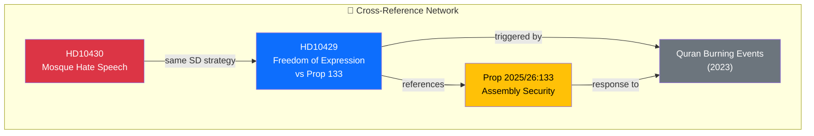

# Cross-Reference Map — Interpellations 2026-04-08

| Field | Value |
|-------|-------|
| **ID** | XREF-IP-2026-04-08-001 |
| **Date** | 2026-04-08 |
| **Riksmöte** | 2025/26 |
| **Documents Analyzed** | 2 |
| **Overall Confidence** | MEDIUM |
| **Generated** | 2026-04-08 10:19 UTC |
| **Analyst** | news-interpellations (AI-enriched) |

## Cross-Document References

| Source | Target | Relationship | Evidence |
|--------|--------|-------------|----------|
| HD10429 | Prop 2025/26:133 | Direct reference — constitutional challenge | Full text explicitly references proposition |
| HD10429 | Quran burning events (2023) | Causal context — Prop 133 was a government response to Quran burnings | HD10429: "efter koranbränningarna" |
| HD10430 | HD10429 | Same SD interpellation strategy, filed same week | Both filed by SD, delivered same day (April 7) |
| Prop 2025/26:133 | Quran burning events | Legislative response to security concerns | Government investigation started summer 2023 |

## Shared Themes

- **Security vs. Freedom**: Both interpellations engage with the fundamental tension between security measures and constitutional rights
- **SD Coalition Strategy**: Both filed by SD targeting coalition partners, suggesting coordinated pressure campaign
- **Media-Parliament Loop**: HD10430 triggered by Expressen journalism; HD10429 references public debate context
