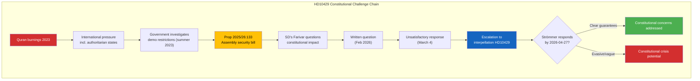

# Per-File Political Intelligence Analysis — HD10429

| Field | Value |
|-------|-------|
| **Document ID** | HD10429 |
| **Document Type** | interpellations |
| **Title** | Skyddet för yttrandefriheten i förhållande till proposition 2025/26:133 |
| **Date** | 2026-04-07 |
| **Riksmöte** | 2025/26 |
| **Source MCP Tool** | get_interpellationer, get_dokument |
| **Analysis Timestamp** | 2026-04-08 10:18 UTC |
| **Analyst** | news-interpellations |

## Executive Summary

SD's Rashid Farivar files interpellation 2025/26:429 directed at Justice Minister Gunnar Strömmer (M) challenging Proposition 2025/26:133 on public assembly security. Farivar argues the proposition creates a "heckler's veto" mechanism where violence threats could effectively suppress demonstrations (including Quran burnings). This is constitutionally significant — raising questions about Sweden's 1766 press freedom tradition versus security imperatives. The interpellation includes 3 specific questions demanding guarantees. **[HIGH confidence]**

## Political Classification

| Field | Assessment |
|-------|-----------|
| **Sensitivity Level** | SENSITIVE |
| **Primary Domain** | Constitutional Law / Justice (JUS) |
| **Urgency** | ELEVATED |
| **Significance Score** | 7/10 |
| **Confidence** | HIGH |

## SWOT Impact Assessment

### Government Coalition Impact

| Quadrant | Statement | Evidence | Confidence | Impact |
|----------|-----------|----------|:----------:|:------:|
| ⚠️ Weakness | Justice Minister Strömmer's previous written response (March 4) was deemed unsatisfactory by questioner — escalation to interpellation | HD10429: "Det svar jag fick den 4 mars var, tyvärr, inte tillfredsställande" | HIGH | HIGH |
| 🔴 Threat | Prop 2025/26:133 faces constitutional legitimacy challenge from within the government's support base | SD directly questions whether Prop 133 undermines fundamental rights | HIGH | HIGH |
| ✅ Strength | Strömmer has until 2026-04-27 to prepare a more substantive response | Response deadline provides time for careful legal framing | MEDIUM | MEDIUM |

### Opposition Impact

| Quadrant | Statement | Evidence | Confidence | Impact |
|----------|-----------|----------|:----------:|:------:|
| 🚀 Opportunity | Constitutional concerns raised by SD could align with opposition's civil liberties agenda | HD10429 raises issues S, V, MP, C have historically championed | MEDIUM | HIGH |
| ⚠️ Weakness | Awkward position — aligning with SD on freedom of expression while opposing SD on other issues | Farivar (SD) is using liberal democratic arguments | MEDIUM | MEDIUM |

## Key Questions Posed (3 questions)

1. Can the minister guarantee Prop 133 will not enable police to deny permits for Quran burnings or controversial expressions?
2. Will the minister monitor implementation to ensure demonstration location rights are preserved?
3. Will the minister act if violence threats determine which demonstrations proceed?

## Risk Assessment

| Risk | L×I | Score | Evidence |
|------|:---:|:-----:|----------|
| "Heckler's veto" institutionalisation | 3×5 | **15** | HD10429: "hot om våld blir ett effektivt verktyg för att stoppa vissa åsikter" |
| Police discretion overreach | 3×4 | **12** | Broad language: "säkerheten för människors liv eller hälsa" |
| Constitutional norm erosion | 2×5 | **10** | HD10429 warns of gradual "förskjutningar som över tid riskerar att bli norm" |

## Forward Indicators

| Indicator | Trigger | Timeline | Confidence |
|-----------|---------|----------|:----------:|
| Strömmer formal response | Response due date | By 2026-04-27 | HIGH |
| Riksdag chamber announcement | Planned announcement | 2026-04-13 | HIGH |
| Committee hearing on Prop 133 | Constitutional Committee (KU) review | Spring 2026 | MEDIUM |
| Cross-party response to Prop 133 | Opposition statements | April-May 2026 | LOW |
