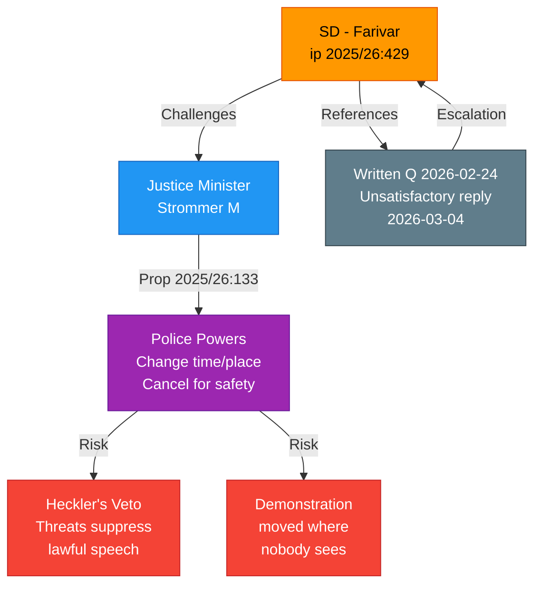

# Document Analysis: Skyddet for yttrandefriheten - Proposition 2025/26:133

**Generated**: 2026-04-08 06:55 UTC
**dok_id**: HD10429
**Document Type**: Interpellation (ip)
**Committee**: Justitieutskottet (JuU)
**Date**: 2026-04-07
**Author**: Rashid Farivar (SD)
**Target Minister**: Justitieminister Gunnar Strommer (M)
**Party**: SD
**Riksmote**: 2025/26
**Significance**: 🟠 High (7/10)
**Confidence**: HIGH (75%)

---

## Executive Summary

SD MP Rashid Farivar files interpellation 2025/26:429 targeting Justice Minister Strommer (M) over Proposition 2025/26:133 "Strengthened Security at Public Gatherings." This is a constitutionally significant interpellation raising the "heckler's veto" concern — whether threats of violence can effectively suppress lawful demonstrations. The interpellation represents a rare case of a support party MP directly challenging government legislative proposals on constitutional grounds. [HIGH confidence — extensive full-text analysis available]

## Document Content

**Interpellation Number**: 2025/26:429
**Filed**: 2026-04-01, Transferred: 2026-04-07
**Announcement**: 2026-04-13 (planned)
**Reply Deadline**: 2026-04-27

**Core Questions (3)**:
1. Can the minister guarantee Prop. 2025/26:133 will NOT enable police to deny permits for Quran burnings or similar controversial demonstrations citing security risks?
2. Will the minister ensure the right to demonstrate where the message actually reaches its audience is not undermined?
3. Will the minister act if threats (domestic or foreign) determine which demonstrations can proceed?

**Key Constitutional Arguments**:
- Sweden's 1766 press freedom tradition invoked as foundational principle
- Proposition enables police to change time/place of gatherings and cancel for "safety of human life/health"
- "Heckler's veto" risk: threats of violence become effective tool to suppress certain speech
- Previous written question (2026-02-24) received unsatisfactory response (2026-03-04)
- Quran burning controversy explicitly referenced as catalyst for Prop. 2025/26:133

## SWOT Analysis

### Government Coalition

| # | Type | Statement | Evidence | Confidence | Impact |
|---|------|-----------|----------|------------|--------|
| W1 | Weakness | Government faces internal challenge on fundamental rights legislation from own support base | ip 2025/26:429 by SD MP directly questioning M-led government proposition | HIGH | Critical |
| W2 | Weakness | Previous ministerial response deemed inadequate — escalation from written question to interpellation | Farivar references unsatisfactory written answer from 2026-03-04 | HIGH | High |
| S1 | Strength | Government can frame Prop. 2025/26:133 as responsible security balance | Proposition addresses genuine security threats at public gatherings | MEDIUM | Moderate |

### Opposition Bloc

| # | Type | Statement | Evidence | Confidence | Impact |
|---|------|-----------|----------|------------|--------|
| O1 | Opportunity | S/V can amplify free speech concerns raised by SD to fracture coalition | SD MP uses constitutional arguments typically associated with liberal positions | MEDIUM | High |
| O2 | Opportunity | Parliamentary debate creates platform to expose government coalition internal divisions | ip demands formal ministerial response in plenary debate | HIGH | Moderate |

### SD (Support Party)

| # | Type | Statement | Evidence | Confidence | Impact |
|---|------|-----------|----------|------------|--------|
| S2 | Strength | SD demonstrates principled position on constitutional rights ahead of 2026 election | Farivar's extensive constitutional argumentation (1766 tradition, ECHR) | HIGH | High |
| S3 | Strength | SD positions itself as defender of free speech against government overreach | "Sweden shall not be a country where whoever threatens most gets to decide most" | HIGH | Critical |
| T1 | Threat | SD's pro-free-speech stance may conflict with party's own support for restrictive security measures | Tension between anti-Islamist position and broad free-speech principle | MEDIUM | Moderate |

### Citizens

| # | Type | Statement | Evidence | Confidence | Impact |
|---|------|-----------|----------|------------|--------|
| W3 | Weakness | Broad "safety of human life/health" formulation creates legal uncertainty for protest organizers | Prop. 2025/26:133 language analysis by Farivar | HIGH | High |
| T2 | Threat | Institutionalization of heckler's veto undermines democratic participation | "If legislation gives such threats actual legal significance, we institutionalize this problem" | HIGH | Critical |

### International/EU

| # | Type | Statement | Evidence | Confidence | Impact |
|---|------|-----------|----------|------------|--------|
| W4 | Weakness | Sweden's international reputation as free speech champion at risk | "Authoritarian states' pressure" cited as origin of Prop. 2025/26:133 | MEDIUM | High |
| O3 | Opportunity | Debate generates important jurisprudence for ECHR Article 10/11 balance | Novel question: can security concerns from foreign state pressure justify restricting domestic demonstrations | MEDIUM | Moderate |

## Risk Assessment

| Risk | Likelihood (1-5) | Impact (1-5) | L x I | Mitigation |
|------|------------------|--------------|-------|------------|
| Constitutional rights erosion through incremental police powers | 3 | 5 | 15 | Parliamentary scrutiny and KU (Constitutional Committee) oversight |
| Heckler's veto becomes normalized enforcement pattern | 3 | 4 | 12 | Clear legislative guardrails and judicial review mechanisms |
| Coalition fracture on fundamental rights legislation | 2 | 5 | 10 | Ministerial engagement with SD concerns before plenary debate |
| Foreign state influence on Swedish domestic legislation | 2 | 4 | 8 | Transparency in legislative motivation; decouple security from external pressure |

## Stakeholder Impact

| Stakeholder | Impact | Evidence | Confidence |
|-------------|--------|----------|------------|
| Citizens | Critical — fundamental rights of assembly and demonstration at stake | Prop. 2025/26:133 directly affects right to public protest | HIGH |
| Government Coalition | High — internal challenge on flagship security legislation | SD support party MP challenges M-led proposition | HIGH |
| Opposition Bloc | Moderate — opportunity to exploit coalition divisions | Free speech debate crosses traditional left-right lines | MEDIUM |
| Business/Industry | Low — no direct economic implications | N/A | LOW |
| Civil Society | Critical — NGOs, protest movements directly affected | Changed time/place powers affect all public gatherings | HIGH |
| International/EU | High — Sweden's free speech model under international scrutiny | Post-Quran-burning international pressure explicitly referenced | HIGH |
| Judiciary/Constitutional | Critical — new police powers require judicial interpretation | "Safety of human life/health" standard requires case law development | HIGH |
| Media/Public Opinion | High — fundamental rights debate generates public engagement | Quran burning coverage demonstrates high media interest | HIGH |

## Mermaid Diagram

## Forward Indicators

1. **Minister response by 2026-04-27** — Critical to watch whether Strommer provides specific legal guarantees or general reassurances
2. **KU (Constitutional Committee) involvement** — If constitutional concerns are referred to KU for formal assessment
3. **SD position on Prop. 2025/26:133 vote** — Whether SD will vote against or abstain on this government proposition
4. **Opposition alignment** — Whether S/V/MP support or oppose the proposition based on free speech grounds
5. **International reactions** — Whether foreign governments comment on Swedish free speech debate

## Data Quality Notes

- **Analysis confidence**: HIGH (75%)
- **Full-text content**: Available — extensive interpellation text with detailed constitutional arguments
- **Data sources**: get_interpellationer, get_dokument_innehall
- **Key strength**: Full legislative context available (Prop. 2025/26:133 referenced)
- **Key limitation**: No minister response yet (deadline 2026-04-27); no prior written answer text available
