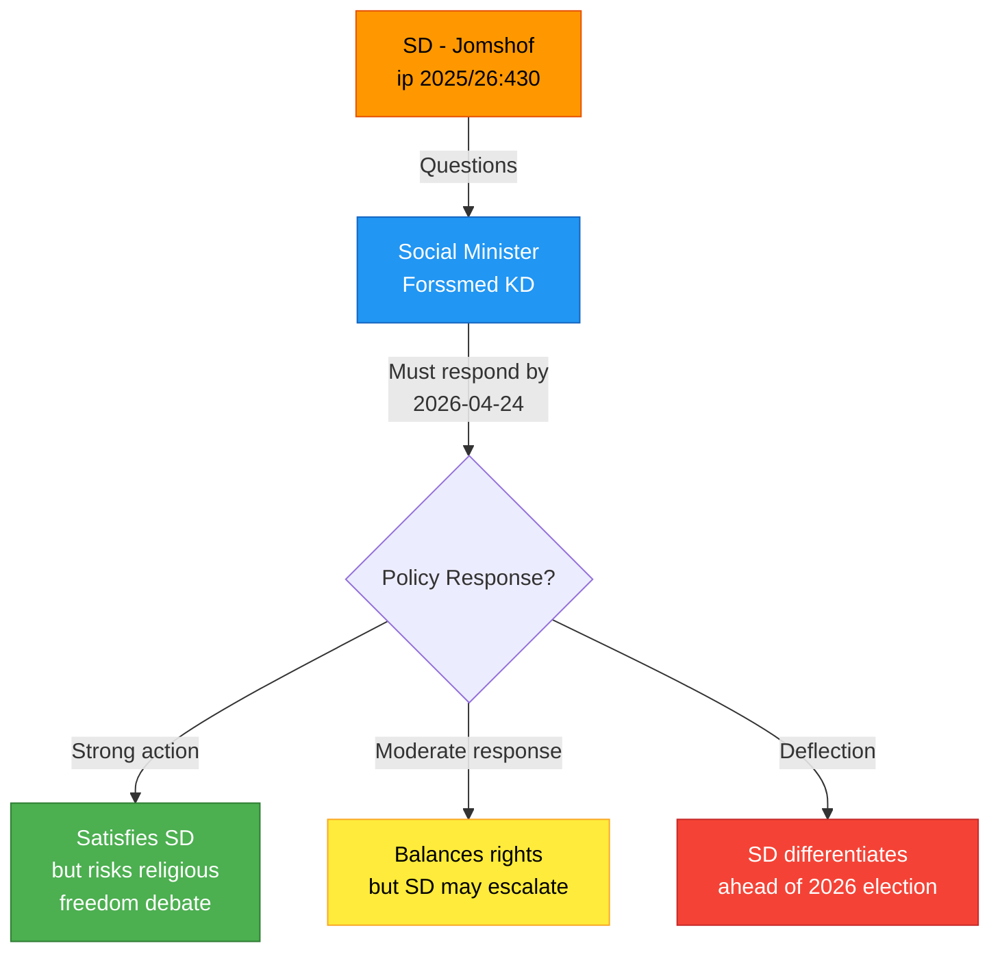

# Document Analysis: Moskéer som sprider hat och hot

**Generated**: 2026-04-08 06:55 UTC
**dok_id**: HD10430
**Document Type**: Interpellation (ip)
**Committee**: Socialutskottet (SoU)
**Date**: 2026-04-07
**Author**: Richard Jomshof (SD)
**Target Minister**: Socialminister Jakob Forssmed (KD)
**Party**: SD
**Riksmöte**: 2025/26
**Significance**: 🟡 Medium (6/10)
**Confidence**: MEDIUM (65%)

---

## Executive Summary

SD party leader on religious affairs Richard Jomshof files interpellation 2025/26:430 targeting Social Minister Forssmed (KD) over Expressen revelations about hate preaching against Jews and non-Muslims at two Sunni mosques in Kristianstad. The interpellation tests coalition cohesion by forcing KD to choose between religious freedom principles and anti-extremism enforcement. [MEDIUM confidence — limited to media-sourced evidence]

## Document Content

**Interpellation Number**: 2025/26:430
**Filed**: 2026-04-02, Transferred: 2026-04-07
**Announcement**: 2026-04-13 (planned)
**Reply Deadline**: 2026-04-24

**Core Question**: Will the minister take general initiatives to address hate preaching in Swedish mosques?

**Key Facts from Document**:
- Two established Sunni mosques in Kristianstad identified
- Expressen investigation (autumn 2025): imam preached husband has right to beat wife under Islam
- Expressen investigation (2 April 2026): second imam spread anti-Jewish/anti-non-Muslim hatred
- Specific incitements documented: calls to "hate" non-Muslims, accusations of Jewish "magic," calls for revenge and "blood, death, and expulsion" against Jews, instructing children to harm Jews

## SWOT Analysis

### Government Coalition

| # | Type | Statement | Evidence | Confidence | Impact |
|---|------|-----------|----------|------------|--------|
| S1 | Strength | KD can position anti-extremism response as values-driven governance | Forssmed responsible for social policy; KD brand as Christian democratic party | MEDIUM | Moderate |
| W1 | Weakness | Coalition must balance SD pressure with religious freedom principles | ip 2025/26:430 forces KD response; constitutional protections limit action scope | HIGH | High |
| W2 | Weakness | Exposes gap between coalition rhetoric on integration and enforcement capacity | Two incidents in same city (Kristianstad) despite prior media scrutiny | MEDIUM | Moderate |

### Opposition Bloc

| # | Type | Statement | Evidence | Confidence | Impact |
|---|------|-----------|----------|------------|--------|
| O1 | Opportunity | S can frame government inaction on extremism as policy failure | No prior government action after first mosque incident (autumn 2025) | MEDIUM | Moderate |
| T1 | Threat | Opposition risks being seen as soft on extremism if they defend religious freedom too strongly | Public opinion polling consistently shows anti-extremism as high-priority issue | LOW | Moderate |

### SD (Support Party)

| # | Type | Statement | Evidence | Confidence | Impact |
|---|------|-----------|----------|------------|--------|
| S2 | Strength | SD demonstrates continued pressure on core issues despite coalition membership | ip 2025/26:430 filed by Jomshof, SD's most prominent voice on religion/immigration | HIGH | High |
| O2 | Opportunity | SD can differentiate from government parties ahead of 2026 election | Using interpellation mechanism shows independence from coalition | MEDIUM | High |

## Risk Assessment

| Risk | Likelihood (1-5) | Impact (1-5) | L x I | Mitigation |
|------|------------------|--------------|-------|------------|
| Coalition tension if KD response is perceived as inadequate by SD | 3 | 3 | 9 | Minister can acknowledge concerns while citing ongoing investigations |
| Escalation of religious tensions through politicization | 2 | 4 | 8 | Redirect to rule-of-law framing rather than religious targeting |
| Media cycle amplification driving policy overreaction | 3 | 2 | 6 | Maintain evidence-based approach to extremism monitoring |

## Stakeholder Impact

| Stakeholder | Impact | Evidence | Confidence |
|-------------|--------|----------|------------|
| Citizens | Direct — Jewish community safety concerns | Explicit death threats documented in Expressen investigation | HIGH |
| Government Coalition | Moderate — forced response within 17 days | ip 2025/26:430 reply deadline 2026-04-24 | HIGH |
| Opposition Bloc | Indirect — limited leverage on anti-extremism issue | S/V unlikely to challenge anti-hate-preaching measures | MEDIUM |
| Business/Industry | Low — no direct economic implications | N/A | LOW |
| Civil Society | Significant — religious freedom vs. anti-extremism debate | Constitutional protection of religious practice vs. incitement laws | MEDIUM |
| International/EU | Moderate — Sweden's reputation on human rights at stake | EU anti-discrimination directives; ECHR Article 10 jurisprudence | LOW |
| Judiciary/Constitutional | Significant — potential test of existing hate speech laws | Brottsbalken 16:8 (hets mot folkgrupp) applicability | MEDIUM |
| Media/Public Opinion | High — Expressen investigations drive public awareness | Two separate Expressen investigations in same city | HIGH |

## Mermaid Diagram

## Forward Indicators

1. **Minister response by 2026-04-24** — Watch for scope of proposed measures and whether Forssmed references existing legal frameworks or proposes new initiatives
2. **SD follow-up activity** — If Jomshof or SD committee members table follow-up motions within 2 weeks of response
3. **Expressen continued reporting** — Whether additional mosque investigations emerge before the debate

## Data Quality Notes

- **Analysis confidence**: MEDIUM (65%)
- **Full-text content**: Available — analysis based on complete interpellation text
- **Data sources**: get_interpellationer, get_dokument_innehall
- **Key limitation**: No minister response yet (deadline 2026-04-24)
