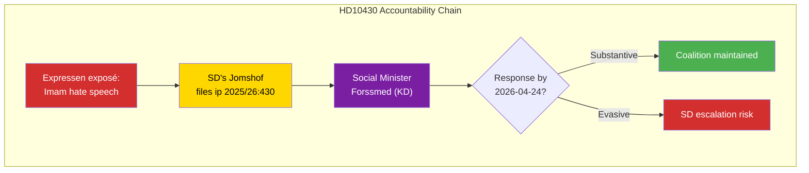

# Per-File Political Intelligence Analysis — HD10430

| Field | Value |
|-------|-------|
| **Document ID** | HD10430 |
| **Document Type** | interpellations |
| **Title** | Moskéer som sprider hat och hot (Mosques spreading hate and threats) |
| **Date** | 2026-04-07 |
| **Riksmöte** | 2025/26 |
| **Source MCP Tool** | get_interpellationer, get_dokument |
| **Analysis Timestamp** | 2026-04-08 10:18 UTC |
| **Analyst** | news-interpellations |

## Executive Summary

SD's Richard Jomshof files interpellation 2025/26:430 directed at Social Minister Jakob Forssmed (KD) regarding documented hate speech by an imam in a Kristianstad mosque. The imam was exposed by Expressen for calling for violence against Jews and hatred of non-Muslims. Jomshof asks whether the minister will take "general initiatives" in response. This is politically significant as SD pressures its own coalition partner on a core ideological issue. **[MEDIUM confidence]**

## Political Classification

| Field | Assessment |
|-------|-----------|
| **Sensitivity Level** | SENSITIVE |
| **Primary Domain** | Social Affairs (SOC) / Religious Extremism |
| **Urgency** | ELEVATED |
| **Significance Score** | 6/10 |
| **Confidence** | MEDIUM |

## SWOT Impact Assessment

### Government Coalition Impact

| Quadrant | Statement | Evidence | Confidence | Impact |
|----------|-----------|----------|:----------:|:------:|
| ✅ Strength | Government can point to existing hate crime legislation as response framework | Swedish hate speech laws already cover incitement against ethnic groups | MEDIUM | LOW |
| ⚠️ Weakness | KD minister Forssmed must respond to SD pressure on mosque regulation — exposes coalition tension | HD10430 mottagare: "Socialminister Jakob Forssmed (KD)" | HIGH | MEDIUM |
| 🔴 Threat | Evasive response could fuel SD narrative that government is soft on religious extremism | Status: "Skickad" — response due 2026-04-24 | MEDIUM | HIGH |

### Opposition Impact

| Quadrant | Statement | Evidence | Confidence | Impact |
|----------|-----------|----------|:----------:|:------:|
| ✅ Strength | Opposition can highlight that government's support party is dissatisfied with its own coalition | SD filing against KD minister | HIGH | MEDIUM |
| ⚠️ Weakness | Complex position — opposition must condemn hate speech without aligning with SD's broader anti-Muslim framing | Jomshof (SD) is known for anti-Islam positions | MEDIUM | MEDIUM |

## Forward Indicators

| Indicator | Trigger | Timeline | Confidence |
|-----------|---------|----------|:----------:|
| Forssmed formal response | Response due date | By 2026-04-24 | HIGH |
| Riksdag chamber announcement | Planned announcement | 2026-04-13 | HIGH |
| Follow-up SD actions | Debate request | Late April 2026 | MEDIUM |
