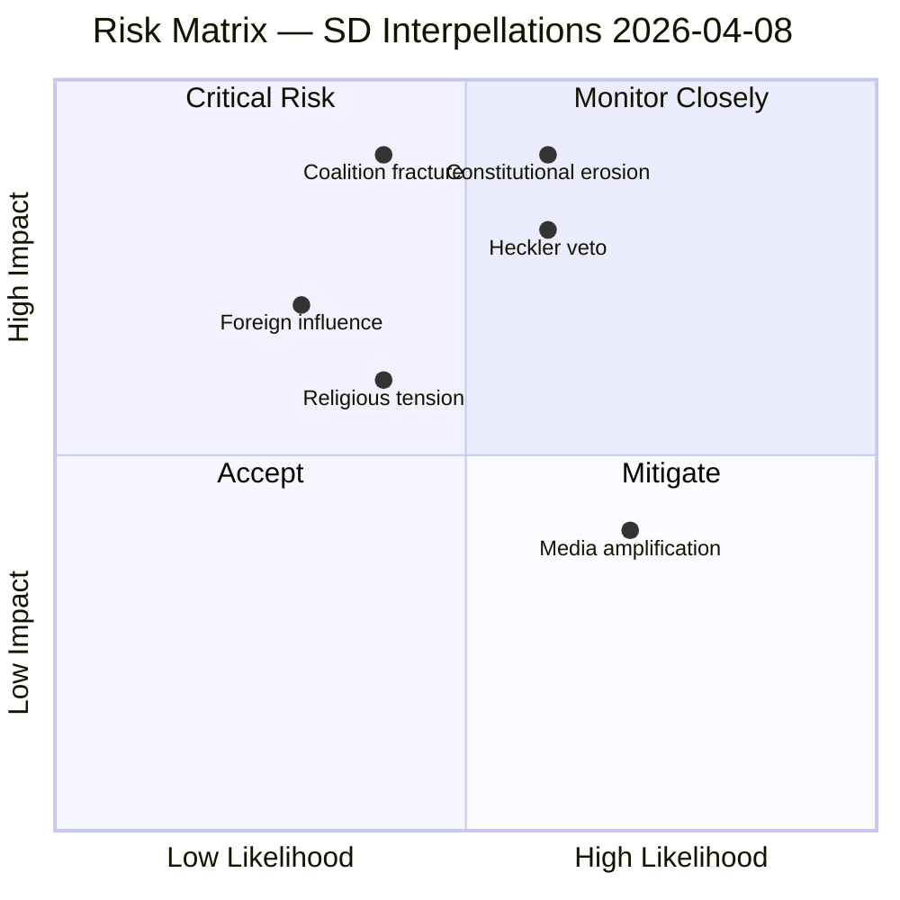
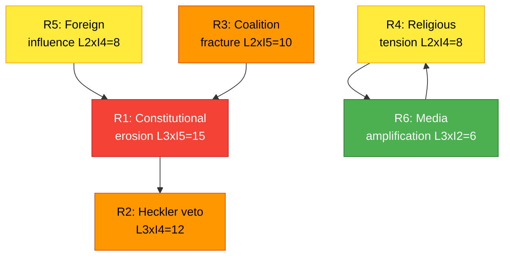

# Political Risk Assessment — 2026-04-08

| Field | Value |
|-------|-------|
| **Risk ID** | RSK-2026-04-08-IP1 |
| **Analysis Date** | 2026-04-08 06:55 UTC |
| **Documents Analyzed** | 2 |
| **Produced By** | news-interpellations workflow (AI-enriched) |
| **Overall Risk Level** | MODERATE |
| **Confidence** | MEDIUM |

---

## Risk Dashboard

## Risk Register

| # | Risk | L (1-5) | I (1-5) | LxI | Category | Source | Mitigation |
|---|------|---------|---------|-----|----------|--------|------------|
| R1 | Constitutional rights erosion through incremental police powers in Prop. 2025/26:133 | 3 | 5 | 15 | Constitutional | HD10429 | KU oversight; judicial review mechanisms; clear legislative guardrails |
| R2 | Heckler's veto normalization — threats suppress lawful demonstrations | 3 | 4 | 12 | Democratic Function | HD10429 | Explicit legislative prohibition; police training on rights-first enforcement |
| R3 | Coalition fracture on fundamental rights legislation | 2 | 5 | 10 | Coalition Stability | HD10429, HD10430 | Pre-debate ministerial engagement with SD; compromise amendments |
| R4 | Escalation of religious tensions through politicization of mosque monitoring | 2 | 4 | 8 | Social Cohesion | HD10430 | Evidence-based approach; separate criminal enforcement from political debate |
| R5 | Foreign state influence on Swedish domestic legislation | 2 | 4 | 8 | Sovereignty | HD10429 | Transparent legislative motivation; decouple from external pressure |
| R6 | Media cycle amplification driving policy overreaction | 3 | 2 | 6 | Policy Quality | HD10430 | Maintain evidence-based policy development timelines |

## Risk Interconnection Map

## Coalition Risk Assessment

**Coalition Risk Score**: 18/100 (LOW-MODERATE)
- Base stability: 83/100 (from CIA data)
- SD interpellation pressure adds +15 to risk (intra-coalition challenge)
- Government majority adequate (M+KD+L+SD = 176 seats vs 173 needed)
- Key risk: SD abstention on Prop. 2025/26:133 would force government to seek opposition support

## Forward Risk Indicators

| Indicator | Current Status | Trigger Level | Timeline |
|-----------|---------------|---------------|----------|
| Minister Strommer response quality | Pending | Vague/defensive = escalation risk | By 2026-04-27 |
| Minister Forssmed response scope | Pending | Narrow response = SD dissatisfaction | By 2026-04-24 |
| Additional SD interpellations | 2 filed April 7 | 3+ in same week = coordinated campaign | Next 2 weeks |
| KU referral on Prop. 2025/26:133 | Not initiated | Formal KU scrutiny = constitutional concern validated | Q2 2026 |

## Data Quality Notes

Risk assessment based on full-text analysis of 2 interpellations with cross-reference to CIA coalition stability metrics. Minister responses pending — risk levels will require re-assessment after replies. Coalition stability data from CIA platform (score: 83/100, denial rate: 96%).

---

**Document Control** | Owner: Hack23 AB | Classification: Public | ISMS: ISO 27001:2022 A.5.1
