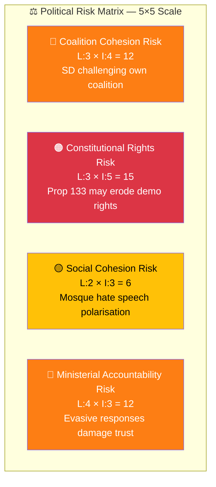

# Political Risk Assessment — Interpellations 2026-04-08

| Field | Value |
|-------|-------|
| **ID** | RISK-IP-2026-04-08-001 |
| **Date** | 2026-04-08 |
| **Riksmöte** | 2025/26 |
| **Documents Analyzed** | 2 |
| **Overall Confidence** | MEDIUM |
| **Generated** | 2026-04-08 10:16 UTC |
| **Analyst** | news-interpellations (AI-enriched) |

## Risk Matrix (Likelihood × Impact)

| # | Risk | Likelihood (1-5) | Impact (1-5) | Score | Evidence | Mitigation |
|---|------|:-----------------:|:------------:|:-----:|----------|------------|
| 1 | Coalition cohesion degradation — SD using interpellations against own coalition | 3 | 4 | **12** | HD10429, HD10430 both filed by SD targeting M/KD ministers | Ministers provide substantive responses by deadlines |
| 2 | Constitutional rights erosion — Prop 133 creates "heckler's veto" mechanism | 3 | 5 | **15** | HD10429 warns about "våldsverkarnas veto"; broad language in Prop 133 | Constitutional review; clear police guidelines |
| 3 | Social polarisation — mosque hate speech framing increases community tension | 2 | 3 | **6** | HD10430 references Expressen exposés of hate preaching | Community engagement; differentiate extremism from religion |
| 4 | Ministerial accountability gap — evasive responses undermine trust | 4 | 3 | **12** | Previous Strömmer response (March 4) deemed "not satisfactory" by Farivar | Clear, substantive ministerial responses |

## Forward Indicators

| Indicator | Trigger | Timeline | Confidence |
|-----------|---------|----------|:----------:|
| Minister Forssmed response quality to HD10430 | Response due | By 2026-04-24 | HIGH |
| Minister Strömmer response quality to HD10429 | Response due | By 2026-04-27 | HIGH |
| SD follow-up actions post-response | Debate requests, new interpellations | Late April/May 2026 | MEDIUM |
| Opposition alignment with SD constitutional concerns | Cross-party statements on Prop 133 | April-May 2026 | LOW |

## Data Quality Notes

Risk confidence: **MEDIUM**. Based on full-text analysis of 2 interpellations. Constitutional risk (Score 15) is the highest-priority finding.
