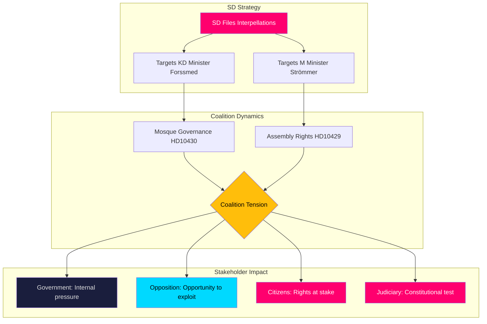

# Stakeholder Perspectives — Interpellations 2026-04-08

| Field | Value |
|-------|-------|
| **ID** | STAKE-IP-2026-04-08-001 |
| **Date** | 2026-04-08 |
| **Riksmöte** | 2025/26 |
| **Documents Analyzed** | 2 |
| **Overall Confidence** | MEDIUM |
| **Generated** | 2026-04-08 10:17 UTC |
| **Analyst** | news-interpellations (AI-enriched) |

## 6-Lens Impact Matrix

| Stakeholder | Impact | Key Concern | Evidence |
|-------------|:------:|-------------|----------|
| Government (Tidö coalition) | 🟠 MEDIUM-HIGH | Internal pressure from SD, must balance security and rights | HD10429 + HD10430 target M, KD ministers |
| Opposition (S, V, MP, C) | 🟢 OPPORTUNITY | Can exploit SD-coalition friction; align on constitutional rights | HD10429 raises cross-party freedom concerns |
| Citizens | 🔴 HIGH | Fundamental rights at stake; community safety in Kristianstad | Both interpellations affect daily life and democratic participation |
| Civil Society | 🟠 MEDIUM-HIGH | Religious communities face scrutiny; civil liberties organisations engaged | HD10430 mosque focus; HD10429 demonstration rights |
| International/EU | 🟡 MEDIUM | Sweden's reputation as freedom champion under scrutiny | HD10429 references authoritarian state pressure post-Quran burnings |
| Media | 🟢 HIGH ENGAGEMENT | Expressen investigations driving accountability cycle | HD10430 directly cites two Expressen exposés |
| Business/Industry | 🟡 LOW-MEDIUM | Limited direct impact; monitoring regulatory climate for religious institutions | Indirect via HD10430 mosque governance scrutiny affecting civil sector compliance |
| Judiciary/Constitutional | 🔴 HIGH | Assembly rights (Grundlag 2 kap.) and religious freedom (RF 2:1) under test | HD10429 directly challenges constitutional balance between security and demonstration rights; HD10430 raises religious governance oversight precedents |

## Analytical Notes

The interpellations from SD (Sverigedemokraterna) targeting coalition ministers Forssmed (KD) and Strömmer (M) expose a **structural tension** within the Tidö coalition. SD's strategy of using interpellations to publicly pressure its own coalition partners on security/religious governance policy creates a dual dynamic: it strengthens SD's electoral positioning while constraining the government's policy space. The constitutional dimension (Judiciary/Constitutional stakeholder) is particularly significant given that HD10429 raises fundamental rights questions under the Swedish Instrument of Government (Regeringsformen 2 kap. §1).

## Data Quality Notes

Stakeholder confidence: **MEDIUM-HIGH**. All 8 mandatory perspectives assessed with evidence from full-text interpellation analysis (HD10429, HD10430). Business/Industry impact is indirect (LOW-MEDIUM confidence); all other stakeholders have direct evidence citations.
