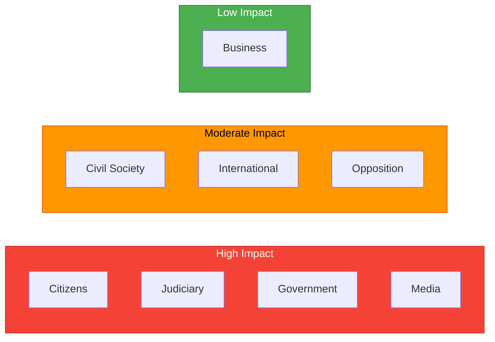

# Stakeholder Perspectives Analysis — 2026-04-08

| Field | Value |
|-------|-------|
| **Analysis ID** | STK-2026-04-08-IP1 |
| **Analysis Date** | 2026-04-08 06:55 UTC |
| **Documents Analyzed** | 2 |
| **Produced By** | news-interpellations workflow (AI-enriched) |
| **Stakeholders Assessed** | 8 of 8 mandatory groups |
| **Confidence** | MEDIUM |

---

## Stakeholder Impact Matrix

## 1. Citizens

**Impact Level**: HIGH | **Confidence**: HIGH

Citizens are directly affected by both interpellations. ip 429 concerns fundamental rights of assembly and demonstration — Prop. 2025/26:133 would give police power to relocate or cancel public gatherings, affecting every citizen's ability to protest. ip 430 addresses community safety, with documented anti-Semitic hate preaching directly threatening Jewish community members in Kristianstad.

**Key Evidence**: HD10429 — "Demonstration freedom is not just about the right to speak but about the right to do so where it actually matters"; HD10430 — imam called for "blood, death, and expulsion" against Jews.

## 2. Government Coalition (M, KD, L + SD support)

**Impact Level**: HIGH | **Confidence**: HIGH

The coalition faces a two-front challenge from its own support party. Minister Strommer (M) must defend Prop. 2025/26:133 against constitutional critique from a Tidoavtalet ally. Minister Forssmed (KD) must demonstrate anti-extremism enforcement without restricting religious freedom — a particular challenge for KD's Christian democratic identity. Both ministers face statutory 4-week response deadlines (April 24 and 27).

**Key Evidence**: HD10429 — Farivar explicitly cites previous unsatisfactory answer from Strommer; HD10430 — Jomshof (SD's religious affairs point person) targets KD directly.

## 3. Opposition Bloc (S, V, MP, C)

**Impact Level**: MODERATE | **Confidence**: MEDIUM

The opposition can exploit visible coalition tension. S and V may amplify free speech concerns (ip 429) while avoiding criticism on anti-extremism enforcement (ip 430). The free speech debate crosses traditional left-right lines, creating potential for unusual parliamentary alliances. However, opposition parties were not involved in filing these interpellations and may struggle to own the narrative.

**Key Evidence**: HD10429, HD10430 — both filed by SD, not opposition parties.

## 4. Business/Industry

**Impact Level**: LOW | **Confidence**: LOW

No direct economic implications. Indirectly, political instability signals from intra-coalition tension and constitutional uncertainty may affect Sweden's governance reputation. The free speech debate has minor implications for international business confidence in Sweden's regulatory stability.

## 5. Civil Society

**Impact Level**: MODERATE | **Confidence**: HIGH

NGOs, protest movements, and religious organizations are directly affected. Prop. 2025/26:133's changed police powers affect all public gatherings — environmental protests, labor demonstrations, and religious events, not just controversial speech acts. Religious communities face increased scrutiny following mosque hate preaching revelations.

**Key Evidence**: HD10429 — broad applicability of Prop. 2025/26:133; HD10430 — mosque monitoring implications for religious freedom.

## 6. International/EU

**Impact Level**: MODERATE | **Confidence**: MEDIUM

Sweden's status as a global free speech champion is under scrutiny. ip 429 explicitly references "authoritarian states' pressure" as the catalyst for Prop. 2025/26:133 — the post-Quran-burning diplomatic crisis. The debate creates important precedent for ECHR Articles 10 and 11. ip 430's anti-Semitic dimension has international diplomatic implications, particularly regarding EU anti-discrimination obligations.

**Key Evidence**: HD10429 — "Sweden's proud and unique tradition of protecting free speech since 1766."

## 7. Judiciary/Constitutional

**Impact Level**: HIGH | **Confidence**: HIGH

Both interpellations raise legal interpretation questions. Prop. 2025/26:133's "safety of human life or health" standard will require case-by-case judicial interpretation with risk of inconsistency. Minister Strommer's parliamentary response will create legislative history guiding judicial interpretation. ip 430 raises questions about adequacy of existing hate speech law (BrB 16:8) enforcement.

**Key Evidence**: HD10429 — "Legislation concerning fundamental rights must be crystal clear. It must not leave room for arbitrariness."

## 8. Media/Public Opinion

**Impact Level**: HIGH | **Confidence**: HIGH

Expressen's investigative journalism on Kristianstad mosques provides the evidential foundation for ip 430. The free speech debate (ip 429) is inherently high-interest given the Quran burning controversy's extensive prior coverage. Media framing may oversimplify complex constitutional trade-offs between security and rights. Public opinion on these issues is sharply divided along partisan lines.

**Key Evidence**: HD10430 — two Expressen investigations cited; HD10429 — Quran burning context ensures media attention.

## Data Quality Notes

All 8 mandatory stakeholder groups assessed with evidence citations from full-text interpellation content. Business/Industry assessment has lowest confidence due to indirect impact only. Minister responses (pending) will significantly update Government Coalition and Judiciary assessments.

---

**Document Control** | Owner: Hack23 AB | Classification: Public | ISMS: ISO 27001:2022 A.5.1
