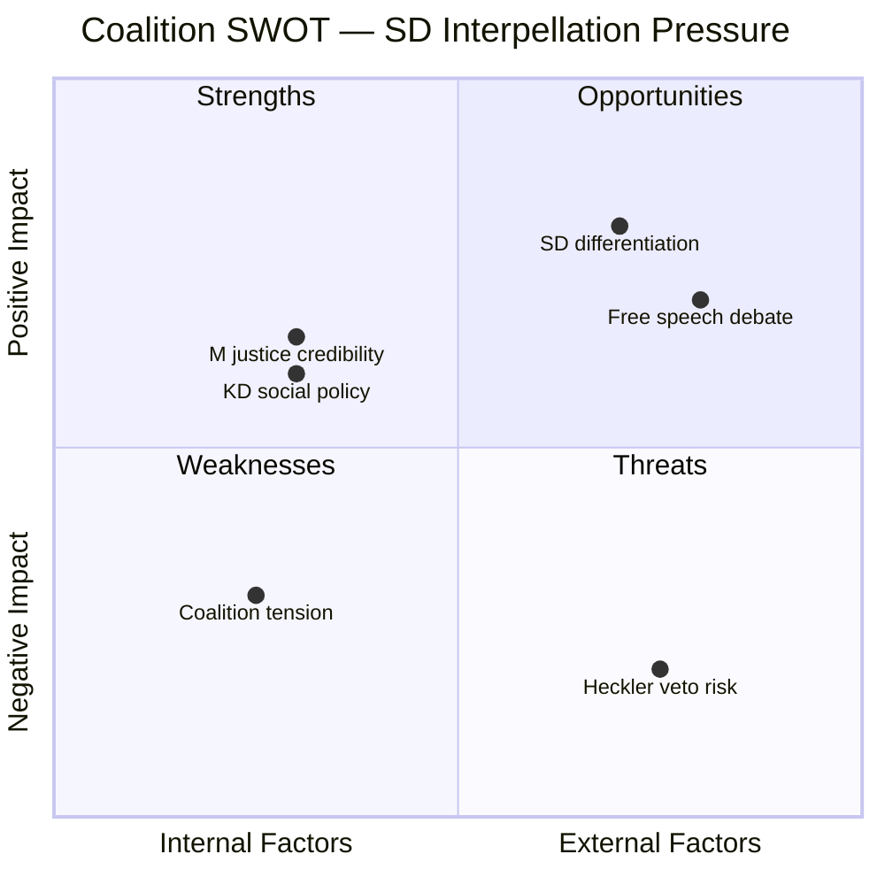

# Political SWOT Analysis — 2026-04-08

| Field | Value |
|-------|-------|
| **SWOT ID** | SWT-2026-04-08-IP1 |
| **Analysis Date** | 2026-04-08 06:55 UTC |
| **Analysis Scope** | SD interpellations targeting coalition ministers |
| **Reference Period** | 2026-W15 (2026-04-07) |
| **Produced By** | news-interpellations workflow (AI-enriched) |
| **Primary MCP Sources** | get_interpellationer, get_dokument_innehall |
| **Validity Window** | Entries valid until 2026-04-27 (latest reply deadline) |
| **Temporal Window** | 2026-04-07 |

---

## SWOT Quadrant Mapping

## Citizens

| # | Type | Statement | Evidence (dok_id) | Confidence | Impact | Entry Date |
|---|------|-----------|-------------------|------------|--------|------------|
| C1 | Strength | Democratic accountability mechanism functioning — support party holds government to account | ip 2025/26:429 (HD10429), ip 2025/26:430 (HD10430) | HIGH | Moderate | 2026-04-08 |
| C2 | Weakness | Proposed police powers in Prop. 2025/26:133 create legal uncertainty for protest organizers | HD10429 — "safety of life/health" standard lacks clear boundaries | HIGH | High | 2026-04-08 |
| C3 | Threat | Heckler's veto risk: threat of violence may suppress lawful demonstrations | HD10429 — "institutionalize this problem" if threats gain legal weight | HIGH | Critical | 2026-04-08 |
| C4 | Weakness | Jewish community safety concerns from documented hate preaching in Kristianstad | HD10430 — explicit death threats against Jews documented by Expressen | HIGH | High | 2026-04-08 |

## Government Coalition

| # | Type | Statement | Evidence (dok_id) | Confidence | Impact | Entry Date |
|---|------|-----------|-------------------|------------|--------|------------|
| G1 | Strength | Government can frame Prop. 2025/26:133 as responsible security balance | HD10429 — proposition addresses genuine security threats at gatherings | MEDIUM | Moderate | 2026-04-08 |
| G2 | Weakness | Internal challenge from support party on flagship legislation | HD10429 — SD MP directly questions M-led proposition | HIGH | High | 2026-04-08 |
| G3 | Weakness | Previous ministerial response deemed inadequate — escalation from written Q to interpellation | HD10429 — Farivar cites unsatisfactory answer from 2026-03-04 | HIGH | High | 2026-04-08 |
| G4 | Weakness | Enforcement gap exposed on extremism monitoring | HD10430 — two incidents in same city despite prior media scrutiny | MEDIUM | Moderate | 2026-04-08 |

## Opposition Bloc

| # | Type | Statement | Evidence (dok_id) | Confidence | Impact | Entry Date |
|---|------|-----------|-------------------|------------|--------|------------|
| O1 | Opportunity | Can amplify free speech concerns to fracture coalition | HD10429 — constitutional arguments cross left-right lines | MEDIUM | High | 2026-04-08 |
| O2 | Opportunity | Parliamentary debate creates platform to expose government internal divisions | HD10429, HD10430 — two simultaneous challenges from support party | HIGH | Moderate | 2026-04-08 |
| O3 | Threat | Opposition risks being marginalized as SD captures free speech narrative | HD10429 — SD positions itself as constitutional rights defender | MEDIUM | Moderate | 2026-04-08 |

## Business/Industry

| # | Type | Statement | Evidence (dok_id) | Confidence | Impact | Entry Date |
|---|------|-----------|-------------------|------------|--------|------------|
| B1 | Weakness | Political instability signals may affect investor confidence in Swedish governance | HD10429, HD10430 — support party challenging government creates uncertainty | LOW | Low | 2026-04-08 |
| B2 | Opportunity | Stable free speech framework supports international business confidence | HD10429 — clear constitutional standards benefit business environment | LOW | Low | 2026-04-08 |

## Civil Society

| # | Type | Statement | Evidence (dok_id) | Confidence | Impact | Entry Date |
|---|------|-----------|-------------------|------------|--------|------------|
| CS1 | Threat | Changed police powers affect all public gatherings, not just controversial ones | HD10429 — Prop. 2025/26:133 applies broadly to assemblies | HIGH | High | 2026-04-08 |
| CS2 | Opportunity | Interpellation debate raises public awareness of free speech risks | HD10429 — detailed constitutional argumentation enters parliamentary record | MEDIUM | Moderate | 2026-04-08 |
| CS3 | Weakness | Religious communities face increased scrutiny following hate preaching revelations | HD10430 — broad mosque monitoring implications | MEDIUM | Moderate | 2026-04-08 |

## International/EU

| # | Type | Statement | Evidence (dok_id) | Confidence | Impact | Entry Date |
|---|------|-----------|-------------------|------------|--------|------------|
| I1 | Weakness | Sweden's international free speech reputation at stake | HD10429 — "authoritarian states' pressure" cited as Prop. origin | MEDIUM | High | 2026-04-08 |
| I2 | Opportunity | Debate generates important ECHR Art. 10/11 jurisprudence precedent | HD10429 — novel question on foreign pressure and domestic speech rights | MEDIUM | Moderate | 2026-04-08 |
| I3 | Threat | International actors may increase pressure if Sweden perceived as softening on extremism | HD10430 — anti-Semitic hate preaching has international diplomatic implications | LOW | Moderate | 2026-04-08 |

## Judiciary/Constitutional

| # | Type | Statement | Evidence (dok_id) | Confidence | Impact | Entry Date |
|---|------|-----------|-------------------|------------|--------|------------|
| J1 | Threat | New police powers in Prop. 2025/26:133 require judicial interpretation with risk of inconsistency | HD10429 — "how will these reasons be interpreted in practice, by police, under pressure" | HIGH | High | 2026-04-08 |
| J2 | Opportunity | Parliamentary debate creates legislative history for judicial interpretation | HD10429 — minister's response will guide courts on legislative intent | HIGH | High | 2026-04-08 |
| J3 | Weakness | Existing hate speech laws (BrB 16:8) may be insufficient for documented extremism | HD10430 — repeated incidents despite media exposure suggest enforcement gap | MEDIUM | Moderate | 2026-04-08 |

## Media/Public Opinion

| # | Type | Statement | Evidence (dok_id) | Confidence | Impact | Entry Date |
|---|------|-----------|-------------------|------------|--------|------------|
| M1 | Strength | Expressen investigations provide strong evidentiary basis for policy debate | HD10430 — two separate investigations in same city | HIGH | High | 2026-04-08 |
| M2 | Opportunity | Free speech debate generates high public engagement | HD10429 — Quran burning controversy remains high-interest topic | HIGH | High | 2026-04-08 |
| M3 | Threat | Media framing may oversimplify complex constitutional trade-offs | HD10429 — nuanced rights balancing difficult in news cycle | MEDIUM | Moderate | 2026-04-08 |

## TOWS Strategic Options

| Strategy | Combination | Action |
|----------|-------------|--------|
| SO: Government leverages security credentials + public concern | G1 + M1 | Frame response as evidence-based anti-extremism while preserving constitutional rights |
| WO: Address enforcement gap + capitalize on media attention | G4 + M1 | Announce concrete measures against hate preaching with Expressen evidence as justification |
| ST: SD hedges between free speech and anti-extremism | S2/S3 + T1 | SD must reconcile pro-free-speech position (ip 429) with anti-extremism demand (ip 430) |
| WT: Coalition manages internal tension before debate | G2/G3 + O1 | Pre-emptive ministerial engagement with SD to prevent plenary confrontation |

## Cross-SWOT Interference

SD's simultaneous filing of ip 429 (pro-free-speech) and ip 430 (anti-extremism) creates a SWOT interference pattern: the **Strength** of constitutional principle (ip 429) conflicts with the **Threat** of extremism tolerance (ip 430). Government can exploit this contradiction, but doing so risks alienating SD further within the Tidoavtalet framework.

## Data Quality Notes

SWOT confidence: **MEDIUM**. All 8 stakeholder groups analyzed with evidence from full-text interpellation content. Minister responses pending — SWOT will require updating after replies (deadlines 2026-04-24 and 2026-04-27).

---

**Document Control** | Owner: Hack23 AB | Classification: Public | ISMS: ISO 27001:2022 A.5.1
