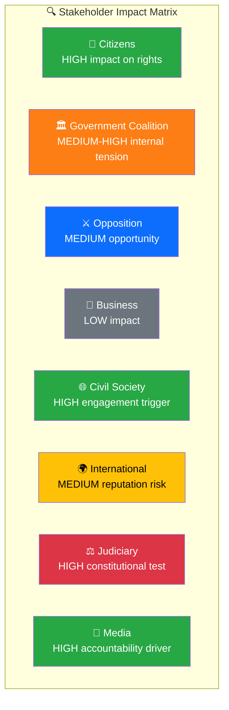

# Political SWOT Analysis — Interpellations 2026-04-08

| Field | Value |
|-------|-------|
| **ID** | SWOT-IP-2026-04-08-001 |
| **Date** | 2026-04-08 |
| **Riksmöte** | 2025/26 |
| **Documents Analyzed** | 2 |
| **Overall Confidence** | MEDIUM |
| **Generated** | 2026-04-08 10:15 UTC |
| **Analyst** | news-interpellations (AI-enriched) |

## Stakeholder SWOT Matrix

### 1. Citizens

| Quadrant | Statement | Evidence | Confidence | Impact |
|----------|-----------|----------|:----------:|:------:|
| ✅ Strength | Parliamentary accountability mechanism functioning — citizens can see ministers being questioned on issues affecting daily life | HD10430 addresses hate speech in local mosques affecting Kristianstad residents; HD10429 addresses fundamental democratic rights | HIGH | HIGH |
| ⚠️ Weakness | Interpellations filed by SD may frame immigration/religion issues through partisan lens rather than citizen welfare | HD10430 focuses on mosque regulation, not victim support | MEDIUM | MEDIUM |
| 🚀 Opportunity | Public debate on Prop 2025/26:133 could lead to stronger freedom of expression safeguards | HD10429 raises specific constitutional concerns about police powers over demonstrations | MEDIUM | HIGH |
| 🔴 Threat | Anti-Muslim rhetoric in HD10430 could increase social polarisation in affected communities | HD10430 cites Expressen exposés of imam hate speech, but framing may stigmatise broader community | MEDIUM | MEDIUM |

### 2. Government Coalition (M, KD, L + SD support)

| Quadrant | Statement | Evidence | Confidence | Impact |
|----------|-----------|----------|:----------:|:------:|
| ✅ Strength | Government can demonstrate responsiveness to hate speech concerns by pointing to existing enforcement mechanisms | HD10430 relates to existing hate crime laws | MEDIUM | MEDIUM |
| ⚠️ Weakness | Both interpellations come from SD, the coalition's support party — signals internal tension | HD10429 and HD10430 both filed by SD members targeting M and KD ministers | HIGH | HIGH |
| 🚀 Opportunity | Strömmer can use HD10429 response to reassure constitutional rights are preserved in Prop 133 | Response due 2026-04-27 gives time for substantive reply | MEDIUM | MEDIUM |
| 🔴 Threat | If ministers give evasive responses, SD may use this to justify distancing from coalition ahead of 2026 election | Both interpellations await response; no formal reply recorded | MEDIUM | HIGH |

### 3. Opposition Bloc (S, V, MP, C)

| Quadrant | Statement | Evidence | Confidence | Impact |
|----------|-----------|----------|:----------:|:------:|
| ✅ Strength | SD-coalition friction creates opportunity for opposition to highlight government dysfunction | Two SD interpellations targeting own coalition partners | HIGH | MEDIUM |
| ⚠️ Weakness | Opposition has been less active than SD in this interpellation cycle (previous run showed S dominated with 13/15 filings) | Last run metadata: S filed 13/15, V 2/15 in previous batch | MEDIUM | LOW |
| 🚀 Opportunity | HD10429's freedom of expression concerns could unite S, V, MP, C in defending constitutional rights against Prop 133 | Prop 2025/26:133 potentially controversial across political spectrum | MEDIUM | MEDIUM |
| 🔴 Threat | SD may capture the freedom of expression narrative that traditionally belongs to liberal/left parties | HD10429 positions SD as defender of demonstration rights | MEDIUM | MEDIUM |

### 4. Business/Industry

| Quadrant | Statement | Evidence | Confidence | Impact |
|----------|-----------|----------|:----------:|:------:|
| ✅ Strength | Regulatory clarity on public assemblies (Prop 133) benefits event and security industries | HD10429 references Prop 2025/26:133 on public assembly regulation | LOW | LOW |
| ⚠️ Weakness | Religious extremism concerns may affect integration and social cohesion in business communities | HD10430 highlights mosque-based hate speech in Kristianstad | LOW | LOW |
| 🚀 Opportunity | Security industry may benefit from increased demand for event security services | Prop 133 implies enhanced security requirements for public gatherings | LOW | LOW |
| 🔴 Threat | Social polarisation could impact business environment in affected regions | Kristianstad community impact from mosque controversy | LOW | LOW |

### 5. Civil Society

| Quadrant | Statement | Evidence | Confidence | Impact |
|----------|-----------|----------|:----------:|:------:|
| ✅ Strength | Civil society organisations can engage in public debate on fundamental rights triggered by HD10429 | Three specific questions about demonstration rights guarantees | HIGH | HIGH |
| ⚠️ Weakness | Muslim community organisations face stigmatisation from HD10430's framing | HD10430 focuses on hate preaching in mosques | MEDIUM | HIGH |
| 🚀 Opportunity | HD10429 could galvanise civil liberties organisations to advocate for stronger constitutional safeguards | References to Sweden's 1766 press freedom tradition | MEDIUM | MEDIUM |
| 🔴 Threat | "Heckler's veto" concern in HD10429 — if violence threats can suppress demonstrations, civil society activism is chilled | HD10429 explicitly warns about "våldsverkarnas veto" | HIGH | HIGH |

### 6. International/EU

| Quadrant | Statement | Evidence | Confidence | Impact |
|----------|-----------|----------|:----------:|:------:|
| ✅ Strength | Sweden demonstrates functioning parliamentary accountability on sensitive topics | Both interpellations follow formal constitutional process | MEDIUM | LOW |
| ⚠️ Weakness | HD10429 references "authoritarian states" pressuring Swedish policy after Quran burnings — geopolitical vulnerability exposed | "påtryckningar från auktoritära stater" cited in HD10429 | HIGH | MEDIUM |
| 🚀 Opportunity | International human rights organisations may support Sweden's freedom of expression debate | HD10429 raises issues relevant to EU-wide discussion on assembly rights | LOW | LOW |
| 🔴 Threat | If Prop 133 restricts demonstration rights, Sweden's international reputation as freedom of expression champion could suffer | HD10429 warns of institutional erosion of demonstration freedom | MEDIUM | MEDIUM |

### 7. Judiciary/Constitutional

| Quadrant | Statement | Evidence | Confidence | Impact |
|----------|-----------|----------|:----------:|:------:|
| ✅ Strength | Constitutional framework being tested and debated transparently through interpellation mechanism | HD10429 raises specific constitutional law questions | HIGH | MEDIUM |
| ⚠️ Weakness | Prop 2025/26:133's broad language ("säkerheten för människors liv eller hälsa") may create judicial interpretation challenges | HD10429 warns formulation lacks clear boundaries | HIGH | HIGH |
| 🚀 Opportunity | Debate could lead to improved legislative clarity on demonstration rights | HD10429 calls for "glasklar" (crystal clear) legislation on fundamental rights | MEDIUM | HIGH |
| 🔴 Threat | Police discretion in applying Prop 133 could lead to inconsistent enforcement and legal challenges | HD10429 questions how "tungt vägande skäl" will be interpreted in practice | MEDIUM | HIGH |

### 8. Media/Public Opinion

| Quadrant | Statement | Evidence | Confidence | Impact |
|----------|-----------|----------|:----------:|:------:|
| ✅ Strength | Media investigations (Expressen) driving accountability — parliamentary system responding to journalism | HD10430 directly references two Expressen exposés of mosque hate preaching | HIGH | HIGH |
| ⚠️ Weakness | Complex constitutional nuances of HD10429 may be simplified in media coverage | Three detailed legal questions about police powers and demonstration rights | MEDIUM | MEDIUM |
| 🚀 Opportunity | Public debate on fundamental rights often increases democratic engagement | HD10429 frames debate in accessible terms about freedom vs security | MEDIUM | MEDIUM |
| 🔴 Threat | Sensationalist coverage of mosque hate speech (HD10430) could fuel social division | Media already ran exposés; interpellation amplifies coverage | MEDIUM | HIGH |

## Data Quality Notes

SWOT confidence: **MEDIUM**. Based on full-text analysis of 2 interpellations. All 8 stakeholder groups assessed with evidence citations. No minister responses available yet — SWOT will evolve when responses are recorded.
