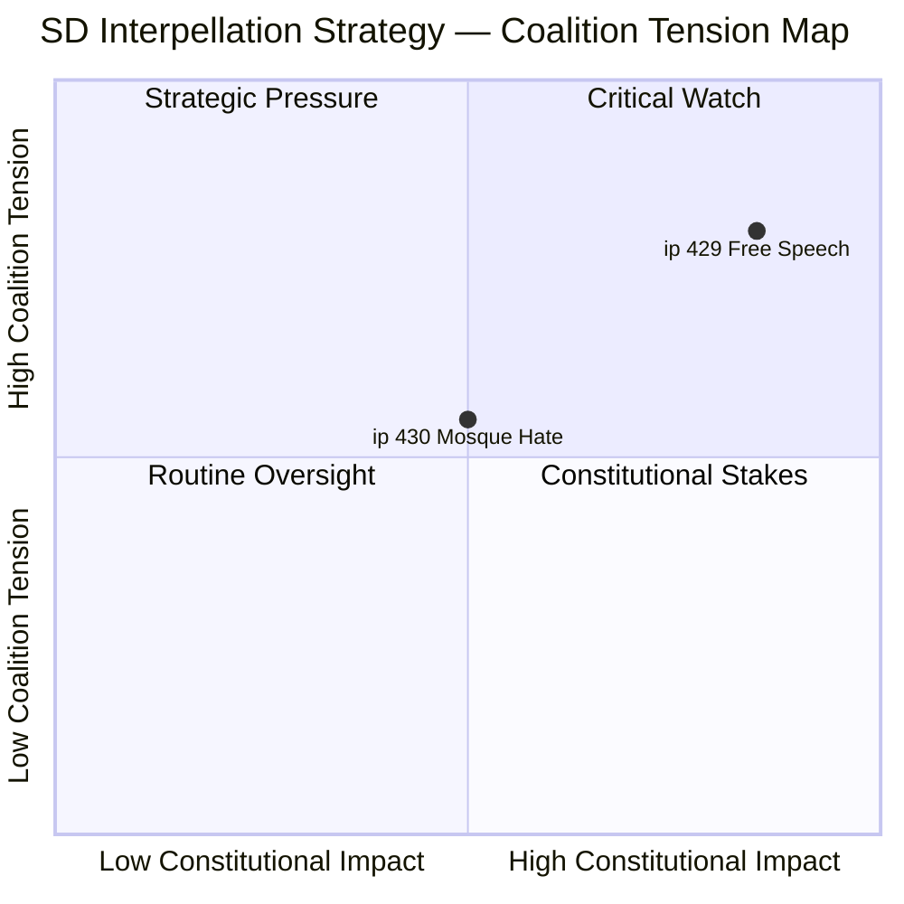
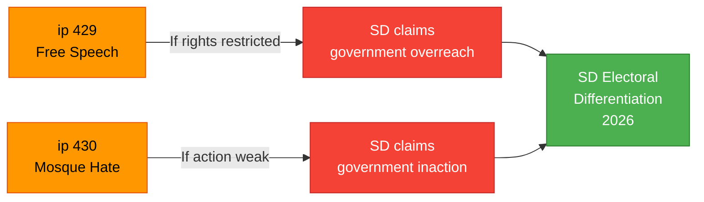

# Analysis Synthesis Summary — 2026-04-08

| Field | Value |
|-------|-------|
| **Synthesis ID** | SYN-2026-04-08-IP1 |
| **Analysis Date** | 2026-04-08 06:55 UTC |
| **Documents Analyzed** | 2 |
| **Analysis Period** | 2026-04-07 00:00–23:59 UTC |
| **Produced By** | news-interpellations workflow (AI-enriched) |
| **Overall Confidence** | MEDIUM |
| **Data Freshness** | Documents sourced from **2026-04-07** |

---

## Intelligence Dashboard

## Summary

Two interpellations filed April 7 by SD MPs represent a coordinated challenge to government coalition partners from within the support base. Both target senior ministers in M and KD — the two largest coalition parties — on politically sensitive topics where SD seeks to differentiate ahead of the 2026 election.

**ip 2025/26:429** (Farivar to Strommer/M) raises constitutionally significant questions about Prop. 2025/26:133's impact on freedom of expression, specifically regarding the "heckler's veto" risk. **ip 2025/26:430** (Jomshof to Forssmed/KD) pressures the Social Minister on extremism in mosques following Expressen investigations. Together, they signal SD's dual strategy: defending constitutional principles while maintaining pressure on integration policy.

## Cross-Document Patterns

1. **SD Coalition Pressure**: Both interpellations target government ministers from SD's coalition partners (M, KD), not opposition parties. This intra-coalition dynamic is significant for Tidoavtalet stability.
2. **Constitutional vs. Security Tension**: ip 429 questions security legislation that may restrict rights; ip 430 demands security action against hate preaching. SD occupies both positions simultaneously — a sophisticated political strategy.
3. **Election Positioning**: Both interpellations allow SD to differentiate from government partners ahead of 2026 election while remaining within the support agreement.
4. **Escalation Pattern**: ip 429 escalates from an unsatisfactory written answer (2026-03-04), showing SD's willingness to use formal parliamentary accountability mechanisms against its own coalition.

## Top Documents by Significance

| Score | Type | dok_id | Title | Key Finding |
|-------|------|--------|-------|-------------|
| 7/10 | ip | HD10429 | Free speech vs. Prop 2025/26:133 | Constitutional challenge to government's public gathering restrictions |
| 6/10 | ip | HD10430 | Mosque hate preaching | SD forces KD response on extremism enforcement gap |

## Aggregate SWOT Assessment

### Government Coalition
- **Key Weakness**: Forced to respond to support party challenges on two politically sensitive fronts simultaneously [HIGH confidence]
- **Key Strength**: Can frame responses as responsible governance balancing security and rights [MEDIUM confidence]

### SD (Support Party)
- **Key Strength**: Demonstrates independence and principled positions ahead of 2026 election [HIGH confidence]
- **Key Risk**: Holding contradictory positions (pro-free-speech on ip 429, anti-extremism on ip 430) may be exposed by media scrutiny [MEDIUM confidence]

## Risk Interconnections

The two interpellations create compounding risk: if Minister Strommer's response to ip 429 appears to restrict speech rights, SD can cite it as evidence of government overreach. If Minister Forssmed's response to ip 430 is weak, SD can claim government inaction on extremism. Either outcome provides SD electoral ammunition.

## Forward Intelligence

| Indicator | Trigger | Timeline | Confidence |
|-----------|---------|----------|------------|
| Minister Strommer response to ip 429 | Reply deadline | By 2026-04-27 | HIGH |
| Minister Forssmed response to ip 430 | Reply deadline | By 2026-04-24 | HIGH |
| KU referral on Prop. 2025/26:133 | Constitutional concerns raised | Within 4 weeks | MEDIUM |
| SD position on Prop. 2025/26:133 vote | Plenary scheduling | Q2 2026 | MEDIUM |
| Additional SD interpellations on related topics | Pattern continuation | Within 2 weeks | LOW |

## Data Quality Notes

Overall confidence: **MEDIUM**. Two documents provide limited but analytically rich material — both contain full-text interpellation content with detailed constitutional and policy arguments. Minister responses pending (deadlines April 24-27).

---

**Document Control** | Owner: Hack23 AB | Classification: Public | ISMS: ISO 27001:2022 A.5.1
