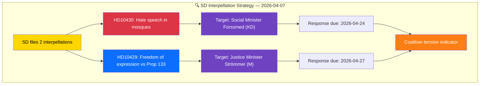

# Analysis Synthesis Summary — 2026-04-08

| Field | Value |
|-------|-------|
| **ID** | SYNTH-IP-2026-04-08-001 |
| **Date** | 2026-04-08 |
| **Riksmöte** | 2025/26 |
| **Documents Analyzed** | 2 |
| **Overall Confidence** | MEDIUM |
| **Risk Level** | MEDIUM |
| **Generated** | 2026-04-08 10:15 UTC |
| **Analyst** | news-interpellations (AI-enriched) |

## Executive Summary

Two interpellations filed by Sverigedemokraterna (SD) on 2026-04-07 target coalition ministers on politically sensitive topics: religious extremism and freedom of expression. **[MEDIUM confidence]** This represents an unusual pattern — SD, as the government's informal support party, is directly challenging its own coalition partners on ideological core issues, signalling potential strain in the Tidö Agreement cooperation.

## Key Findings

| # | Finding | Evidence | Confidence |
|---|---------|----------|:----------:|
| 1 | SD is using interpellations to pressure its own coalition partners on immigration and religious extremism issues | HD10430 targets KD minister Forssmed on mosque hate speech | MEDIUM |
| 2 | Proposition 2025/26:133 on public assembly security creates internal coalition friction — SD views it as potentially restricting demonstration rights (including Quran burnings) | HD10429 explicitly references post-Quran-burning legislative response | HIGH |
| 3 | Both interpellations were submitted April 1-2 but delivered April 7, suggesting coordinated filing timing | dok_id HD10429, HD10430 submission dates | MEDIUM |
| 4 | No minister responses recorded yet — accountability tracking begins | Status: "Skickad" for both | HIGH |

## Top Documents by Significance

| Score | Type | dok_id | Title | Target Minister |
|-------|------|--------|-------|----------------|
| 7/10 | ip | HD10429 | Skyddet för yttrandefriheten i förhållande till prop 2025/26:133 | Justitieminister Gunnar Strömmer (M) |
| 6/10 | ip | HD10430 | Moskéer som sprider hat och hot | Socialminister Jakob Forssmed (KD) |

## Cross-Document Patterns

Both interpellations share a common thread: the tension between security measures and fundamental freedoms in Swedish society. HD10430 addresses the security threat from religious extremism in mosques, while HD10429 questions whether the government's response to such threats (via Prop 2025/26:133) might itself undermine constitutional rights. This creates a policy paradox that SD is exploiting politically.

## Forward Indicators

| Indicator | Trigger | Timeline | Confidence |
|-----------|---------|----------|:----------:|
| Minister Forssmed response to HD10430 | Response due date | By 2026-04-24 | HIGH |
| Minister Strömmer response to HD10429 | Response due date | By 2026-04-27 | HIGH |
| Announcement in Riksdag chamber | Both announced | 2026-04-13 | HIGH |
| SD satisfaction with responses | Debate scheduling post-response | Late April 2026 | MEDIUM |

## Implications

The SD interpellation pair signals growing assertiveness from the government's external support party. As the 2026 election approaches, SD is positioning itself as a credible opposition-within-cooperation force, using the formal parliamentary accountability mechanism to create visible distance from coalition policy. **[MEDIUM confidence]**

## Data Quality Notes

Overall confidence: **MEDIUM**. Analysis based on 2 interpellations filed 2026-04-07 via lookback from article date 2026-04-08. Full text available for both documents. No minister responses yet recorded.
