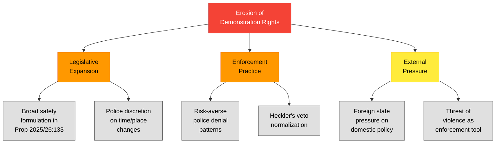

# Political Threat Analysis — 2026-04-08

| Field | Value |
|-------|-------|
| **Threat ID** | THR-2026-04-08-IP1 |
| **Analysis Date** | 2026-04-08 06:55 UTC |
| **Documents Analyzed** | 2 |
| **Produced By** | news-interpellations workflow (AI-enriched) |
| **Overall Threat Level** | MODERATE |
| **Confidence** | MEDIUM |

---

## Threat Taxonomy Assessment

### Democratic Function Threats

| Threat Category | Severity | Evidence | Confidence |
|----------------|----------|----------|------------|
| **Freedom of Expression** | HIGH | Prop. 2025/26:133 enables police to restrict public gatherings (HD10429) | HIGH |
| **Democratic Participation** | MODERATE | "Heckler's veto" risk reduces citizens' ability to organize protests (HD10429) | HIGH |
| **Rule of Law** | MODERATE | Broad "safety of life/health" formulation creates discretionary enforcement (HD10429) | MEDIUM |
| **Minority Rights** | MODERATE | Anti-Semitic hate preaching documented but enforcement gap persists (HD10430) | HIGH |
| **Government Accountability** | LOW | Interpellation mechanism functioning — ministers will be required to respond | HIGH |
| **Coalition Integrity** | LOW-MODERATE | Support party challenges coalition partners but within parliamentary norms | MEDIUM |

### Attack Tree: Erosion of Demonstration Rights

## Threat-Specific Analysis

### T1: Legislative Overreach on Public Gatherings (Severity: HIGH)

**Source**: ip 2025/26:429 (HD10429)
**Mechanism**: Prop. 2025/26:133 grants police explicit authority to change time/place and cancel gatherings for "safety of human life or health"
**Farivar's Argument**: "If the state can refer a demonstration to a place where nobody sees or hears it, then we have in practice hollowed out the freedom of demonstration"
**Countermeasure**: Minister Strommer must provide specific legal safeguards, not general reassurances
**Confidence**: HIGH — based on full legislative text analysis

### T2: Hate Preaching Enforcement Gap (Severity: MODERATE)

**Source**: ip 2025/26:430 (HD10430)
**Mechanism**: Two documented incidents of extremist preaching in Kristianstad mosques despite media exposure
**Jomshof's Argument**: Asks whether minister will take "general initiatives" — suggesting existing tools are insufficient
**Countermeasure**: Review adequacy of BrB 16:8 (hets mot folkgrupp) enforcement procedures
**Confidence**: HIGH — based on Expressen investigative evidence

## Data Quality Notes

Threat assessment based on full-text analysis of 2 interpellations. Constitutional threat (T1) rated higher due to systemic implications across all public gatherings. Hate preaching threat (T2) is significant but localized. Both require minister responses for complete threat picture.

---

**Document Control** | Owner: Hack23 AB | Classification: Public | ISMS: ISO 27001:2022 A.5.1
