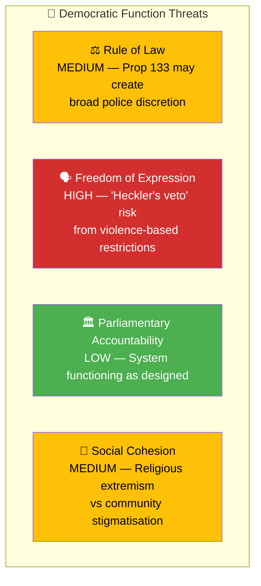

# Political Threat Analysis — Interpellations 2026-04-08

| Field | Value |
|-------|-------|
| **ID** | THREAT-IP-2026-04-08-001 |
| **Date** | 2026-04-08 |
| **Riksmöte** | 2025/26 |
| **Documents Analyzed** | 2 |
| **Overall Confidence** | MEDIUM |
| **Generated** | 2026-04-08 10:16 UTC |
| **Analyst** | news-interpellations (AI-enriched) |

## Threat Taxonomy Assessment

| # | Threat Category | Severity | Evidence | Confidence |
|---|----------------|:--------:|----------|:----------:|
| 1 | Freedom of Expression erosion via Prop 2025/26:133 | HIGH | HD10429: "våldsverkarnas veto" — violence threats could suppress demonstrations; broad language "säkerheten för människors liv eller hälsa" | HIGH |
| 2 | Rule of Law — police discretion overreach | MEDIUM | HD10429: questions whether police can effectively "deny permits to Quran burnings" using security rationale | MEDIUM |
| 3 | Social Cohesion — religious extremism and stigmatisation | MEDIUM | HD10430: documented hate preaching (Expressen exposés) juxtaposed with potential community stigmatisation | MEDIUM |
| 4 | Coalition Stability — support party challenging government | LOW-MEDIUM | Both interpellations from SD targeting M and KD ministers on sensitive topics | MEDIUM |

## Data Quality Notes

Threat confidence: **MEDIUM**. Freedom of expression threat is the most substantiated finding, based on detailed constitutional arguments in HD10429.
