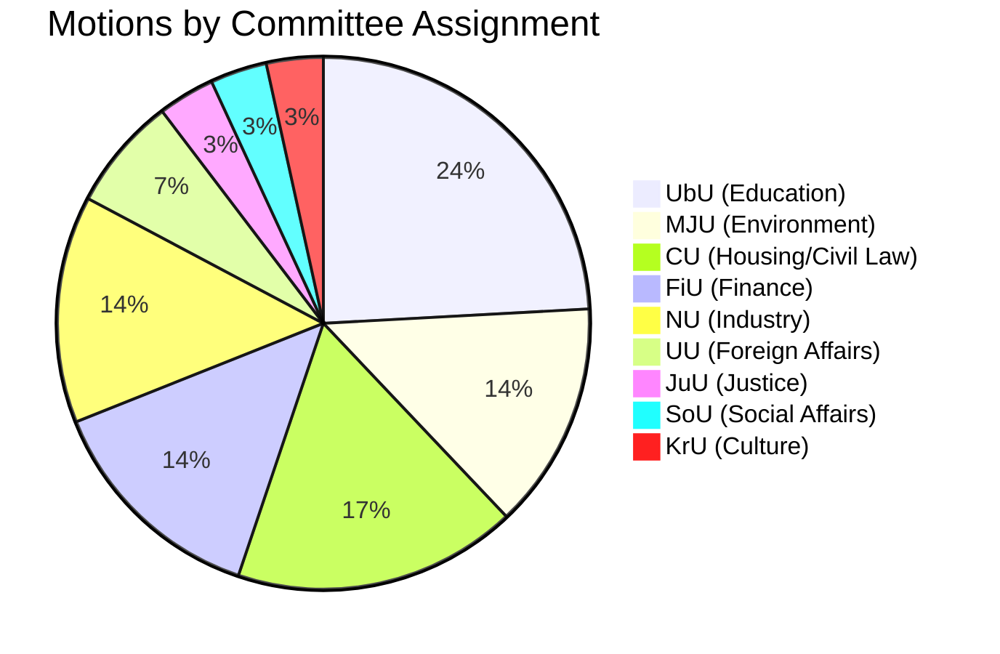

# Classification Results — Opposition Motions 2026-04-08

**Generated**: 2026-04-08 10:38 UTC  
**Analysis ID**: CLASS-MOT-20260408-001  
**Documents Analyzed**: 30  
**Confidence**: MEDIUM

---

## Classification Summary

## Domain Mapping

| Committee | Domain | Document Count | Key Propositions Challenged |
|-----------|--------|---------------|---------------------------|
| UbU | Education | 7 | prop. 2025/26:197 (grading), prop. 2025/26:191 (transparency), prop. 2025/26:194 (curriculum) |
| CU | Housing & Civil Law | 5 | prop. 2025/26:212 (housing), prop. 2025/26:180 (building), prop. 2025/26:224 (enforcement), prop. 2025/26:209 (prisons) |
| MJU | Environment & Agriculture | 4 | prop. 2025/26:211 (hunting), prop. 2025/26:205 (food preparedness), prop. 2025/26:206 (food fraud) |
| FiU | Finance | 4 | prop. 2025/26:199 (cash), prop. 2025/26:177 (procurement) |
| NU | Industry & Rural | 4 | prop. 2025/26:184 (private copying), prop. 2025/26:158 (rural policy) |
| UU | Foreign Affairs | 2 | skr. 2025/26:226 (Sida), skr. 2025/26:90 (Nordic) |
| JuU | Justice | 1 | prop. 2025/26:185 (prison abroad) |
| SoU | Social Affairs | 1 | prop. 2025/26:190 (suicide prevention) |
| KrU | Culture | 1 | skr. 2025/26:163 (architecture policy) |

## Data Quality Notes

Classification confidence: **MEDIUM**. Based on official committee assignments from riksdag-regering-mcp data.
