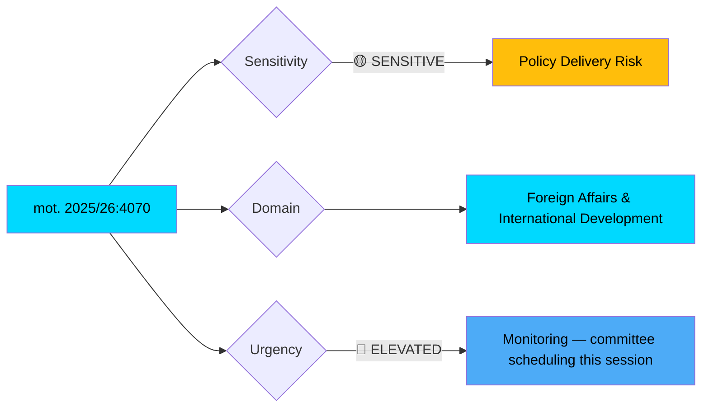
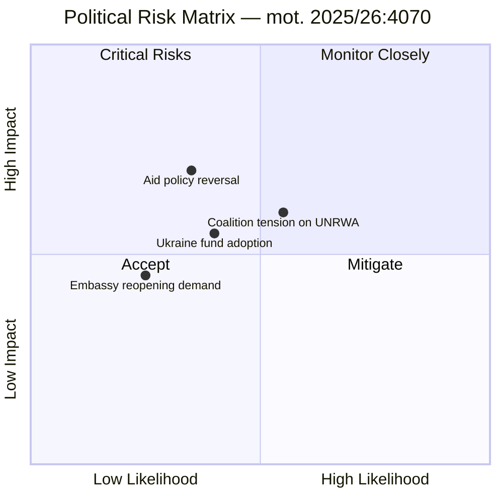

# Document Analysis: Centerpartiet Challenges Government on Sida's Humanitarian Aid Strategy

**Generated**: 2026-04-08 10:35 UTC
**dok_id**: HD024070
**Document Type**: motions
**Committee**: UU (Utrikesutskottet — Foreign Affairs Committee)
**Date**: 2026-04-08
**Author**: Anna Lasses, Kerstin Lundgren
**Party**: C (Centerpartiet)
**Riksmöte**: 2025/26
**Significance**: 🟡 Medium (6/10)
**Confidence**: HIGH (85%)
**Analysis ID**: MOT-HD024070-001

---

## Executive Summary

Centerpartiet files a committee motion (mot. 2025/26:4070) responding to the Swedish National Audit Office (Riksrevisionen) report on Sida's humanitarian aid operations. The motion demands four concrete government actions: (1) bridge the gap between development and humanitarian aid, (2) leverage embassies better in aid delivery, (3) resume UNRWA funding, and (4) create a dedicated Ukraine support fund. This represents an escalation in C's foreign aid criticism, aligning Riksrevisionen's audit findings with opposition policy demands. **[HIGH confidence]**

---

## Political Classification

| Field | Value |
|-------|-------|
| **Sensitivity** | 🟡 SENSITIVE — Foreign aid policy with UNRWA diplomatic implications |
| **Primary Domain** | Foreign Affairs & International Development |
| **Secondary Domain** | National Security (Ukraine fund proposal) |
| **Urgency** | 🔵 ELEVATED — Riksrevisionen report requires government response |
| **Committee** | UU (Utrikesutskottet) |

---

## SWOT Analysis

### Strengths (Government Position)

| # | Statement | Evidence | Confidence | Impact |
|---|-----------|----------|------------|--------|
| S1 | Government controls aid budget allocation and can selectively implement audit recommendations | Riksrevisionen report skr. 2025/26:226 acknowledges existing framework | HIGH | Medium |
| S2 | Current humanitarian aid levels maintained despite reorientation | mot. 2025/26:4070 implicitly confirms continued humanitarian spending | MEDIUM | Low |

### Weaknesses (Government Position)

| # | Statement | Evidence | Confidence | Impact |
|---|-----------|----------|------------|--------|
| W1 | Riksrevisionen confirms government steering failures in aid coordination | mot. 2025/26:4070 cites "brister i regeringens styrning" | HIGH | High |
| W2 | Embassy closures undermine local aid delivery capacity | Motion text: "Stängningen av ambassader i flera av de kontexter dit det humanitära biståndet går" | HIGH | High |
| W3 | UNRWA funding suspension seen as politically motivated intervention | Motion: "myndighetsledningen efter politisk påtryckning gått in och ändrat beslut" | MEDIUM | High |

### Opportunities (Opposition)

| # | Statement | Evidence | Confidence | Impact |
|---|-----------|----------|------------|--------|
| O1 | C leverages independent audit to validate years of opposition criticism | mot. 2025/26:4070: "stämmer till stor del överens med den kritik som Centerpartiet har framfört" | HIGH | High |
| O2 | Ukraine fund proposal positions C as constructive on defence/aid nexus | Motion proposes "en Ukrainafond...där allt stöd till Ukraina ingår" | HIGH | Medium |
| O3 | UNRWA resumption demand appeals to broad humanitarian constituency | Motion's third yrkande explicitly demands UNRWA aid resumption | HIGH | Medium |

### Threats (Political System)

| # | Statement | Evidence | Confidence | Impact |
|---|-----------|----------|------------|--------|
| T1 | Audit-opposition alignment may force government concessions or damage credibility | Riksrevisionen findings cited as independent validation of C policy | MEDIUM | High |
| T2 | UNRWA resumption demand may strain coalition dynamics with SD position on Palestine aid | Known SD opposition to UNRWA funding | MEDIUM | Medium |

---

## Risk Assessment

| Risk | Likelihood (1-5) | Impact (1-5) | L×I Score | Mitigation |
|------|------------------|--------------|-----------|------------|
| Government forced to address Riksrevisionen findings | 4 | 3 | 12 | Standard committee process absorbs pressure |
| UNRWA funding debate splits coalition | 3 | 4 | 12 | SD likely to block, containing damage |
| Embassy closure critique gains media traction | 3 | 3 | 9 | Government can cite security/budget rationale |
| Ukraine fund proposal gains cross-party support | 2 | 3 | 6 | Existing bilateral frameworks may suffice |

---

## Stakeholder Impact Analysis

| Stakeholder Group | Impact | Assessment | Confidence |
|-------------------|--------|------------|------------|
| **Citizens** | 🟡 Medium | Indirect — aid effectiveness affects Sweden's international reputation and tax allocation | MEDIUM |
| **Government Coalition** | 🟡 Medium | Must respond to Riksrevisionen findings; UNRWA demand creates SD friction | HIGH |
| **Opposition Bloc** | 🟢 Positive | C strengthens foreign policy critique; potential for S/V alignment on UNRWA | HIGH |
| **Business/Industry** | ⚪ Low | Minimal direct impact unless Ukraine fund affects trade policy | LOW |
| **Civil Society** | 🟡 Medium | Aid organizations closely monitoring UNRWA decision and nexus approach | MEDIUM |
| **International/EU** | 🟡 Medium | UNRWA and Ukraine positions signal Sweden's international alignment | HIGH |
| **Judiciary/Constitutional** | ⚪ Low | No constitutional implications identified | HIGH |
| **Media/Public Opinion** | 🟡 Medium | Riksrevisionen backing gives opposition critique news value | MEDIUM |

---

## Forward Indicators

| Indicator | Trigger | Timeline | Confidence |
|-----------|---------|----------|------------|
| UU committee scheduling of skr. 2025/26:226 debate | Committee calendar publication | 2-4 weeks | HIGH |
| Government written response to Riksrevisionen | Formal reply deadline | 4-8 weeks | HIGH |
| Cross-party motion alignment on UNRWA | S or V filing similar yrkanden | 1-3 weeks | MEDIUM |
| Media coverage of embassy closure impact | Investigative journalism cycle | Ongoing | LOW |

---

## Data Quality Notes

- **Analysis confidence**: HIGH (85%)
- **Full-text content**: Available — deep content analysis performed
- **Data sources**: get_motioner, get_dokument_innehall
- **Cross-references**: skr. 2025/26:226 (Riksrevisionen report)
- **Analysis method**: 6-lens stakeholder analysis with SWOT, risk matrix, political threat taxonomy
