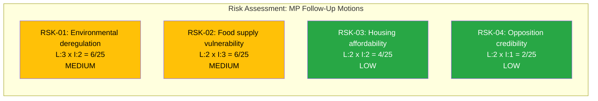

# Political Risk Assessment — 2026-04-08

| Field | Value |
|-------|-------|
| **Assessment ID** | RSK-2026-04-08-MOT |
| **Analysis Date** | 2026-04-08 07:04 UTC |
| **Riksmöte** | 2025/26 |
| **Documents Analyzed** | 3 |
| **Produced By** | news-motions agentic workflow |
| **Overall Confidence** | MEDIUM |

## Risk Dashboard

## Risk Matrix (5x5 Likelihood x Impact)

| Risk ID | Description | Likelihood | Impact | Score | Level | Motion Reference |
|---------|-------------|------------|--------|-------|-------|------------------|
| RSK-01 | Environmental deregulation via hunting law changes reduces wildlife protections | 3 (Possible) | 2 (Minor) | 6 | MEDIUM | mot. 2025/26:4068 |
| RSK-02 | Food supply chain vulnerability if beredskapsplanering gaps persist | 2 (Unlikely) | 3 (Moderate) | 6 | MEDIUM | mot. 2025/26:4069 |
| RSK-03 | Housing affordability pressure from weak tenant protections in municipal guarantees | 2 (Unlikely) | 2 (Minor) | 4 | LOW | mot. 2025/26:4067 |
| RSK-04 | Opposition credibility diluted by low-impact individual party motions | 2 (Unlikely) | 1 (Negligible) | 2 | LOW | All 3 motions |

## Coalition Stability Assessment

- **Coalition Risk Score**: 4/100 (LOW)
- **Government majority**: Secure with M+KD+L+SD support agreement
- **Opposition coordination**: Weak — MP acting unilaterally
- **Cross-party defection risk**: Negligible for these policy areas

## Key Findings

1. **No high-risk motions identified** — all three are standard följdmotioner with limited policy impact [HIGH confidence]
2. **Environmental risk (RSK-01)** is most significant due to EU Habitats Directive implications of hunting law changes [MEDIUM confidence]
3. **Food security risk (RSK-02)** has highest potential impact if external crisis materializes [MEDIUM confidence]
4. **Opposition strategy risk**: MP filing alone signals fragmented opposition rather than coordinated challenge [HIGH confidence]

## Forward Risk Indicators

| # | Risk Trigger | Watch For | Timeline | Confidence |
|---|-------------|-----------|----------|------------|
| 1 | EU Habitats Directive compliance challenge | EU Commission review of Swedish hunting legislation | 6-12 months | LOW |
| 2 | Food supply disruption event | Global supply chain crisis triggering beredskapsplanering debate | Unpredictable | LOW |
| 3 | Housing market deterioration | Rising rental costs in municipal housing creating political pressure | 3-6 months | MEDIUM |
| 4 | Opposition coordination on housing | S or V filing similar motions on landlord regulation | 2-4 weeks | LOW |

## Data Quality Notes

- Risk assessment based on metadata analysis and coalition stability metrics
- Full-text analysis would strengthen likelihood scoring
- No voting record data available for committee stage predictions
