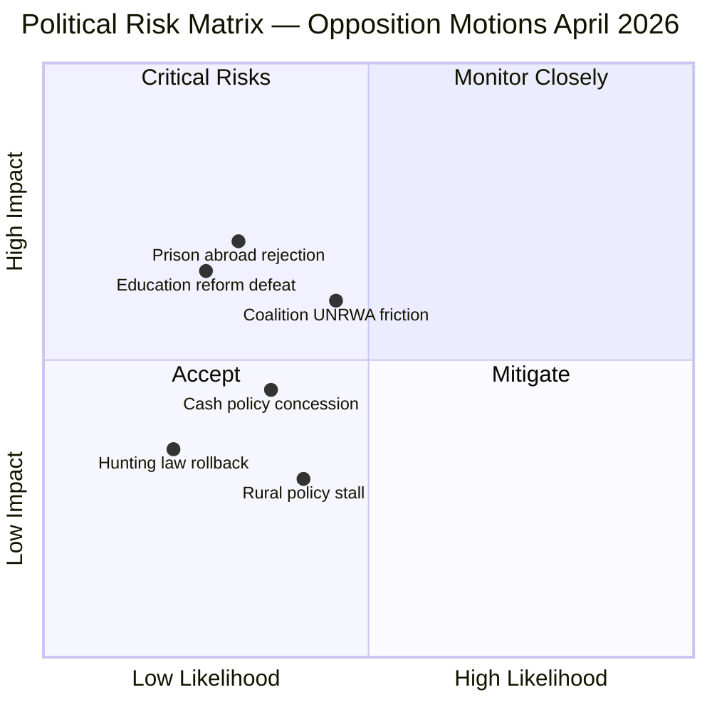

# Political Risk Assessment — Opposition Motions 2026-04-08

**Generated**: 2026-04-08 10:37 UTC  
**Analysis ID**: RISK-MOT-20260408-001  
**Data Sources**: get_motioner, get_dokument_innehall  
**Documents Analyzed**: 30  
**Overall Risk Level**: LOW-MEDIUM  
**Overall Confidence**: MEDIUM  
**Riksmöte**: 2025/26

---

## Risk Matrix

## Risk Register

| # | Risk | L (1-5) | I (1-5) | L×I | Category | Trigger | Owner |
|---|------|---------|---------|-----|----------|---------|-------|
| R1 | Government forced to amend education reform after 3-party opposition | 2 | 4 | 8 | Policy Delivery | UbU committee scheduling | UbU |
| R2 | UNRWA debate exposes coalition division on Palestine policy | 3 | 4 | 12 | Coalition Stability | UU committee debate | UU |
| R3 | Cash payment legislation seen as too narrow, requiring amendment | 2 | 3 | 6 | Policy Delivery | FiU hearings | FiU |
| R4 | Prison abroad proposition faces constitutional challenge | 2 | 5 | 10 | Constitutional | JuU committee review | JuU |
| R5 | Riksrevisionen findings amplify government credibility damage on aid | 3 | 3 | 9 | Reputation | Media cycle | UU |
| R6 | Hunting simplification rollback after environmental opposition | 1 | 2 | 2 | Policy Delivery | MJU voting | MJU |

## Key Risk Drivers

1. **Multi-party coordination** — S, C, MP aligning on education and cash policy creates unusual opposition breadth **[HIGH confidence]**
2. **Independent audit backing** — Riksrevisionen validates C foreign aid critique, elevating from partisan to institutional criticism **[HIGH confidence]**
3. **Constitutional dimension** — MP's prison abroad motion (mot. 2025/26:4063) raises fundamental rights concerns **[MEDIUM confidence]**
4. **Electoral proximity** — 2026 election cycle amplifies opposition motion significance **[MEDIUM confidence]**

## Mitigation Recommendations

- Government should proactively address Riksrevisionen findings before UU debate
- Education reform transition provisions could defuse 3-party opposition
- Cash policy amendment expanding scope could neutralize coordinated critique

## Data Quality Notes

Risk confidence: **MEDIUM**. Coalition stability assessment based on current seat distribution and known party positions. Electoral impact estimates are directional only.
