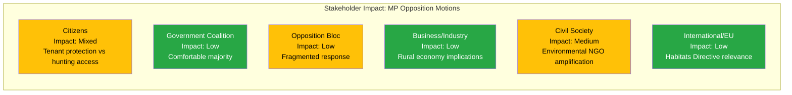

# Stakeholder Perspective Analysis — 2026-04-08

| Field | Value |
|-------|-------|
| **Analysis ID** | STK-2026-04-08-MOT |
| **Analysis Date** | 2026-04-08 07:04 UTC |
| **Riksmöte** | 2025/26 |
| **Documents Analyzed** | 3 |
| **Produced By** | news-motions agentic workflow |
| **Overall Confidence** | MEDIUM |

## Stakeholder Impact Matrix

## 6-Lens Analysis

### Lens 1: Parliamentary Impact
- **Assessment**: LOW — Follow-up motions from single party with no cross-party support
- **Evidence**: All 3 motions signed by MP only; government majority secure
- **Forward indicator**: Watch for S or V filing complementary motions within 2-4 weeks

### Lens 2: Policy Domain Impact
- **Assessment**: MEDIUM — Touches housing, food security, and environmental regulation
- **Evidence**: mot. 2025/26:4067 (CU/housing), mot. 2025/26:4068-4069 (MJU/environment)
- **Forward indicator**: Committee reports on parent propositions within 3-6 weeks

### Lens 3: Coalition Dynamics
- **Assessment**: LOW — No stress on government coalition from these motions
- **Evidence**: M+KD+L+SD alignment on all three parent propositions expected
- **Forward indicator**: SD position on housing guarantees could diverge from M/KD/L

### Lens 4: Electoral Implications
- **Assessment**: LOW — Technical motions unlikely to shift voter preferences
- **Evidence**: Low media salience topics; no poll-moving potential
- **Forward indicator**: If food crisis occurs, beredskapsplanering becomes election issue

### Lens 5: International Relations
- **Assessment**: LOW-MEDIUM — Hunting law changes have EU Habitats Directive implications
- **Evidence**: mot. 2025/26:4068 references art- och habitatdirektivet
- **Forward indicator**: EU Commission response to Swedish hunting legislation changes

### Lens 6: Media/Public Salience
- **Assessment**: LOW — Technical legislative amendments with limited public interest
- **Evidence**: No major media coverage expected; seal hunting could generate niche attention
- **Forward indicator**: Environmental campaign groups may amplify hunting motion

## Key Findings

1. **Civil society** is the most activated stakeholder group through environmental NGO channels [MEDIUM confidence]
2. **Government coalition** faces minimal pressure from these opposition motions [HIGH confidence]
3. **International/EU dimension** exists for hunting legislation but is not immediately salient [LOW confidence]
4. **Citizens** have mixed interests — tenants benefit from housing motion, hunters disadvantaged by hunting motion

## Data Quality Notes

- Analysis based on document metadata and political context knowledge
- Full stakeholder mapping would require committee hearing records
- Media impact assessment is predictive and low-confidence
