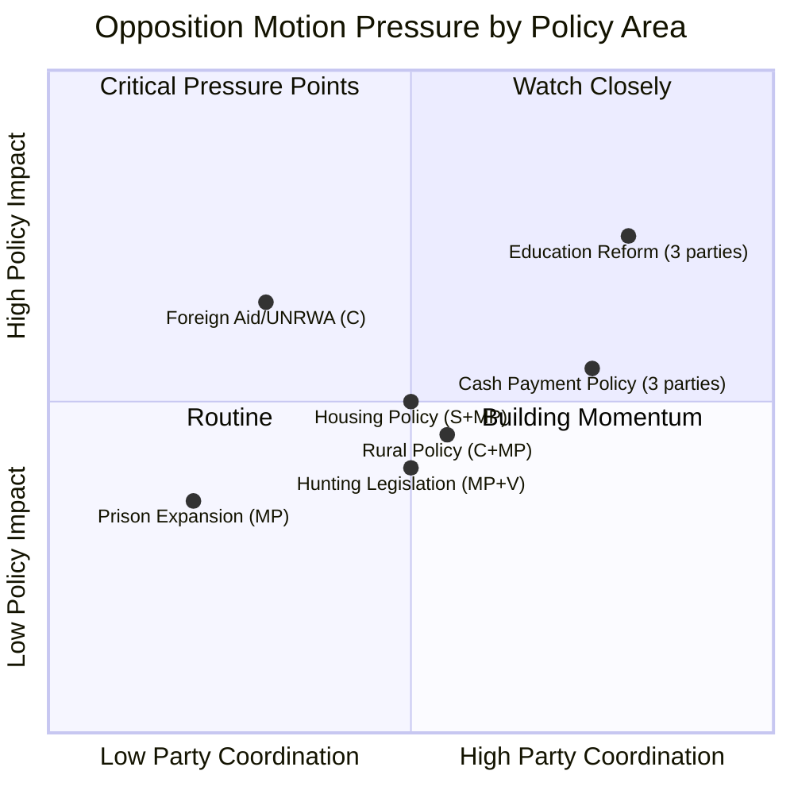

# Political SWOT Analysis — Opposition Motions 2026-04-08

**Generated**: 2026-04-08 10:37 UTC  
**Analysis ID**: SWOT-MOT-20260408-001  
**Data Sources**: get_motioner, get_dokument_innehall  
**Documents Analyzed**: 30 (1 today + 29 recent rm 2025/26)  
**Overall Confidence**: MEDIUM  
**Riksmöte**: 2025/26

---

## Multi-Stakeholder SWOT Matrix

## Strengths

### Citizens
| # | Statement | Evidence (dok_id) | Confidence | Impact | Entry Date |
|---|-----------|-------------------|------------|--------|------------|
| S1 | Multiple parties advocate for cash access rights, protecting vulnerable populations | mot. 2025/26:4043 (C), mot. 2025/26:4013 (S), mot. 2025/26:4061 (MP) | HIGH | High | 2026-04-01 |
| S2 | School transparency demands benefit parents' right to information | mot. 2025/26:4024 (S), mot. 2025/26:4049 (MP) | HIGH | Medium | 2026-04-01 |
| S3 | Suicide prevention motion strengthens mental health infrastructure | mot. 2025/26:4045 (C) — SoU committee | HIGH | Medium | 2026-04-01 |

### Government Coalition
| # | Statement | Evidence (dok_id) | Confidence | Impact | Entry Date |
|---|-----------|-------------------|------------|--------|------------|
| S4 | Maintains committee majority; can absorb opposition motions via rejection | Government holds 176+ seats across coalition | HIGH | High | Ongoing |
| S5 | Grading reform (prop. 2025/26:197) backed by education establishment | Three counter-motions indicate government proposal exists | MEDIUM | Medium | 2026-04-01 |

### Opposition Bloc
| # | Statement | Evidence (dok_id) | Confidence | Impact | Entry Date |
|---|-----------|-------------------|------------|--------|------------|
| S6 | Unprecedented 3-party coordination on education and cash policy | S, C, MP filing parallel motions on prop. 2025/26:197 and prop. 2025/26:199 | HIGH | High | 2026-04-01 |
| S7 | Riksrevisionen audit validates Centerpartiet's foreign aid critique | mot. 2025/26:4070 explicitly cites audit alignment with C positions | HIGH | High | 2026-04-08 |

### Business/Industry
| # | Statement | Evidence (dok_id) | Confidence | Impact | Entry Date |
|---|-----------|-------------------|------------|--------|------------|
| S8 | Procurement simplification (prop. 2025/26:177) supported across parties with nuanced S opposition | mot. 2025/26:4014 (S) demands stronger controls, not rejection | MEDIUM | Medium | 2026-04-01 |

### Civil Society
| # | Statement | Evidence (dok_id) | Confidence | Impact | Entry Date |
|---|-----------|-------------------|------------|--------|------------|
| S9 | MP's food supply chain preparedness motion strengthens crisis resilience | mot. 2025/26:4069 (MP) — MJU committee | HIGH | Medium | 2026-04-07 |

## Weaknesses

### Citizens
| # | Statement | Evidence (dok_id) | Confidence | Impact | Entry Date |
|---|-----------|-------------------|------------|--------|------------|
| W1 | Grading system upheaval may cause student confusion during transition | mot. 2025/26:4044 (C) warns of insufficient transition provisions | MEDIUM | Medium | 2026-04-01 |

### Government Coalition
| # | Statement | Evidence (dok_id) | Confidence | Impact | Entry Date |
|---|-----------|-------------------|------------|--------|------------|
| W2 | Government's Sida steering failures confirmed by Riksrevisionen | mot. 2025/26:4070 cites "brister i regeringens styrning" | HIGH | High | 2026-04-08 |
| W3 | Cash payment legislation seen as insufficiently broad by 3 opposition parties | mot. 2025/26:4043, 4013, 4061 all demand expanded cash rights | HIGH | Medium | 2026-04-01 |
| W4 | Building regulation simplification faces environmental sustainability concerns | mot. 2025/26:4059 (MP) demands reuse provisions | MEDIUM | Medium | 2026-04-01 |

### Opposition Bloc
| # | Statement | Evidence (dok_id) | Confidence | Impact | Entry Date |
|---|-----------|-------------------|------------|--------|------------|
| W5 | SD largely absent from coordination — only 1 motion (private copying) | mot. 2025/26:4007 (SD) on NU committee, isolated from main themes | HIGH | Medium | 2026-04-01 |
| W6 | V minimal participation — only 1 hunting motion | mot. 2025/26:4030 (V) limited to environmental niche | HIGH | Low | 2026-04-01 |

### International/EU
| # | Statement | Evidence (dok_id) | Confidence | Impact | Entry Date |
|---|-----------|-------------------|------------|--------|------------|
| W7 | UNRWA funding suspension damages Sweden's multilateral credibility | mot. 2025/26:4070 (C) demands resumption citing political interference | MEDIUM | High | 2026-04-08 |

### Media/Public Opinion
| # | Statement | Evidence (dok_id) | Confidence | Impact | Entry Date |
|---|-----------|-------------------|------------|--------|------------|
| W8 | Riksrevisionen backing gives opposition foreign aid critique significant media weight | Independent audit validation elevates story beyond partisan framing | HIGH | Medium | 2026-04-08 |

## Opportunities

### Opposition Bloc
| # | Statement | Evidence (dok_id) | Confidence | Impact | Entry Date |
|---|-----------|-------------------|------------|--------|------------|
| O1 | Education reform provides ideal rallying point for broad opposition unity | 3 parties (S, C, MP) with distinct but aligned concerns on grading and curricula | HIGH | High | 2026-04-01 |
| O2 | Cash policy debate can resonate with elderly and rural voters ahead of 2026 election | Universal consumer concern, 3-party coordination | MEDIUM | Medium | 2026-04-01 |

### Judiciary/Constitutional
| # | Statement | Evidence (dok_id) | Confidence | Impact | Entry Date |
|---|-----------|-------------------|------------|--------|------------|
| O3 | Prison abroad proposal (prop. 2025/26:185) raises fundamental rights questions | mot. 2025/26:4063 (MP) demands rejection on constitutional grounds | HIGH | High | 2026-04-01 |

### International/EU
| # | Statement | Evidence (dok_id) | Confidence | Impact | Entry Date |
|---|-----------|-------------------|------------|--------|------------|
| O4 | Ukraine fund proposal could achieve cross-party consensus | mot. 2025/26:4070 (C) — defence/aid nexus appeal | MEDIUM | Medium | 2026-04-08 |

## Threats

### Government Coalition
| # | Statement | Evidence (dok_id) | Confidence | Impact | Entry Date |
|---|-----------|-------------------|------------|--------|------------|
| T1 | Multi-front opposition coordination may strain committee resources | 6+ committees receiving coordinated motions simultaneously | MEDIUM | Medium | 2026-04-01 |
| T2 | UNRWA demand may expose SD-coalition friction on Palestine policy | mot. 2025/26:4070 (C) — SD known opposition to UNRWA | MEDIUM | High | 2026-04-08 |

### Citizens
| # | Statement | Evidence (dok_id) | Confidence | Impact | Entry Date |
|---|-----------|-------------------|------------|--------|------------|
| T3 | Hunting law simplification threatens wildlife conservation | mot. 2025/26:4068 (MP), mot. 2025/26:4030 (V) — seal hunting expansion concerns | MEDIUM | Medium | 2026-04-01/07 |

---

## Data Quality Notes

SWOT confidence: **MEDIUM**. Full text analysis for today's motion (HD024070); metadata-level analysis for 29 additional motions. All 8 stakeholder groups represented.
