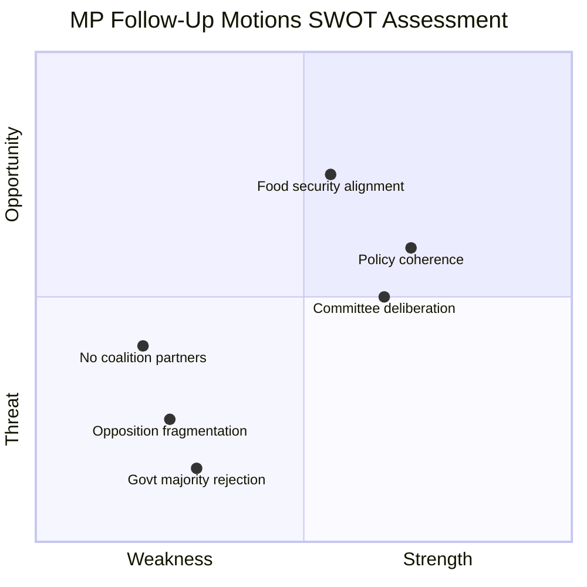

# Political SWOT Analysis — 2026-04-08

| Field | Value |
|-------|-------|
| **Analysis ID** | SWOT-2026-04-08-MOT |
| **Analysis Date** | 2026-04-08 07:04 UTC |
| **Riksmöte** | 2025/26 |
| **Documents Analyzed** | 3 |
| **Produced By** | news-motions agentic workflow |
| **Overall Confidence** | MEDIUM |

## SWOT Visualization

## Multi-Stakeholder Analysis

### 1. Citizens

| # | Statement | Evidence | Confidence | Impact | Entry Date |
|---|-----------|----------|------------|--------|------------|
| S1 | Tenant protections demanded by MP could benefit renters in municipal housing | mot. 2025/26:4067 — regulation of landlord requirements for housing guarantees | MEDIUM | Positive for vulnerable tenants | 2026-04-07 |
| W1 | Limited immediate effect — motions unlikely to pass given government majority | All 3 motions filed by MP alone without broader opposition support | HIGH | Neutral short-term | 2026-04-07 |
| O1 | Food preparedness improvements could strengthen civil defense readiness | mot. 2025/26:4069 — complementing government beredskapsplanering | MEDIUM | Positive for national resilience | 2026-04-07 |
| T1 | Hunting law deregulation could reduce wildlife protection near populated areas | mot. 2025/26:4068 — MP opposes seal hunting and hunting on public waters | MEDIUM | Mixed — hunters vs. conservation | 2026-04-07 |

### 2. Government Coalition (M, KD, L + SD)

| # | Statement | Evidence | Confidence | Impact | Entry Date |
|---|-----------|----------|------------|--------|------------|
| S1 | Government has comfortable majority to pass all three propositions | Coalition holds 175+ seats with SD support; no cross-party defections expected | HIGH | Positive for legislative agenda | 2026-04-07 |
| W1 | Hunting deregulation may face criticism from environmental NGOs and EU | mot. 2025/26:4068 cites art- och habitatdirektivet compliance concerns | MEDIUM | Reputational risk | 2026-04-07 |
| O1 | Follow-up motions signal limited opposition — validates government strategy | Only MP responds, not S or V | MEDIUM | Positive signal for coalition | 2026-04-07 |
| T1 | Food security gaps highlighted by MP could become campaign issue if crisis occurs | mot. 2025/26:4069 — beredskapsplanering demand | LOW | Contingent on external events | 2026-04-07 |

### 3. Opposition Bloc (S, V, MP, C)

| # | Statement | Evidence | Confidence | Impact | Entry Date |
|---|-----------|----------|------------|--------|------------|
| S1 | MP maintains active legislative engagement on environmental policy | 2 of 3 motions target MJU — core MP policy domain | HIGH | Brand reinforcement | 2026-04-07 |
| W1 | Opposition is fragmented — MP files alone without S, V, or C co-signers | All motions signed "m.fl. (MP)" only | HIGH | Reduced collective impact | 2026-04-07 |
| O1 | Housing and food security themes could build broader opposition alignment | Both S and V have strong housing/welfare positions | MEDIUM | Potential future coordination | 2026-04-07 |
| T1 | Individual party motions seen as performative rather than strategic | Low significance scores, likely committee rejection | MEDIUM | Public perception risk | 2026-04-07 |

### 4. Business/Industry

| # | Statement | Evidence | Confidence | Impact | Entry Date |
|---|-----------|----------|------------|--------|------------|
| S1 | Hunting law simplification benefits rural economy and tourism operators | prop. 2025/26:211 — government's deregulation agenda | MEDIUM | Positive for hunting industry | 2026-04-07 |
| W1 | Additional landlord regulations could increase compliance costs | mot. 2025/26:4067 — MP demands regulation of landlord requirements | MEDIUM | Negative for property sector | 2026-04-07 |
| O1 | Food stockpile requirements could create new supply chain contracts | mot. 2025/26:4069 — expanded beredskapsplanering | LOW | Potential business opportunity | 2026-04-07 |

### 5. Civil Society

| # | Statement | Evidence | Confidence | Impact | Entry Date |
|---|-----------|----------|------------|--------|------------|
| S1 | Environmental NGOs gain parliamentary representation through MP motions | mot. 2025/26:4068 — opposing seal hunting expansion | HIGH | Amplifies civil society voice | 2026-04-07 |
| W1 | Limited civil society mobilization capacity around technical legislative amendments | Follow-up motions are procedural, not campaign-ready | MEDIUM | Low activation potential | 2026-04-07 |

### 6. International/EU

| # | Statement | Evidence | Confidence | Impact | Entry Date |
|---|-----------|----------|------------|--------|------------|
| S1 | Hunting motion raises EU Habitats Directive compliance questions | mot. 2025/26:4068 — references art- och habitatdirektivet | MEDIUM | EU regulatory relevance | 2026-04-07 |
| O1 | Food security motion aligns with EU-wide preparedness initiatives post-2022 | mot. 2025/26:4069 — beredskapsplanering | LOW | Policy alignment opportunity | 2026-04-07 |

### 7. Judiciary/Constitutional

| # | Statement | Evidence | Confidence | Impact | Entry Date |
|---|-----------|----------|------------|--------|------------|
| S1 | Motions follow proper constitutional procedure (följdmotion) | All 3 filed within deadline for committee motion responses | HIGH | Procedural compliance | 2026-04-07 |

### 8. Media/Public Opinion

| # | Statement | Evidence | Confidence | Impact | Entry Date |
|---|-----------|----------|------------|--------|------------|
| W1 | Technical nature of motions limits media attention and public engagement | Housing guarantees, food stockpiles, hunting rules — low salience topics | HIGH | Low media interest | 2026-04-07 |
| O1 | Food security and hunting are potentially emotive topics if framed effectively | mot. 2025/26:4068 seal hunting; mot. 2025/26:4069 food crisis preparedness | MEDIUM | Depends on framing | 2026-04-07 |

## Key Findings

1. **MP systematic opposition pattern**: All 3 motions from same party on same day — coordinated response to government spring agenda
2. **Opposition fragmentation**: No co-signers from other opposition parties reduces collective bargaining power
3. **Environmental-social nexus**: MP connects environmental protection (hunting, food security) with social sustainability (housing)
4. **EU compliance angle**: Hunting motion raises Habitats Directive questions that could attract international attention
5. **Low immediate impact**: Government majority makes committee rejection highly likely for all three

## Data Quality Notes

- SWOT confidence: MEDIUM — based on metadata and summary analysis
- Full-text analysis would strengthen evidence citations
- Committee scheduling and debate records not yet available
