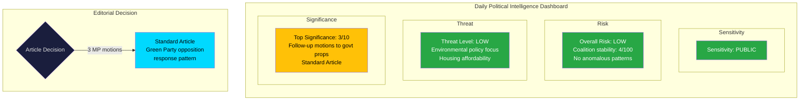

# Analysis Synthesis Summary — 2026-04-08

| Field | Value |
|-------|-------|
| **Synthesis ID** | SYN-2026-04-08-MOT |
| **Analysis Date** | 2026-04-08 07:04 UTC |
| **Riksmöte** | 2025/26 |
| **Documents Analyzed** | 3 |
| **Analysis Period** | 2026-04-07 motions |
| **Produced By** | news-motions agentic workflow |
| **Overall Confidence** | MEDIUM |

## Intelligence Dashboard

## Summary

Three follow-up motions (följdmotioner) filed by **Miljöpartiet (MP)** on 2026-04-07 in response to government propositions. All three are committee motions (kommittémotioner) filed by MP parliamentary group members, targeting housing policy (CU committee) and environmental/agriculture policy (MJU committee). This pattern represents MP's systematic opposition response to the Kristersson government's spring legislative agenda.

**Data Freshness**: Documents sourced from **2026-04-07** via lookback fallback (article date: 2026-04-08).

## Cross-Document Patterns

### Pattern 1: MP Systematic Opposition Response
All three motions originate from MP (Miljöpartiet), filed on the same day, each responding to a different government proposition. This indicates coordinated opposition activity rather than isolated initiatives:

| # | Motion | Proposition Targeted | Committee | MP Author | Policy Domain |
|---|--------|---------------------|-----------|-----------|---------------|
| 1 | mot. 2025/26:4067 | prop. 2025/26:212 (Housing guarantees) | CU | Amanda Palmstierna m.fl. | Housing policy |
| 2 | mot. 2025/26:4069 | prop. 2025/26:205 (Food stockpiles) | MJU | Emma Nohrén m.fl. | Food security/preparedness |
| 3 | mot. 2025/26:4068 | prop. 2025/26:211 (Hunting legislation) | MJU | Emma Nohrén m.fl. | Environmental/wildlife policy |

### Pattern 2: Environmental-Social Policy Nexus
Two of three motions (mot. 2025/26:4068, mot. 2025/26:4069) are referred to MJU (Miljö- och jordbruksutskottet), while one (mot. 2025/26:4067) goes to CU (Civilutskottet). MP is challenging government policy across both environmental and social sustainability fronts.

### Pattern 3: Regulatory Strengthening vs. Government Deregulation
The motions share a common theme: MP argues government proposals do not go far enough. In housing (mot. 2025/26:4067), MP wants stricter regulation of landlord requirements. In hunting (mot. 2025/26:4068), MP opposes expanding hunting rights. In food security (mot. 2025/26:4069), MP demands faster complementary preparedness measures.

## Aggregate SWOT

### Strengths
- **[MEDIUM]** MP demonstrates policy coherence across environmental and social domains, reinforcing party brand [Evidence: 3 motions filed same day across 2 committees]
- **[MEDIUM]** Follow-up motions force committee deliberation on government blind spots [Evidence: mot. 2025/26:4067 demands landlord regulation absent from prop. 2025/26:212]

### Weaknesses
- **[HIGH]** MP lacks coalition partners for these specific demands — no co-signers from S, V, or C [Evidence: all 3 motions signed by MP only]
- **[MEDIUM]** Low significance scores (1/10 each) suggest limited immediate policy impact

### Opportunities
- **[MEDIUM]** Food security motion (mot. 2025/26:4069) aligns with cross-party defense preparedness concerns post-2022
- **[LOW]** Housing guarantee regulation could attract S support given shared social housing priorities

### Threats
- **[HIGH]** Government majority (175+ seats with SD support) likely to reject all three motions in committee
- **[MEDIUM]** Opposition fragmentation — MP filing alone rather than with broader opposition bloc reduces impact

## Risk Interconnections

| Risk ID | Description | L | I | Score | Motions |
|---------|-------------|---|---|-------|---------|
| RSK-01 | Environmental deregulation accelerates under hunting law changes | 3 | 2 | 6 | mot. 2025/26:4068 |
| RSK-02 | Food supply chain vulnerability if preparedness gaps remain | 2 | 3 | 6 | mot. 2025/26:4069 |
| RSK-03 | Housing affordability pressure from weak tenant protections | 2 | 2 | 4 | mot. 2025/26:4067 |
| RSK-04 | Opposition credibility diluted by low-impact follow-up motions | 2 | 1 | 2 | All 3 motions |

## Forward Intelligence

| # | Indicator | Trigger | Timeline | Confidence |
|---|-----------|---------|----------|------------|
| 1 | CU committee scheduling of prop. 2025/26:212 debate | Committee calendar update | 2-4 weeks | MEDIUM |
| 2 | MJU committee treatment of hunting law opposition | Committee report publication | 3-6 weeks | MEDIUM |
| 3 | Cross-party food security amendments in MJU | Other parties filing similar motions | 1-3 weeks | LOW |
| 4 | MP coordination with S on housing regulation | Joint press statements or follow-up motions | 2-6 weeks | LOW |

## Document Significance Ranking

| Rank | dok_id | Score | Rationale |
|------|--------|-------|-----------|
| 1 | HD024069 | 3/10 | Food security preparedness has broader political resonance and defense policy cross-over |
| 2 | HD024068 | 2/10 | Hunting law changes touch environmental protection principles with EU implications |
| 3 | HD024067 | 2/10 | Housing guarantees regulation is narrow but socially significant |

## Data Quality Notes

- **Overall Confidence**: MEDIUM — metadata-only analysis, full-text unavailable
- **Data Freshness**: Documents from 2026-04-07, analyzed 2026-04-08
- **Limitations**: No debate transcripts available yet; committee scheduling not yet published
