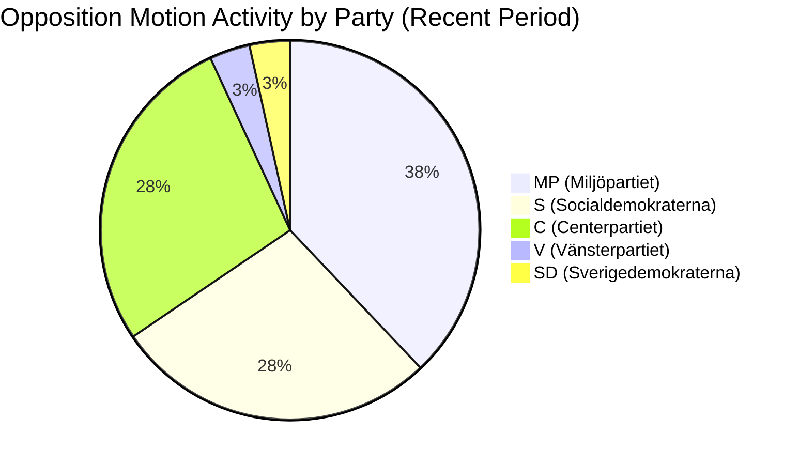
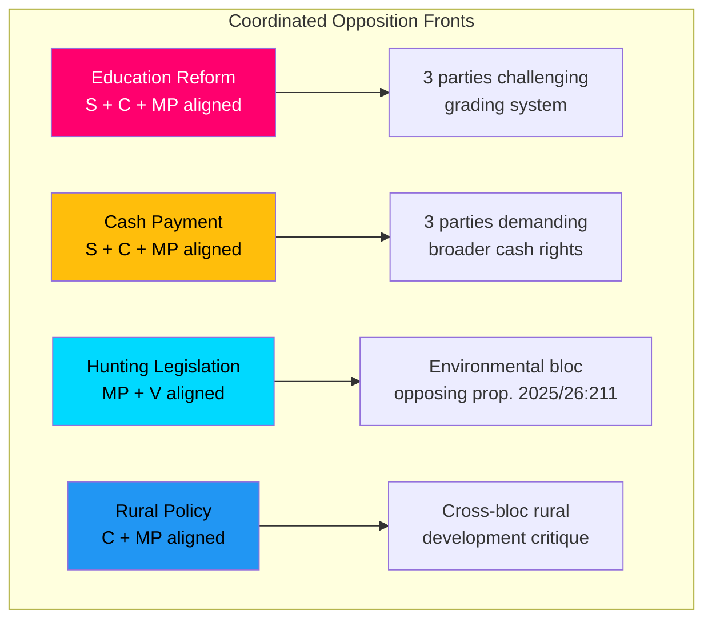

# Analysis Synthesis Summary — 2026-04-08

**Generated**: 2026-04-08 10:36 UTC  
**Analysis ID**: SYNTH-MOT-20260408-001  
**Data Sources**: get_motioner, get_dokument_innehall  
**Documents Analyzed**: 1 (today) + 29 recent (rm 2025/26)  
**Overall Confidence**: MEDIUM  
**Riksmöte**: 2025/26  
**Analyst**: news-motions workflow

---

## Executive Summary

One new opposition motion filed on 2026-04-08: Centerpartiet's committee motion (mot. 2025/26:4070) challenging the government on Sida's humanitarian aid strategy, citing Riksrevisionen audit findings. This continues an active opposition period: 29 additional motions from recent days (April 1-7) reveal coordinated multi-party campaigns across education (UbU), housing (CU), environment (MJU), finance (FiU), and rural policy (NU). **[MEDIUM confidence]**

## Key Themes

### 1. Foreign Aid & International Policy (UU)
- **mot. 2025/26:4070** (C) — Riksrevisionen critique of Sida, UNRWA resumption demand, Ukraine fund proposal
- **mot. 2025/26:4039** (C) — Nordic cooperation strengthening via revised Helsinki Agreement

### 2. Education System Reform (UbU) — Multi-Party Front
- **mot. 2025/26:4025** (S), **mot. 2025/26:4044** (C), **mot. 2025/26:4058** (MP) — Three parties challenge grading system reform (prop. 2025/26:197)
- **mot. 2025/26:4024** (S), **mot. 2025/26:4049** (MP) — Public transparency in school system (prop. 2025/26:191)
- **mot. 2025/26:4022** (S), **mot. 2025/26:4054** (MP) — Curriculum reform concerns (prop. 2025/26:194)

### 3. Environment & Agriculture (MJU)
- **mot. 2025/26:4068** (MP), **mot. 2025/26:4030** (V) — Hunting legislation opposition
- **mot. 2025/26:4069** (MP) — Food supply chain preparedness
- **mot. 2025/26:4020** (S) — Food fraud control strengthening

### 4. Housing & Construction (CU)
- **mot. 2025/26:4067** (MP) — Municipal housing guarantees
- **mot. 2025/26:4010** (S), **mot. 2025/26:4059** (MP) — Building regulation changes
- **mot. 2025/26:4060** (MP) — Prison facility expansion critique
- **mot. 2025/26:4008** (S) — Debt enforcement rules

### 5. Finance & Economic Policy (FiU)
- **mot. 2025/26:4043** (C), **mot. 2025/26:4013** (S), **mot. 2025/26:4061** (MP) — Three-party cash payment legislation
- **mot. 2025/26:4014** (S) — Procurement control strengthening

### 6. Rural & Industrial Policy (NU)
- **mot. 2025/26:4038** (C), **mot. 2025/26:4055** (MP) — Rural policy critique
- **mot. 2025/26:4007** (SD), **mot. 2025/26:4037** (C) — Private copying fee opposition

## Opposition Coordination Patterns

## Risk Level Assessment

| Risk Area | Level | Score | Key Driver |
|-----------|-------|-------|------------|
| Coalition stability | LOW | 15/100 | No critical government defeats expected |
| Opposition coordination | MEDIUM | 45/100 | Multi-party alignment on education and cash policy |
| Policy delivery risk | LOW | 20/100 | Government maintains committee majority on most issues |
| International reputation | MEDIUM | 40/100 | UNRWA and Riksrevisionen findings create diplomatic exposure |

## Forward Indicators

1. **UbU committee scheduling** — Three-party front on grading reform signals possible government concessions [MEDIUM confidence]
2. **FiU cash policy debate** — Three-party alignment rare; watch for government amendment strategy [MEDIUM confidence]
3. **UU response to Riksrevisionen** — Government must formally respond; UNRWA demand creates coalition friction with SD [HIGH confidence]
4. **MJU hunting debate** — MP+V bloc insufficient alone; watch for C position [LOW confidence]

## Data Quality Notes

Overall confidence: **MEDIUM**. One document from today analyzed with full text; 29 additional from recent period analyzed via metadata. Cross-referenced with Riksrevisionen report (skr. 2025/26:226).
