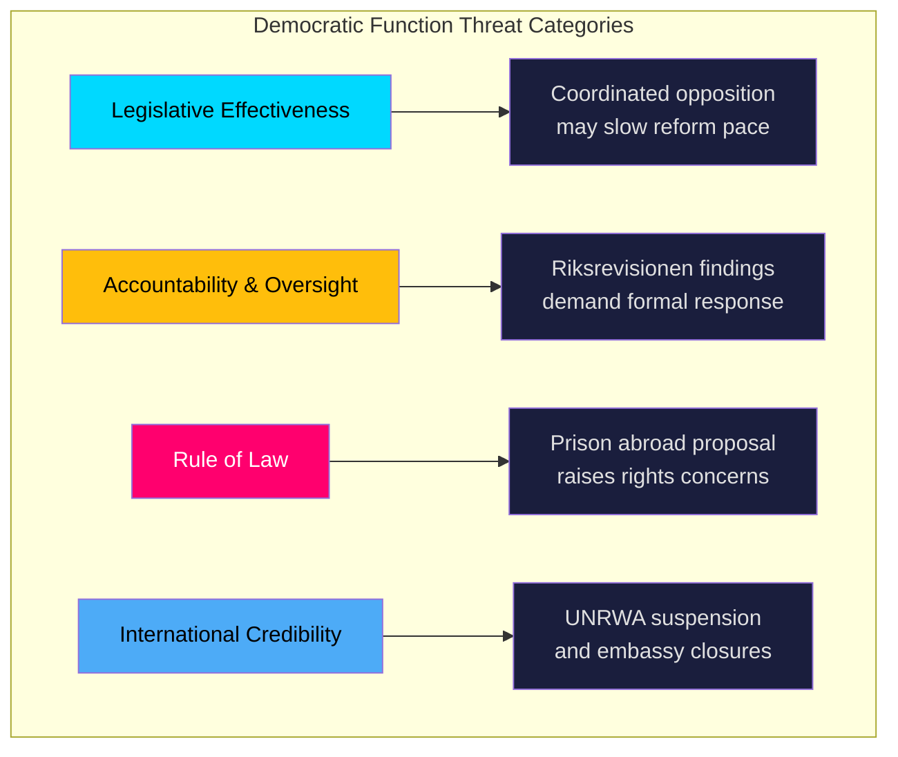

# Political Threat Analysis — Opposition Motions 2026-04-08

**Generated**: 2026-04-08 10:38 UTC  
**Analysis ID**: THREAT-MOT-20260408-001  
**Documents Analyzed**: 30  
**Overall Threat Level**: LOW  
**Confidence**: MEDIUM  
**Riksmöte**: 2025/26

---

## Threat Taxonomy

## Threat Indicators

| Category | Threat | Severity | Evidence | Confidence |
|----------|--------|----------|----------|------------|
| Accountability | Riksrevisionen audit ignored | 🟡 Medium | mot. 2025/26:4070 — audit findings match opposition critique | HIGH |
| Rule of Law | Fundamental rights compromised by prison abroad | 🟠 Elevated | mot. 2025/26:4063 (MP) seeks full rejection of prop. 2025/26:185 | MEDIUM |
| International | Multilateral credibility damaged by UNRWA suspension | 🟡 Medium | mot. 2025/26:4070 — political interference in aid decisions | MEDIUM |
| Democratic Participation | Building code changes bypass environmental review | 🟢 Low | mot. 2025/26:4059 (MP) — sustainability concerns | LOW |

## Forward Watch Items

1. Constitutional committee (KU) review of prison abroad constitutionality — **Timeline: 4-8 weeks** [MEDIUM]
2. Government formal response to Riksrevisionen on Sida — **Timeline: 2-6 weeks** [HIGH]
3. UbU grading system debate outcome — **Timeline: Spring 2026 session** [MEDIUM]

## Data Quality Notes

Threat confidence: **MEDIUM**. Analysis based on motion content and known institutional processes. Constitutional threat assessment requires legal expertise beyond political analysis scope.
