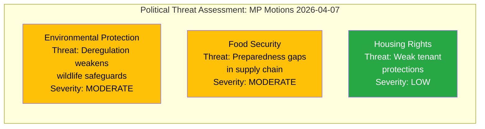

# Political Threat Analysis — 2026-04-08

| Field | Value |
|-------|-------|
| **Analysis ID** | THR-2026-04-08-MOT |
| **Analysis Date** | 2026-04-08 07:04 UTC |
| **Riksmöte** | 2025/26 |
| **Documents Analyzed** | 3 |
| **Produced By** | news-motions agentic workflow |
| **Overall Confidence** | MEDIUM |

## Threat Landscape

## Threat Categories

### Democratic Process (DP) — LOW
- Follow-up motions demonstrate healthy democratic debate
- No threats to parliamentary procedure identified
- All motions filed within constitutional framework

### Legislative Integrity (LI) — LOW
- Government propositions follow standard legislative process
- MP opposition through följdmotioner is routine and constructive
- No concerns about legislative shortcuts or irregular procedures

### Environmental Policy (Custom) — MODERATE
- **mot. 2025/26:4068**: Government hunting law simplification could conflict with EU Habitats Directive [MEDIUM confidence]
- MP raises legitimate concerns about seal hunting expansion and hunting on public waters
- Potential international compliance implications

### Civil Preparedness (Custom) — MODERATE
- **mot. 2025/26:4069**: Food supply chain preparedness identified as gap by MP [MEDIUM confidence]
- Post-2022 security environment heightens importance of beredskapsplanering
- Government's pace of preparedness implementation questioned

## Key Findings

1. **No severe threats** to democratic functions from these motions [HIGH confidence]
2. **Environmental deregulation** via hunting law changes is the most substantive policy concern [MEDIUM confidence]
3. **Civil preparedness gaps** could become critical if external crisis materializes [LOW confidence]
4. Motions represent healthy democratic opposition, not systemic threats

## Data Quality Notes

- Threat analysis based on metadata and policy domain assessment
- Full-text analysis would strengthen severity calibration
- No evidence of anti-democratic patterns in this document batch
