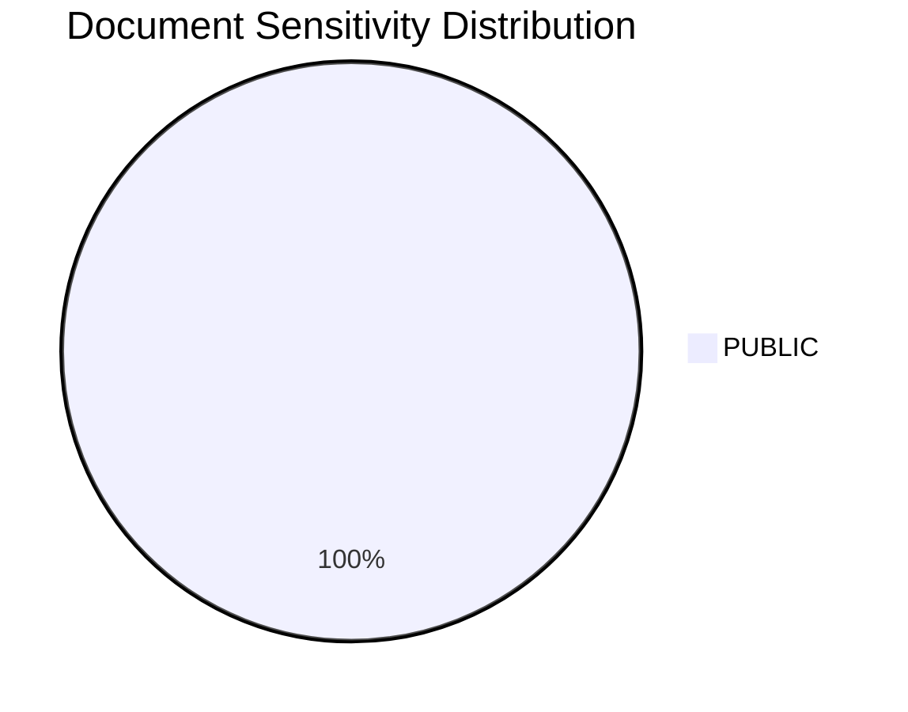
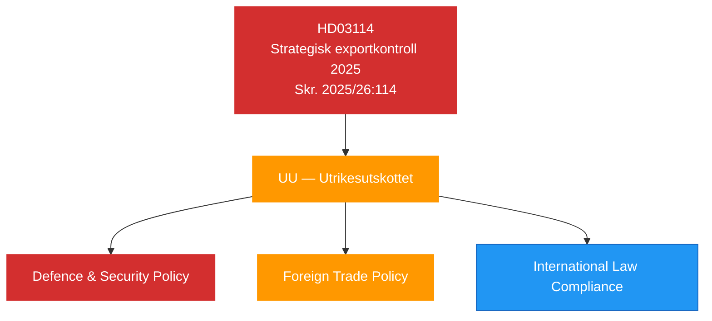

# Document Classification Results — 2026-04-08

| **Field** | **Value** |
|-----------|-----------|
| **Analysis ID** | CLASS-2026-04-08-001 |
| **Analysis Date** | 2026-04-08 06:04 UTC |
| **Documents Analyzed** | 1 |
| **Produced By** | news-propositions workflow (AI-enriched) |
| **Overall Confidence** | MEDIUM |

---

## Classification Summary

| dok_id | Type | Sensitivity | Domain | Urgency | Priority |
|--------|------|-------------|--------|---------|----------|
| HD03114 | Skrivelse (Skr.) | 🟢 PUBLIC | Defence & Security Policy | ROUTINE | MEDIUM |

## Detailed Classification

### HD03114 — Strategisk exportkontroll 2025

- **Document type**: Skrivelse (government communication) — Skr. 2025/26:114
- **Sensitivity**: PUBLIC — annual transparency report, no classified content in report itself
- **Primary domain**: Defence and security policy
- **Secondary domains**: Foreign trade policy, international law compliance, dual-use technology
- **Urgency**: ROUTINE — annual reporting cycle
- **Priority**: MEDIUM — elevated by post-NATO context
- **Committee assignment**: UU (Utrikesutskottet / Foreign Affairs Committee)
- **Policy impact**: Defence export framework, NATO interoperability, dual-use controls

## Classification Distribution

## Data Quality Notes

Classification based on document metadata, committee assignment, and policy domain analysis. Confidence: MEDIUM [MEDIUM]. Single document limits statistical analysis; classification confidence elevated by NATO context and committee-level verification.
