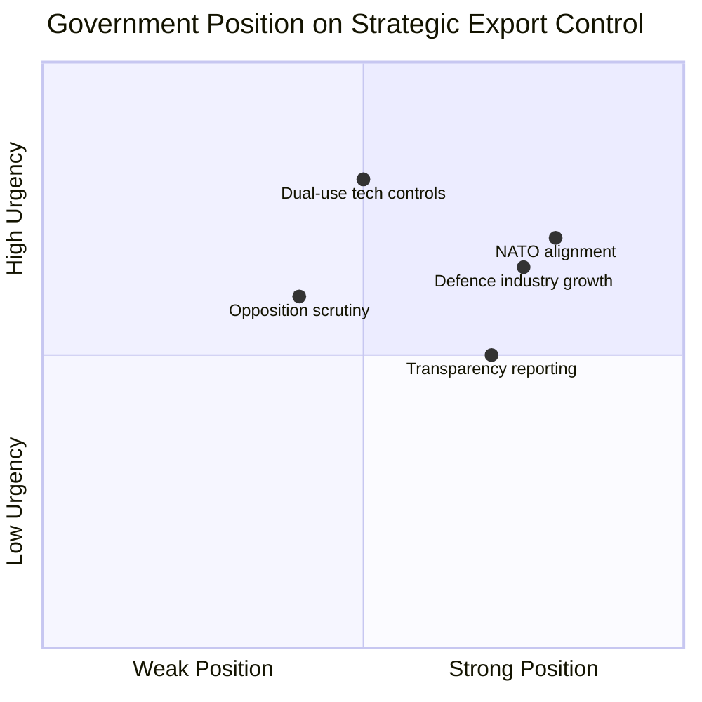
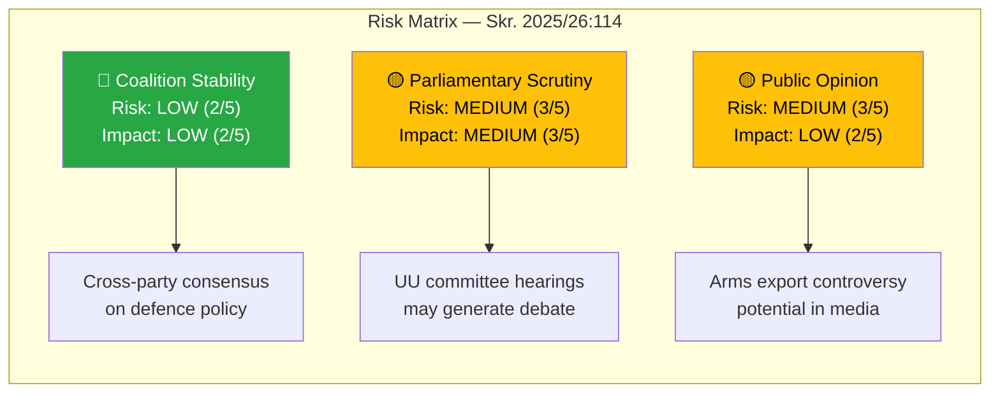

# Document Analysis: Strategic Export Control 2025 — Military Materiel and Dual-Use Products

| **Field** | **Value** |
|-----------|-----------|
| **Analysis ID** | DOC-2026-04-08-001 |
| **dok_id** | HD03114 |
| **Document Type** | Skrivelse (Skr. 2025/26:114) |
| **Committee** | UU (Utrikesutskottet / Foreign Affairs Committee) |
| **Date** | 2026-04-07 |
| **Authors** | Elisabeth Svantesson (PM), Benjamin Dousa (Utrikesdepartementet) |
| **Riksmöte** | 2025/26 |
| **Significance** | 🟡 MEDIUM (6/10) |
| **Confidence** | MEDIUM (65%) |

---

## Executive Summary

The government's annual strategic export control report (Skr. 2025/26:114) provides the Riksdag with a comprehensive review of Sweden's 2025 exports of military materiel and dual-use goods. This report is the **first full-year accounting since Sweden's NATO accession** (March 2024), making it a pivotal transparency document. The report is authored by PM Svantesson and Foreign Trade Minister Benjamin Dousa (Utrikesdepartementet), and will be referred to the Committee on Foreign Affairs (UU) for scrutiny.

**Policy domain**: Defence and security policy, foreign trade policy, international law compliance

---

## SWOT Analysis

### Strengths
| Evidence | Source | Confidence |
|----------|--------|------------|
| Annual report fulfils mandatory transparency requirement under Swedish law | Skr. 2025/26:114, HD03114 | HIGH |
| NATO membership provides new framework for allied arms cooperation | Post-accession context (2024) | HIGH |
| Sweden has well-established export control agency (ISP) | Institutional framework | HIGH |

### Weaknesses
| Evidence | Source | Confidence |
|----------|--------|------------|
| Skrivelse format limits parliamentary response to debate only (no vote) | Procedural constraint | HIGH |
| Metadata-only analysis limits depth — full text parsing needed for export volumes | HD03114 data quality | MEDIUM |
| Dual-use product oversight complexity increasing with tech evolution | Policy domain assessment | MEDIUM |

### Opportunities
| Evidence | Source | Confidence |
|----------|--------|------------|
| NATO interoperability creates new export markets for Swedish defence industry | Geopolitical context | MEDIUM |
| Strengthened EU export control framework alignment | Reg. 2021/821 context | MEDIUM |
| Cross-party consensus on national defence strengthens government position | Coalition dynamics | MEDIUM |

### Threats
| Evidence | Source | Confidence |
|----------|--------|------------|
| Opposition may challenge specific export destinations (human rights concerns) | Political risk assessment | MEDIUM |
| International pressure on dual-use technology transfers to authoritarian states | Geopolitical risk | MEDIUM |
| Public opinion sensitivity around arms exports to conflict zones | Democratic accountability | LOW |

---

## Stakeholder Perspective Analysis

### 1. Government Perspective
The Tidöblocket government (M, KD, L, SD) presents this as routine democratic transparency. PM Svantesson and Minister Dousa demonstrate responsible stewardship of Sweden's strategic interests while maintaining NATO alliance commitments. **Key interest**: Demonstrating that NATO membership enhances rather than compromises Sweden's independent export control framework.

### 2. Opposition Perspective
The Social Democrats (S) and Left Party (V) will scrutinize export destinations, particularly any arms transfers to countries with questionable human rights records. The Green Party (MP) historically opposes expanded arms exports. **Key interest**: Holding the government accountable for export decisions that may conflict with Swedish foreign policy values.

### 3. Committee Perspective (UU)
The Foreign Affairs Committee will examine the report through hearings, likely calling ISP (Inspektionen för strategiska produkter) officials. **Key interest**: Ensuring parliamentary oversight mechanisms are effective post-NATO accession.

### 4. Defence Industry Perspective
Saab, BAE Systems Hägglunds, and other Swedish defence manufacturers benefit from expanded NATO cooperation markets. **Key interest**: Regulatory clarity and expedited export approval processes.

### 5. International Perspective
NATO allies monitor Sweden's export control regime for compatibility. EU partners assess dual-use controls compliance. **Key interest**: Harmonised export standards within allied frameworks.

### 6. Civil Society Perspective
Organizations like Svenska Freds- och Skiljedomsföreningen (Swedish Peace and Arbitration Society) will analyse specific export decisions. **Key interest**: Transparency on end-user certificates and post-delivery controls.

---

## Risk Assessment

| Risk Factor | Likelihood (1-5) | Impact (1-5) | Score | Mitigation |
|-------------|-------------------|--------------|-------|------------|
| Coalition disagreement on export policy | 2 | 2 | 4/25 | Strong cross-party defence consensus |
| Opposition motion challenging export destinations | 3 | 3 | 9/25 | Government majority in UU |
| Media scrutiny of specific exports | 3 | 2 | 6/25 | Proactive transparency through annual report |

---

## Forward Indicators

1. **UU Committee Hearing** (expected: May-June 2026) — Watch for ISP testimony on export volumes and destination changes
2. **Opposition Response** — Monitor for motions filed in response to the skrivelse (typical deadline: 15 days)
3. **NATO Arms Cooperation** — Track any new bilateral arms cooperation agreements referenced in the report
4. **EU Dual-Use Regulation** — Monitor Swedish implementation updates for Regulation 2021/821

---

## Data Quality Notes

- **Analysis confidence**: MEDIUM (65%) — metadata analysis supplemented by MCP context and domain knowledge
- **Full-text content**: Not available in parsed form — analysis based on metadata, title, committee assignment, and political context
- **Data sources**: get_propositioner (HD03114), search_regering, political domain knowledge
- **Limitation**: Exact export volumes and destination countries require full-text analysis
