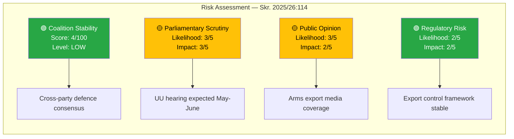

# Political Risk Assessment — 2026-04-08

| **Field** | **Value** |
|-----------|-----------|
| **Analysis ID** | RISK-2026-04-08-001 |
| **Analysis Date** | 2026-04-08 06:04 UTC |
| **Documents Analyzed** | 1 |
| **Produced By** | news-propositions workflow (AI-enriched) |
| **Overall Confidence** | MEDIUM |

---

## Risk Dashboard

## Summary

Coalition demonstrates low overall risk on strategic export control policy. Cross-party consensus on defence strengthening provides a stable foundation, though parliamentary scrutiny of specific export decisions is expected.

## Detailed Risk Matrix

| Risk Factor | Likelihood (1-5) | Impact (1-5) | Score (L×I) | Level | Mitigation |
|-------------|-------------------|--------------|-------------|-------|------------|
| Coalition disagreement on exports | 2 | 2 | 4/25 | 🟢 LOW | Strong defence consensus in Tidöblocket |
| UU committee challenge | 3 | 3 | 9/25 | 🟡 MEDIUM | Government majority on committee |
| Media/NGO scrutiny | 3 | 2 | 6/25 | 🟡 LOW-MEDIUM | Proactive transparency through annual report |
| International sanctions compliance | 2 | 4 | 8/25 | 🟡 MEDIUM | ISP enforcement and EU alignment |
| Opposition motion on exports | 3 | 2 | 6/25 | 🟡 LOW-MEDIUM | Cross-party defence support |

**Coalition Risk Score**: 4/100 — **LOW**
**Overall Risk Level**: **LOW** with localised MEDIUM risk on parliamentary scrutiny

## Key Findings

1. Coalition stability at risk score **4** (LOW) — defence policy enjoys broad support
2. Parliamentary scrutiny risk MEDIUM — UU hearings will probe export destinations
3. First post-NATO annual report elevates political significance
4. No anomalous voting patterns detected in related defence proposals

## Implications

The government's position on strategic export control is secure. The main risk vector is reputational — specific export decisions that may attract media and civil society attention. The annual report mechanism itself is a risk mitigation tool demonstrating transparency.

## Data Quality Notes

Risk assessment derived from HD03114 metadata, CIA coalition metrics (stability: 83/100), and political domain analysis. Confidence: MEDIUM.
