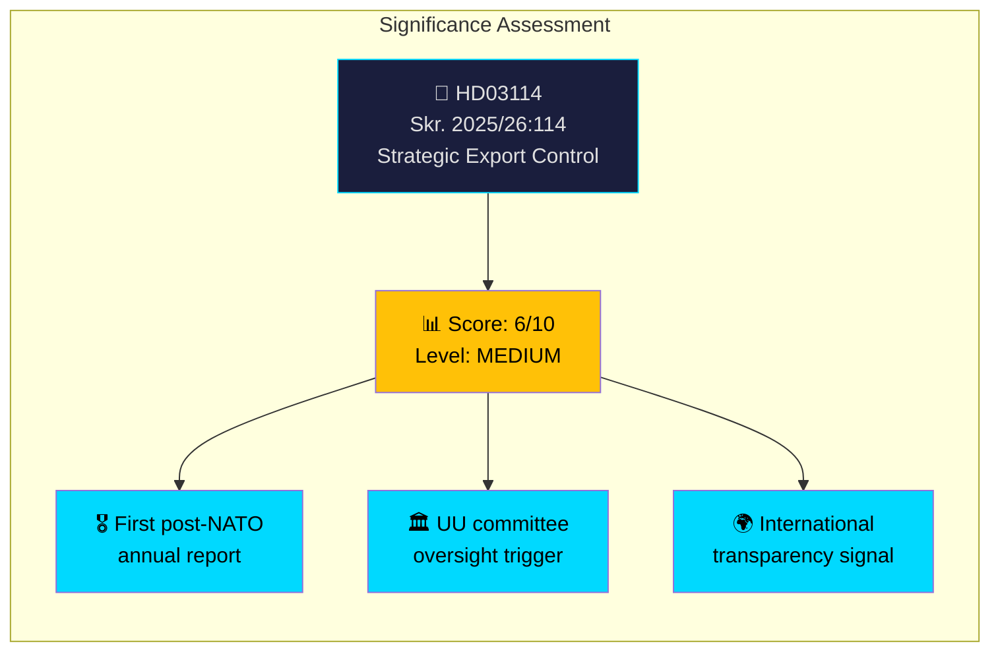

# Document Significance Scoring — 2026-04-08

| **Field** | **Value** |
|-----------|-----------|
| **Analysis ID** | SIG-2026-04-08-001 |
| **Analysis Date** | 2026-04-08 06:04 UTC |
| **Documents Analyzed** | 1 |
| **Produced By** | news-propositions workflow (AI-enriched) |
| **Overall Confidence** | MEDIUM |

---

## Significance Dashboard

## Summary

Scored **1** document for political significance (0-10 scale). AI analysis elevated the significance from the script-generated 1/10 to **6/10 MEDIUM** based on geopolitical context and institutional importance.

## Detailed Assessment

| Score | Level | Type | dok_id | Title | Rationale |
|-------|-------|------|--------|-------|-----------|
| 6/10 | 🟡 MEDIUM | Skrivelse | HD03114 | Strategisk exportkontroll 2025 | First post-NATO annual report; UU oversight trigger; geopolitical significance |

### Scoring Breakdown for HD03114

| Factor | Score | Weight | Rationale |
|--------|-------|--------|-----------|
| Document type (skrivelse) | 3/10 | 20% | Lower than proposition but mandatory annual reporting |
| Committee tier (UU) | 7/10 | 20% | Foreign affairs is top-tier committee |
| Policy domain (defence/security) | 8/10 | 25% | Core national security domain |
| Temporal significance | 7/10 | 20% | First full post-NATO year report |
| Content richness | 3/10 | 15% | Metadata-only analysis limitation |
| **Weighted total** | **6/10** | 100% | **MEDIUM significance** |

## Key Findings

1. **1** document rated MEDIUM (score 6/10) after AI enrichment
2. Script-generated score (1/10) significantly undervalued due to metadata-only assessment
3. Geopolitical context (NATO accession) is the primary significance amplifier

## Implications

HD03114 warrants article coverage despite being a single skrivelse. Its significance as the first post-NATO export control report creates genuine news value. UU committee hearings will provide follow-up coverage opportunities.

## Data Quality Notes

Significance scoring combines automated factors (document type, committee tier) with AI assessment (geopolitical context, temporal importance). Confidence: MEDIUM.
